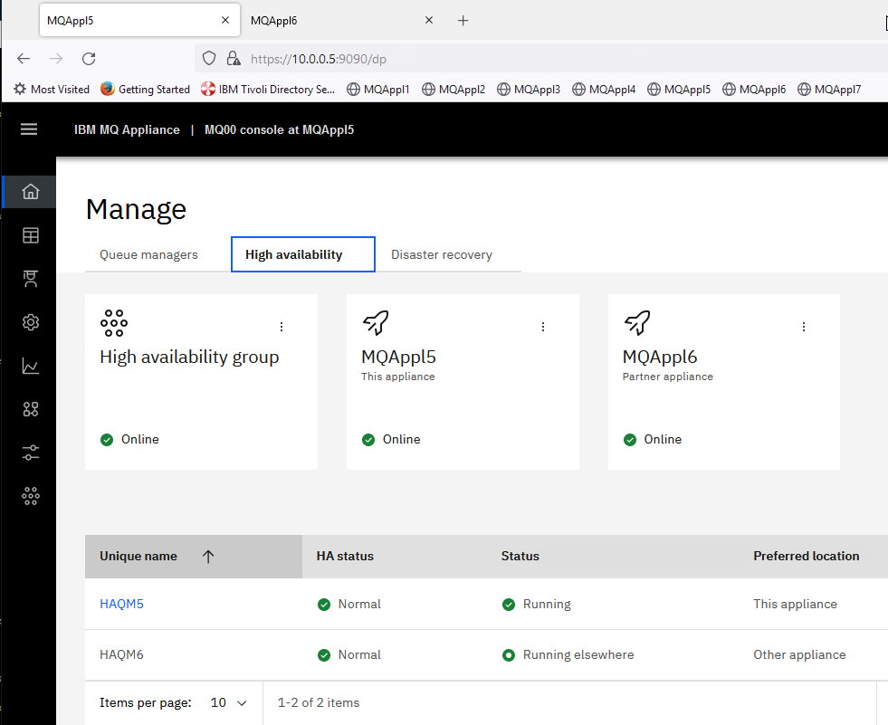
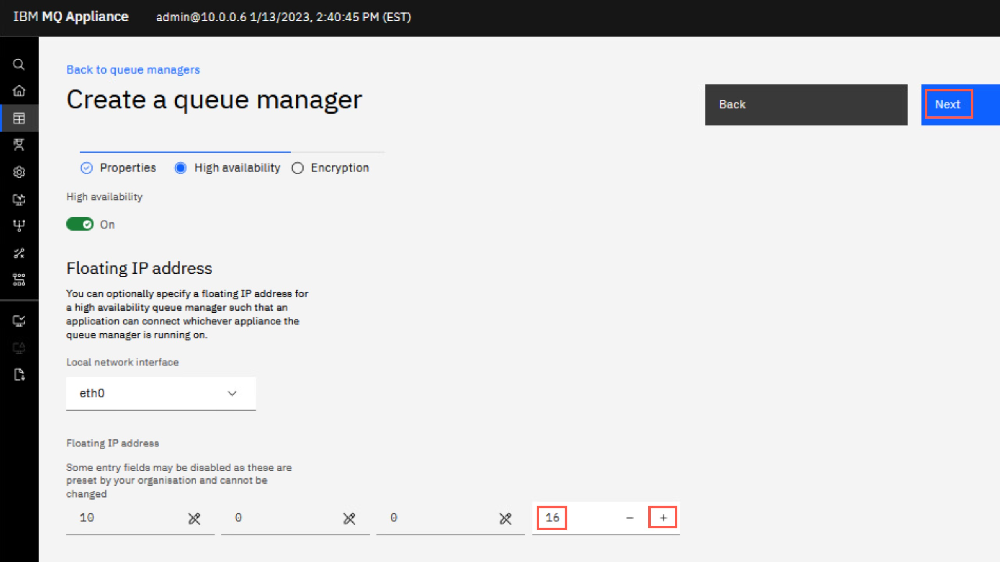
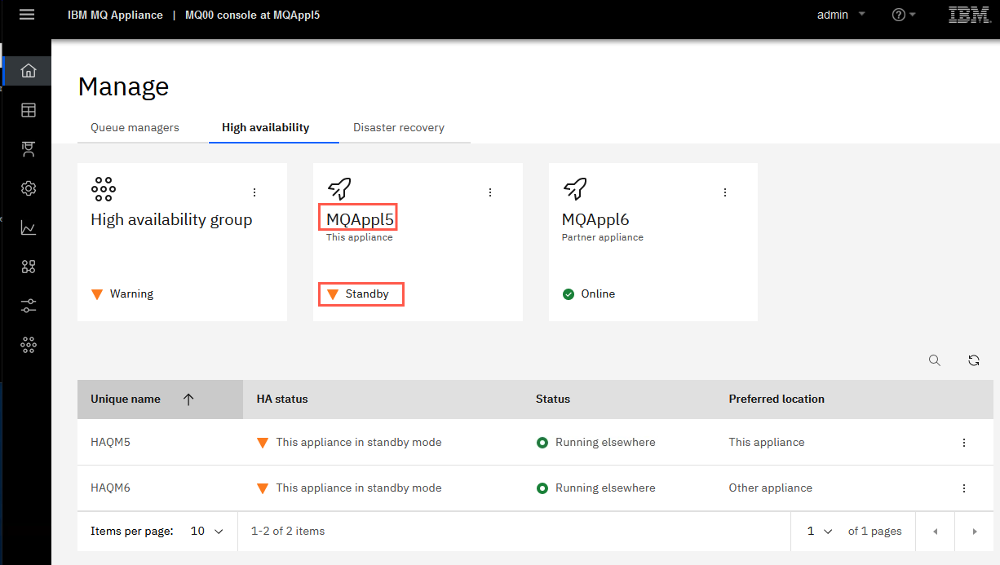

# Lab 2 - IBM MQ Appliance High Availability

In this lab, you will configure two virtual appliances for high availability (HA) and test that HA works as expected.

VMs required:

* **Windows 10 x64**
* **MQAppl5**
* **MQAppl6**

The lab environment consists of two virtual appliances (MQAppl5 and
MQAppl6) and a Windows environment to perform console operations and
testing. There are other virtual appliances (MQAppl1, MQAppl2, MQAppl3, MQAppl4, and MQAppl7)
that will not be used in this lab. You can just ignore them for now. 

## Start the environment

1. Wait for the virtual machines to power on. MQAppl5 is shown below. MQAppl6 should appear the same.
    
    

2. Log in with user / password **admin** / **passw0rd**.
	
	

> <span style="color: Blue">**Note:** <BR>If you see a message that states *Notice: startup config contains errors*, you can ignore the message.</span>
	
### Sync the appliance clocks
 
> <span style="color: red">**Important:** <br>For this lab, the appliance clocks need to be synchronized. Automatic time sync is not available on the Skytap virtual MQ Appliances. Therefore the time on the appliance will start from the time the VM was last shut down or suspended. You should make sure the appliance time is in sync with the Windows desktop time. Use the \"show clock\" to display the time. If it doesn't match, use the \"clock\" command to set the appliance time to sync with the Windows time.</span>

## The virtual environment

Prior to MQ 9.2.3, the normal process is to use the command line interface (CLI) to configure HA between the appliances. If you want to use the CLI continue below with [Virtual appliance MQAppl5](#cli). 

As of MQ 9.2.3 you now have the option to use the MQ Console user interface (UI) to configure HA between the appliances. If you would rather use the MQ console go to [Configure HA Using MQ Console](#configure). When you reach the end of that section make sure to click the "Process Messages" hyperlink to continue testing persistent messages when failing over in an HA environment.

<a name="cli"></a>

> <span style="color: Blue">**Note:**Use Putty when you are instructed to open a command window to enter CLI commands on an appliance.</span>

### Virtual appliance MQAppl5 

1. The first virtual appliance you will look at is MQAppl5. Check that
    this appliance is in a running state.

2. Make sure you are at the appliance command line. If you are in the
    mqcli, type "**exit**". Execute the "**show ipaddress**" command. The IP
    addresses in use for this appliance are as follows:

    
    
1. You need to be at the *mqcli* command line to issue the mq commands. 
	Enter **mqcli**

	      
    
### Virtual appliance MQAppl6

1. The second virtual appliance you will look at is MQAppl6. Check that this appliance is in a running state and log on with the same credentials as MQAppl5 -- **admin** / **passw0rd**.

2. Make sure you are at the appliance command line. If you are in the mqcli, type "**exit**". Execute the "**show ipaddress**" command. The IP addresses in use for this appliance are as follows:

    
    
3. Enter **mqcli**

## Create the HA Group

You will now create the HA group on the two appliances. You should be at the mqcli command line, as shown below:

1. On *MQAppl6*, run the following command:

	```
	prepareha -s SomeSecret -a 10.0.1.5
	```

	
	
> <span style="color: Blue">**Note:** About *prepareha*:  
This command prepares an appliance to be part of an HA group. You run it on the appliance that you do not run *crthagrp* on.
<br><br> '*-a 10.0.1.5*' 
Specifies the IP address on the HA group primary interface, on the other appliance in the group.
<br><br>'*-s SomeSecret*'
Specifies a string that is used to generate a short-lived password. The password is used to set up the unique key for the two appliances.
	
2. Now go to *MQAppl5* (do not wait for the prepareha command to
    complete) and issue the following command:

	```
	crthagrp -s SomeSecret -a 10.0.1.6
	```

	
	
	> **Note:** About *crthagrp*: 
	This command creates an HA group of two appliances. The prepareha command must be run on the other appliance before you run *crthagrp*. 
	<br>
	'*-a 10.0.1.6*'
	Specifies the IP address on the HA group primary interface, on the other appliance in the group.
	<br>
	'*-s SomeSecret*'
	Specifies a string that is used to generate a short-lived password in the preparha command. It is the unique key for the two appliances. "%} 

3. This may take a few minutes. At the completion of the command execution, you should see the following messages:

    
    
4. Check the results on *MQAppl6*. You will see that the HA group was
    successfully created.

    

	You are now ready to create queue managers and test the HA.

## Create queue managers 

1. On the *MQAppl5* appliance, issue the following command:

	```
	crtmqm -p 1511 -fs 2 -sx HAQM5
	```

	> **Note:** About filesystem size (-fs) and (-sx):
<br>
	The -fs parameter specifies that the queue manager is created with the file system size fs. 
<br>	
	The default file system size is set to 64GB on a real appliance, but you set it to only 2GB on the virtual appliance. 
<br>
	The -sx parameter specifies that the queue manager is a high availability (HA) queue manager. A queue manager is not configured for HA, and synchronized across the two appliances without specifying this flag. It is still possible to have non-HA queue managers on an appliance in an HA group.

2. After the queue manager has been created, you will see the HA
    configuration taking place as shown below. You should see the
    message indicating that the final HA configuration has succeeded.

	

	> <span style="color: Blue">**Note:** <BR> About high availability status:  
	<br>
	You can view the status of a queue manager in a high availability (HA) group by using the status command on the command line.  
<br>
	The status command returns information about the operational status of a specified queue manager in the HA group. The status can include the following information:
	the operational state of the HA group,
	the filesystem size and CPU used by the queue manager,
	the replication status of the queue manager (if synchronization is in progress), the preferred appliance for the queue manager,
	whether a partitioned situation is detected and if it has, the amount of 'out-of-sync' data held. 

3. You should now run the following command to check the status of the
    queue manager:

	```
	status HAQM5
	```

4. You should now see that the queue manager is running, HA is enabled
    and running normally, with "This appliance" as the preferred
    location.

	

5. If you do not see output as above, try running the command again as
    synchronization may still be in progress.

6. Now, go to the *MQAppl6* appliance.

7. Create another HA queue manager. Issue the following command:

	```
	crtmqm -p 1512 -fs 2 -sx HAQM6
	```

8. Again, you expect to see the successful creation of the queue
    manager and successful completion of the HA configuration.

	
	
9. Run the status command for this queue manager to check that initial
    synchronization has completed successfully.

	```
	status HAQM6
	```

10. Staying on *MQAppl6*, run the status command for the HAQM5 queue
    manager. If you contrast this with the HAQM6 status results you see
    the following:

    

	The status shows us that the HAQM5 queue manager is running on
    another appliance, and that that other appliance is the preferred
    location for HAQM5.

	You are now ready to start testing HA, but first you need to set up the
MQ Explorer.

<a name="mqexplorer"></a>
## Set up MQ Explorer	

We will use the *ibmdemo* messaging user that was created in Lab 1. 

> **Note:**  This is different from the user who administers the appliance itself.

1. Validate that *ibmdemo* is defined, by entering the following command on either appliance:

	```
	userlist -u ibmdemo
	```

	

	If *ibmdemo* does not exist, enter the following command on both MQAppl5 and MQAppl6:
	
	```
	usercreate -u ibmdemo -p passw0rd -g mqm
	```
	
	You now need to set up the **SYSTEM.ADMIN.SVRCONN** channel that the MQ Explorer uses for communication.

2. Go to the *MQAppl5* appliance and enter the following commands:

	```
	runmqsc HAQM5
	
	DEFINE CHANNEL(SYSTEM.ADMIN.SVRCONN) CHLTYPE(SVRCONN)
	
	SET CHLAUTH(SYSTEM.ADMIN.SVRCONN) TYPE(BLOCKUSER) USERLIST('*whatever')
	
	ALTER AUTHINFO('SYSTEM.DEFAULT.AUTHINFO.IDPWOS') AUTHTYPE(IDPWOS) ADOPTCTX(YES)
	
	REFRESH SECURITY TYPE(CONNAUTH)
	
	END
	```

	

3. Go to the *MQAppl6* appliance and repeat all of the steps in this Set up
    MQ Explorer section (replacing **HAQM6** for HAQM5).

	You are now ready to add the appliance HA queue managers to MQ Explorer.

4. Open the VM (Windows 10 x64) where the MQ Explorer and browser
    reside.

5. Log on as **ibmdemo** (password = passw0rd)

6. Open **MQ Explorer** (from the desktop).

    

7. Right-click the **Queue Managers** folder and select **Add Remote
    Queue Manager...**

	

8. Enter the name of the MQAppl5 queue manager (**HAQM5**) and select
    **Connect directly**.

	

9. Click **Next**.

10. Enter the IP address of the MQAppl5 appliance (**10.0.0.5**) and the
    port number of the listener (**1511**).

    

11. Click **Next** twice.

43. Select the check box next to **Enable user identification**.

44. Enter **ibmdemo** as the **Userid**.

45. Select the **Prompt for password** radio button. 

	Click **Finish**. 
	
	
	
46. In the *Password details* popup, enter the password ("passw0rd") and then click **OK**. 

	
	
49. The queue manager should now be visible in MQ Explorer.

	

16. Repeat the steps above to add the
    HAQM6 using the following details:

	-   Queue manager (**HAQM6**)

	-   IP address (**10.0.0.6**)

	-   Listener port (**1512**)

	-   Messaging user and password (**ibmdemo** / **passw0rd**)

17. You will now see the two MQ Appliance queue managers in the Queue
    Managers folder.

    

18. In the content pane, you will see that the queue managers are
    identified as Appliance queue managers.

	

You are now ready to test the HA Failover.

## Test HA Failover

1. Go back to **MQAppl5**.

2. Ensure you are at the mqcli interface and issue the following command:

	```
	sethagrp -s
	```

	> **NOTES:** About *sethagrp -s*. 
 This command pauses and resumes an appliance in a high availability group. When you use the sethagrp command to pause (or suspend) an appliance that is part of a high availability group, any queue managers running on that appliance fail over to the other appliance in the group. 
                  
3. Run a **status HAQM5** command and note what it displays.

    

4. Go back to the MQ Explorer and add HAQM5, but this time use the
    following details to add it as if it was running on MQAppl6 rather
    than MQAppl5

	-   Queue manager (**HAQM5**]

	-   IP address (**_10.0.0.6_**)

	-   Listener port (**_1511_**)

	-   Messaging user and password (**ibmdemo** / **passw0rd**)

5. You will now see three queue managers listed, but both queue
    managers are now running on the MQAppl6 appliance.

    

6. The queue manager on MQAppl5 appliance shows as disconnected and
    does not show a status.

    

	Now resume the appliance from standby mode.

7. Go back to *MQAppl5* and enter the following command:

	```
	sethagrp -r
	```

8. Check the status of the HAQM5 queue manager and note what it
    displays.

    

9. If the queue manager is not yet showing as *Running*, it is still in
    the process of failing back. Run the status command again.

	Is it running on MQAppl5 again? If it is, you can proceed to the
    next step.

10. Go to the MQ Explorer and check that it is also showing the HAQM5 as
    running on the MQAppl5 appliance. Note: if not, you may have to
    reconnect to the queue manager (*right-click* on the queue manager and select **Connect**).

	Do the same failover test, but for the **HAQM6** queue manager on the
**MQAppl6** appliance.

11. Go back to the MQAppl6 appliance and run the sethagrp command to
    suspend (**sethagrp -s**) as before.

12. Check the status of the **HAQM6** queue manager to verify that the
    status indicates that it is running elsewhere.

13. Check in the MQ Explorer to verify that you can add (and then see)
    the HAQM6 running on the MQAppl5 (**10.0.0.5**) appliance.

    

14. Finally, go back to the MQAppl6 and use the **sethagrp -r** command
    to resume the appliance.

15. Verify that both queue managers are running on the appropriate
    appliance.

Finally, for this lab you need to process some messages in the HA
environment.

<a name="processmessages"></a>
## Process Messages

In this section, you will create queues and process messages to and from
these queues. You may use any combination of your favorite tools to do
any of this (MQ Explorer, RFHutil, any of the sample programs for MQ).
However, start with the Web console because it is a very useful
interface to the appliance queue managers.

1. Open a **Firefox** browser on Windows.

2. You want to have two tabs in the browser, one for the web console of each appliance.

3. If you receive any exception messages when opening the console URLs,
    add an exception and continue.

4. Select the first tab and log on to the console for *MQAppl5* (**user =
    admin / password = passw0rd**).

5. Click the **Manage** icon.
    
    

6. In *Manage*, all queue managers defined on *MQAppl5* are displayed. HAQM5 should be *Running* and HAQM6 should be *Running elsewhere*. QM5 was defined previously. Click the **High availability** tab.

	
	
1. First, notice the *High Availability* status of the *HA group* showing a checkmark to signify that the high availability status of the HA group is good -- that both appliances are up and running as part of the HA group and shown as *Online*. 

	

	Also notice that each tile has an elipsis. If you click the elipsis for the local appliance **MQAppl5** or the partner appliance **MQAppl6**, you can suspend the that appliance. By clicking the elipsis for the **HA group**, you can delete the group or regenerate SSH keys.

	The next interesting thing you see is the queue manager status in the bottom half of the window. The regular display of the queue managers is shown. You see both queue managers in a running and highly available state.

7. Click the hyperlink for queue manager **HAQM5**. You are taken to the queue objects tab for the queue manager. You now need to create the queue you will use for testing. Click **Create**. 

	

13. Click the **Local** tile. Name the queue **Q1** and leave the default object type set to local. Click **Create**.

    

14. You are returned to the list of queues and **Q1** is now in the list. This summary screen of queues shows the *Type* of queue, *Depth* percentage, and *Maximum depth* which shows the number of messages on the queue over the max depth. 

    
    
1. On the far right side of the display is an elipsis for each queue. Here you can view the messages, create messages, clear the queue, or view the configuration (properties) of the queue. Click the elipsis for **Q1** and select **View configuration**. 

	

1. Click **Edit**. In edit mode there are two tabs - *Properties* and *Security* where you can maintain authority records for the queue. Stay on *Properties* tab. You may need to scroll down within the *General* properties to find *Default persistence*. Click the drop-down under *Default persistence* and set it to **Persistent**. Then click **Save**.

    
    
    Click the breadcrumb for **HAQM5** to return to list of queues.
    
    
    
1. You now need to put some messages into the Q1 queue. Use the MQ Explorer for this, because you can easily do it without having to perform any additional configuration. Open the MQ Explorer content pane for the HAQM queues.

18. Drill down into **HAQM5**, and then into **Queues**. Right-click **Q1** and select **Put Test Message...**.

    

19. Enter some test messages by entering some text and clicking **Put message**.

	

20. Repeat this for as many messages as you wish to put on the queue (the lab test scenario has 13 messages).

21. When you are finished, click **Close**.

22. Go back to the Web console dashboard and refresh the page. 

23. You should now see that there are 13 messages on the queue (or as many messages as you put there).

    

	You now need to test HA to ensure that the messages fail over to the queue and queue manager on the other appliance.

24. Go to the *MQAppl5* appliance.

25. Suspend the appliance using the **sethagrp -s** command as before.

26. Use the **dspmq** command to verify that the HAQM5 is running elsewhere (as before, if this takes a little time, continue to run the command until the results are as shown below).

    

27. Go back to the browser, but this time log on to the Web console for the MQAppl6 appliance (this is the other tab in the browser).

28. Click the **Home** icon to show the queue managers.

    

1. Click the **Manage** icon. You see that both HA queue managers are now runnng on MQAppl6. Click the **HAQM5** hyperlink.

	

31. As you can see, the 13 messages are all present on Q1 (on *MQAppl6*).

    

1.	From here, you can browse the messages on the queue. Click the elipsis for **Q1** queue then select **View messages**.

    
    
33. Verify that the messages all appear as you expect.

	

34. Click the breadcrumb for **HAQM5** to return to list of queues.

1. You now want to put the queue managers back the way they were. Go to the *MQAppl5* appliance.

36. Issue the **sethagrp -r** command to resume the appliance.

37. Go back to the Web console dashboard for MQAppl5. Refresh the page and click the manage icon if necessary to see that HAQM5 is now running on this appliance again and HAQM6 is still running on the other appliance.

		
38. Click the hyperlink for **HAQM5** to see that the 13 messages for Q1 are back where they belong, on the queue belonging to this queue manager on this appliance.

    
    


## Congratulations

This concludes the HA lab.
You have now successfully completed the setup and testing of the HA
environment between two MQ Appliances. This officially ends this lab. If
time allows, you may continue with the extra credit section: 

[Run sample client applications](#extracredit)

[Return MQ Appliance Menu](mq_appl_pot_overview.html)

<a name="extracredit"></a>	
## Extra Credit

If you have time to spare and want to try more testing, you may wish to
test failing over the other queue manager. Alternatively, you may wish
to test using other sample MQ utilities such as amqsputc and amqsgetc.

Bear in mind that if you want to run these utilities from the browser /
MQ Explorer image you will also need to do additional set up.

### Set up SYSTEM.DEF.SVRCONN

You can use the default svrconn channel for your client
    communication with the queue managers, but you will need to
    configure the channel authentication as you did previously for the
    SYSTEM.ADMIN.SVRCONN.

1. Using **runmqsc** for **HAQM5** and **HAQM6** on each of the appliances, perform the following:

	```
	SET CHLAUTH(SYSTEM.DEF.SVRCONN) TYPE(BLOCKUSER) USERLIST('*whatever')

	ALTER AUTHINFO('SYSTEM.DEFAULT.AUTHINFO.IDPWOS') AUTHTYPE(IDPWOS) ADOPTCTX(YES)

	REFRESH SECURITY TYPE(CONNAUTH)

	END
	```

### Set up variables

You also need to set the connection information for the MQSERVER and
MQSAMP\_USER\_ID variables.

Depending on whether you are running your test in a Windows or a
    Linux environment, they will have a slightly different format.

1. For Windows:
	
	```
	set MQSERVER=SYSTEM.DEF.SVRCONN/TCP/ipaddress(port) 

	set MQSAMP_USER_ID=ibmdemo
	```

2. For Linux:

	```
	export MQSERVER=SYSTEM.DEF.SVRCONN/TCP/'ipaddress(port)'

	export MQSAMP\_USER\_ID=ibmdemo
	```

You can change these variables to suit whichever particular appliance
and queue manager you are running a test for.

If you are unfamiliar with the sample programs and wish to use them,
please speak to the instructor.

[Return MQ Appliance Menu](../index.md)

<a name="configure"></a>
## Configure HA Using MQ Console


This section is included to show how to create an HA group and HA queue
managers using the MQ Console.

1. Open Firefox and open two tabs, one for the *MQAppl5* bookmark and one for the *MQAppl6* bookmark.

2. Sign in with **admin** / **passw0rd** in each tab so you are ready to respond to prompts within the timeout period.

1. In the *MQAppl5* tab, click the **Manage** icon on the left side bar.

	

3. Click the **High Availability** tab. 

	

1. Switch to the *MQAppl6* tab, click the **Manage** icon on the left side bar, and then click the **High Availability** tab. 

	
	
1. Still on *MQAppl6*, click the **Set up high availability group** button.

	

1. Enter **10.0.1.5** for the *IP address of the partner HA primary link*, then click the **Next** button to test the connection.

	
	
1. If the ping is not successful, you will get an error message. When successful, the console will display a temporary key that must be used to complete the high availability setup on the second appliance. Be sure to make note of the *temporary key* as you need to enter it on the partner appliance *MQAppl5*.

	
	
	> <span style="color: red">**Important:** <br>Note that this temporary key gets uniquely generated every time, and you only have 5 minutes to enter this temporary key in the Console of the second appliance before the process timesout.</span>


1. Switch back to the *MQAppl5* tab, and click the **Set up high availability group** button.

2. Enter **10.0.1.6** for the *IP address of the partner HA primary link*, then click the **Next** button to test the connection.

	
	
	
1. When successful, the creation process moves to *Step 2*. Enter the *temporary key* and click **Next**. 

	
		
1. Once the group creation is complete (be patient, it will take a couple minutes), you will receive a green *Success* message box popup and then the *HA group* and both appliances appear online with green checkmarks. Change to *MQAppl6* and you will see the same display on that appliance.

	
	
	

	Notice that no queue managers have been created yet. You must have the HA group defined before creating queue managers in the HA group.

10. Move to the *MQAppl5* browser tab. Click **Queue managers**. You see the local queue manager in the *Manage* display but it is not an HA queue manager. Click **Create** to create a new HA queue manager. 

    
    
11. Fill in the panel with the following values:

	-   Name: **HAQM5**

	-   Port: **1511**

	-   Define queue manager size: **2 GB**

	-	 Auto start queue manager: **Checked**

	Click **Next**.

         

12. On the second page of *Create a queue manager*, make sure to toggle the **High Availability** switch to **On**. Notice that you have the opportunity right then to define a floating IP address for the HA queue manager. Click the drop-down under **Local network interface** and select **eth0** which is the interface which applications connect to.

    
    
12. Ater you make the *eth0* selection, the IP adress to be used for the floating IP address is displayed and can be set. Using the arrow, increase the value to **15** (making the floating IP address 10.0.0.15).
    
     
       
13. Click **Next**.

1.  IBM MQ Appliance 9.3 enabled disk encryption. Click the toggle switch to *On* for *Enable file system encryption*.

	
	
1. Enter a passphrase in *Enter file system passphrase* and confirm it with the same value. You can click the *Show passphrase* icon to view what you entered.

	

	> **NOTE:** Pick a passphrase that you can remember. 'mqappl' was used in this case. Be sure to store the passphrase in a secure manner for future reference. " %}
	
13. Click **Create**.
		
14. The queue manager status temporarily shows *Deploying* while it is being created and replicated to the second appliance. This will take a few minutes. 

	

1.  The queue manager status will change to *Stopped*. Then you will receive a green success message and the status changes to *Running*. 

    

15. Switch to the *MQAppl6* browser. Click the **Queue managers** tab. You will see *HAQM5* in the *Queue Managers* display but this time it shows running on the other appliance.

    
	 
16. Click **Create** to create another queue manager on *MQAppl6* with the following values:

	-   Name: **HAQM6**

	-   Port: **1512**

	-   Queue manage size: **2 GB**

	-	 Auto start queue manger: **Checked**

	
	
	Click **Next**. 
	
1. On the second page of *Create a queue manager*, make sure to toggle the **High Availability** switch to **On**. Notice that you have the opportunity right then to define a floating IP address for the HA queue manager. Click the drop-down under *Local network interface* and select **eth0** which is the interface which applications connect to. 

	 
	
1. After you make the *eth0* selection, the IP adress to be used for the floating IP address is displayed and can be set. Using the arrow, increase the value to **16** (making the floating IP address 10.0.0.16). 

	

1. Click **Next**.
  	
1. The *Encryption* toggle is automatically set for this one. Enter the same passphrase you used for HAQM5 in *Enter file system passphrase* and confirm it with the same value. You click the *Show passphrase* icon to view what you entered.

	
	
13. Click **Create**.  	
  	
1. 	The queue manager status temporarily shows *Deploying* while it is being created and replicated to the second appliance. This will take a few minutes. 

	
	
	Again, the queue manager will be created and replicated to the second appliance.

1. Then you will receive a green success message and the status changes to *Running*.

	 
	
	Creation complete -- running queue manager. HAQM5 running on MQAppl5 (elsewhere), and HAQM6 running here.
    
18. Switch to the *MQAppl5* browser. Click **High availability** to ensure high availability is
    enabled. HAQM5 running locally (MQAppl5), HAQM6 running on MQAppl6
    (elsewhere).

    

19. Staying on MQAppl5, click the elipsis on the *MQAppl5* tile and select **Suspend appliance**.

    

20. You get a warning box popup. Click **Suspend this appliance** to confirm.

    

21. The work to suspend the appliance starts. When complete, an alert is posted and HAQM5 will show as *Running elsewhere*. 

    
    
    > **NOTE:** Notice that 'suspending' the appliance in the HA group simply temporarily suspends its participation in the HA group. The appliance is still running, just not doing any HA replication, allowing you to now perform actions such as a firmware upgrade on the suspended appliance." %}

22. The display automatically updates and shows that this appliance is in *Standby*.

        

23. Return to the *MQAppl6* browser, and click on the **High availability** tab if not there. See that the queue manager statuses have been updated automatically and an HA alert is posted.

    

24. Back on *MQAppl5*, under *High Availability* click the elipsis for *MQAppl5* and select **Resume appliance** to bring MQAppl5 back online in the HA group.

    

25. Repeat the process by suspending MQAppl6 and observe the queue manager statuses on both appliances. 

1.  Return to [Setup MQ Explorer](#mqexplorer) to add the queue managers to MQ Explorer, test failover, and process messages on HA queue managers. 

[Return MQ Appliance Menu](../index.md)

[Continue with Lab 2](../lab3/mq_appl_pot_lab3.md)