# Lab 3 - Exploring the IBM MQ Appliance Web UI and MQ Console

## Overview 

In this lab, you will be introduced to the MQ Appliance Web UI and MQ Console in more detail than in the previous labs.

VMs required:

* **Windows 10 x64**
* **MQAppl1**
* **MQAppl2**
* **MQAppl3**

The lab environment consists of two virtual appliances (MQAppl1 and
MQAppl2) and a Windows environment to perform console operations and
testing. There are other virtual appliances (MQAppl4, MQAppl5, MQAppl6, and MQAppl7)
that will not be used in this lab. You should suspend them.


* What is the IBM MQ Appliance Web UI and MQ Console? 

* Starting the MQ Appliance Web UI

* Exploring the Appliance Administration Web UI

* The Appliance Administrator role

* The MQ Console dashboard

* Clean Up


## What is the IBM MQ Appliance Web UI and MQ Console?

The IBM MQ Appliance M2003 provides a browser-based administrative
interface for managing the appliance. This browser-based Web UI, which
you saw briefly in Lab 1, supplies a user-friendly alternative to the MQ
Appliance command shell for appliance administration. It also includes
the MQ Console, which provides an alternative to the MQ Appliance mqcli
command shell.

As a browser-based tool, the Web UI and MQ Console offers certain
advantages over command shell or eclipse-based tools like the MQ
Explorer, such as avoiding the overhead of installing and maintaining
software remotely, as well as being available across a much wider
variety of platforms and devices.
  
  > <span style="color: Blue">**Note:** <BR>The IBM MQ Console does not presently offer all of the configuration functionality of MQ Explorer, so there are cases where it will need to be used in conjunction with MQ Explorer or MQ Script Commands (MQSC).</span>
  
This lab will explore some of the appliance administration capabilities
of the Web UI, but the majority of this lab will focus on the
capabilities of the MQ Console. The MQ Console provides both
configuration and monitoring capabilities. In this lab, you will explore
its configuration capabilities; in a subsequent lab, you will explore
some of the monitoring capabilities it provides.

In this lab, you will explore various capabilities of both the Appliance
Admin interface as well as the IBM MQ Console.

## Starting the MQ Appliance Web UI

 The virtual appliances you will use for this lab will be
**MQAppl1** and **MQAppl2**, and also the **Windows 10 x64** VM. There are other virtual appliances (MQAppl4, MQAppl5, MQAppl6, and MQAppl7) that will not be used in this lab. You should suspend them.


### Connect to the MQ Appliance

1.  In Lab 1, you displayed the IP addresses available on virtual
    appliance MQAppl1. If you still have those addresses, you can skip
    this step.

    To obtain the IP addresses available on virtual appliance *MQAppl1*, login (**admin** / **passw0rd**) and then issue the **show ipaddress** command (remember you must be at the high level shell). Take note of the IP addresses
    shown.

    Use the IP address for **eth0** to access the appliance using the
    Web UI.

    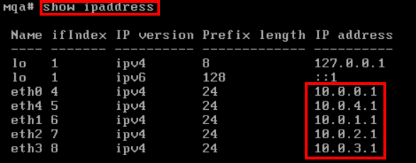

2. Double-click the **Firefox** icon on the Windows image to start a web
    browser session (login as **ibmdemo** / **passw0rd** if necessary).

	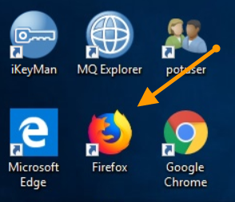    

3. Navigate to **https://\<address of eth0\>:9090** or click the bookmark for MQAppl1.

	If you receive any exception messages when opening the console URLs, add an exception and continue. 
    
4. The login screen for the IBM Appliance web UI will be displayed.

    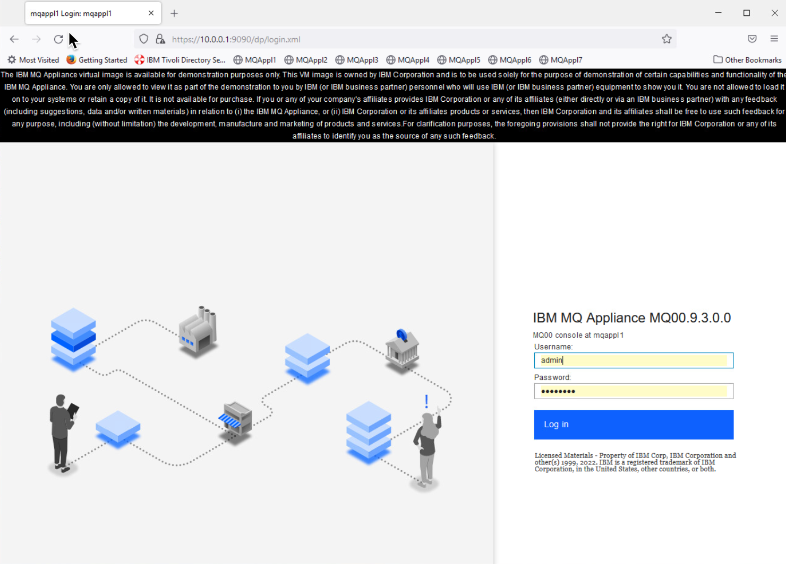

5. Enter **admin** and **passw0rd** for the user name and password,
    and click **Login**.
    
## Exploring the Appliance Administration Web UI 

### Getting started with the Web UI 

1. Take a few minutes to explore the main features of the MQ Appliance
    web UI.

    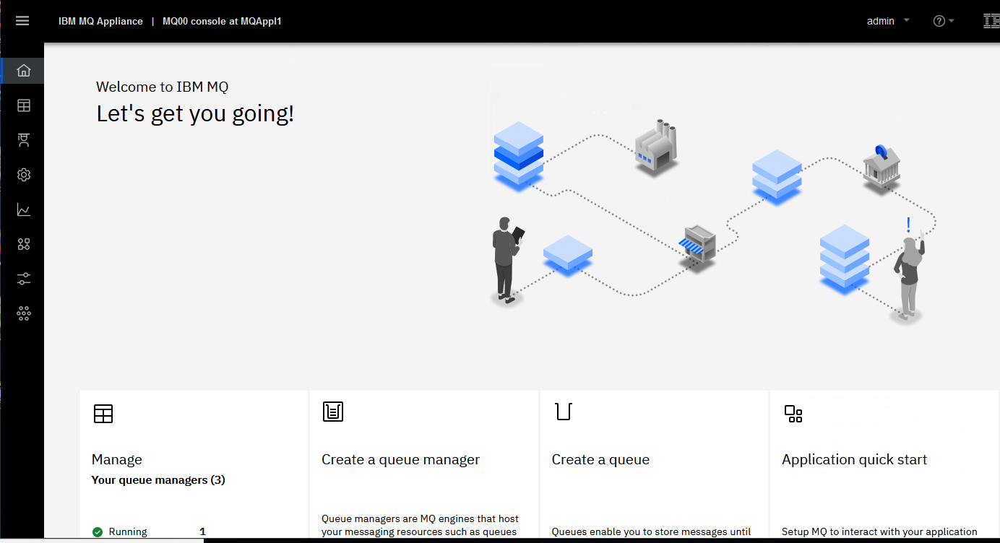
 
	> <span style="color: Blue">**Note:** <BR>On the MQ Appliance,  'Appliance Administration' and 'MQ Administration' are separate roles. Neither is a superset or subset of the other.</span>
  
2. Notice the drop downs at the very top on the grey bar. This is the
    one part of the Web GUI that does not change when you select
    different options.

    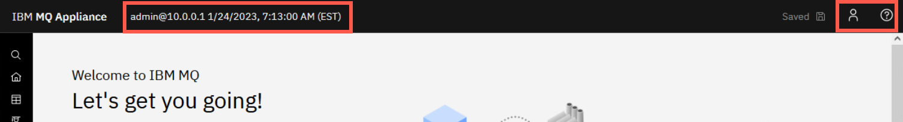

3. The "admin" shown on the bar is the user name logged into the Web
    GUI. When you click the drop down arrow here, you get the option to
    logout. The circled question mark is the help menu. Clicking the
    drop down arrow here gives you options to get to IBM Documentation for the MQ Appliance, the Support Portal, or to generate an error report
    that contains configuration information, trace snippets, etc. for
    the 'system' level processes on the box.

    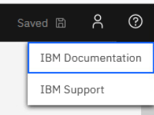

4. Next, you see that there are quite a few options along the left
    edge of the interface, in the navigation bar.

    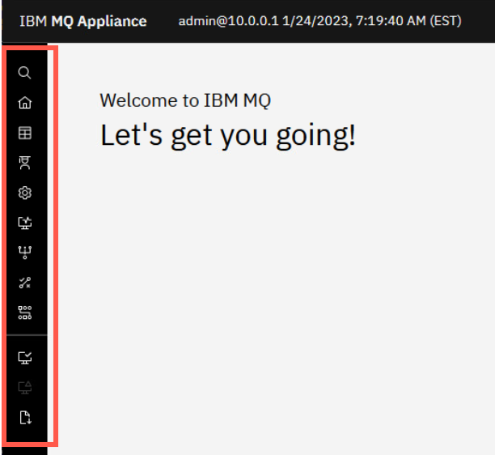

5. When you log in you start on the home page where you can manage your queue managers or link to the various other functions. When you hover your pointer over an icon, the name of the option displays. Click the **Manage** icon. 

    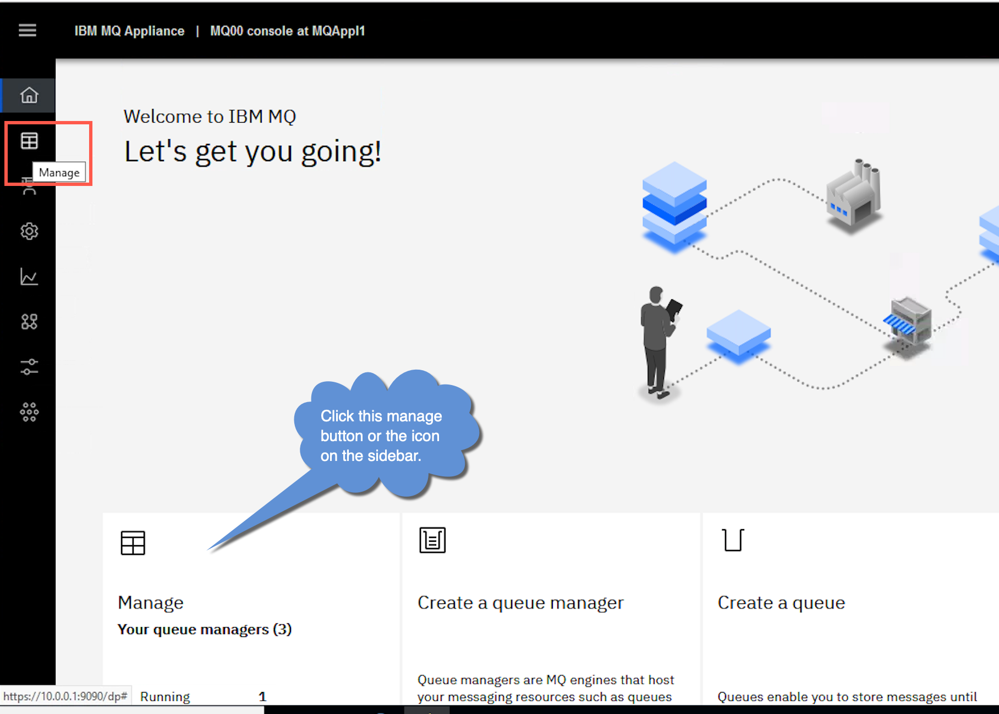
    
1. The queue managers on the appliance are displayed, either local ones or ones defined in the HA group. You also have the ability to create queue managers from this page.

	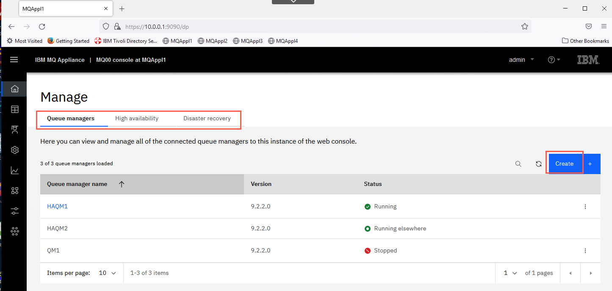
	
1. Click the arrow at the bottom left of window. 

	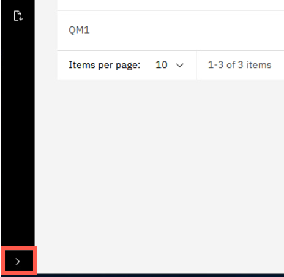
	
	This display shows what the icons mean.
	
	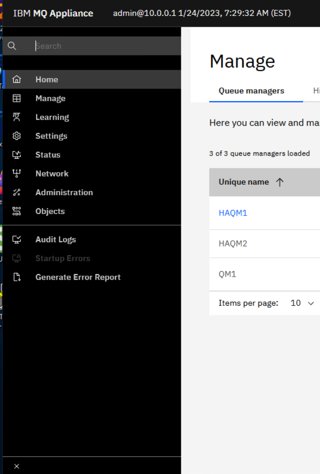	

## The Appliance Administrator role

### Explore the Appliance Administration options

The **appliance administrator** manages the appliance as a whole. A
    person in that role is managing the platform, not MQ resources.
    Before going into detail on the MQ Console, which is where an MQ
    administrator would spend all or the vast majority of their time in
    the Web GUI, let us first look at each of the other options that
    appliance administrators would largely use.

### Explore the Status page

1. Click the icon that looks like a graph, the **Status** icon.

    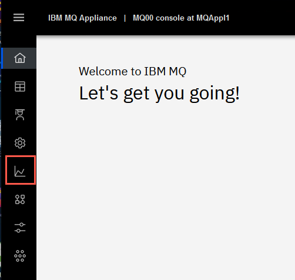
    
2. The Status page allows you to see the status of a large variety of
    components, including some appliance logs, active users (in the
    "Main" menu), date and time (in "Main"), appliance configuration,
    system components, network details, some MQ overview details, and a
    few other items. Again, this is status information -- not where you
    configure anything. Note the ability to search for a component to
    retrieve status for, and the ability to refresh the information.

    Feel free to look around the various options in this and all the
    panels.

    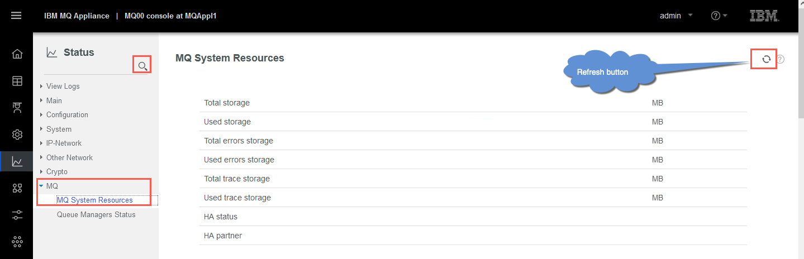

3. Click the twisty for **View Logs**. 

    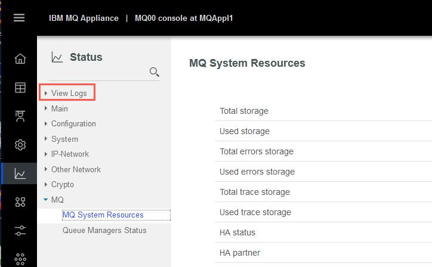

4. You then see the various options under the View Logs category. Now
    click **System Logs**. The page will now display the list of log
    records in the system log. We do not care right now what is in the
    logs. Click the **question mark** symbol (top right corner).

    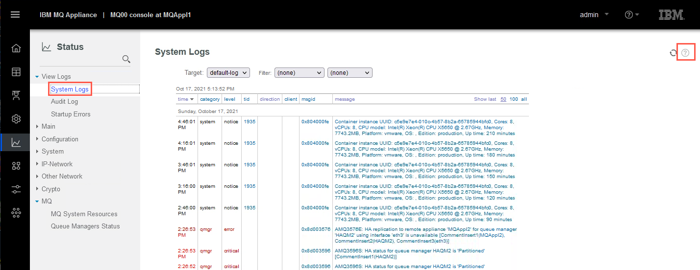
    
5. This brings up a help popup box explaining this option. Click the
    **X** to close the window.

    

### Explore the Network page

1. Click the **Network** icon. The Network page allows you to manage
    the interfaces on the appliance, the network, and the SSH/web
    management services. Again, you can search for a specific option,
    refresh the screen, filter the list, and perform actions on a
    selected item. Help is available for each option.

    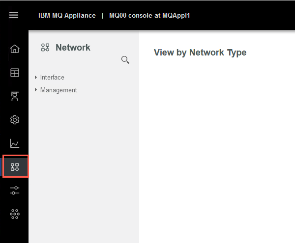

2. Click the twisty for **Interface** and then the **Ethernet
    Interface** option.

    You should recognize the Ethernet interfaces you configured in
    Lab 1. Feel free to explore but do not change anything.

    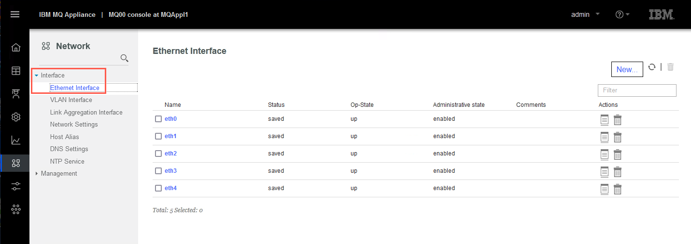

### Explore the Administration page

1. Click the **Administration** icon. The Administration page allows
    you to manage various aspects of the appliance configuration,
    including admin users, as well as perform some network
    troubleshooting.

    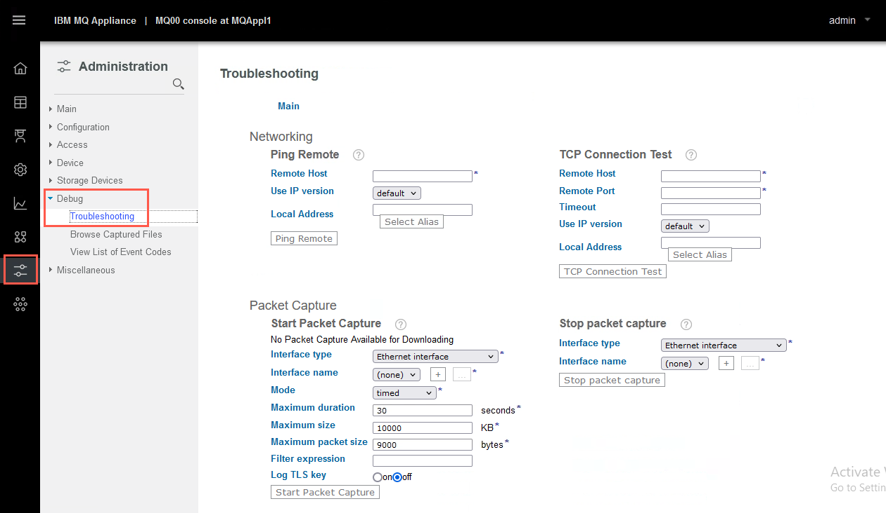

2. Click the **Access** twisty and then the **User Account** option.
    These are the administration user accounts, not messaging users.
    Messaging users cannot currently be defined in the Web GUI.

    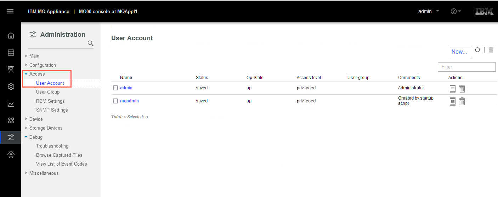

3. Now click the **Device** twisty and then the **System Settings**
    option. Briefly review the System Settings that are managed by the
    appliance administrator. Note that none of these are MQ-related.

    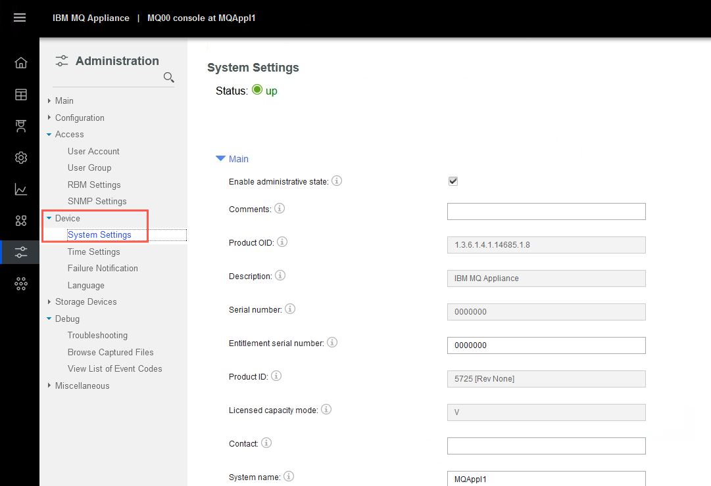

4. You can hover over
    the hotspot next to each property to see a
    description of that property. Of course, clicking the question mark
    provides help for the whole page.

    Note that some properties are greyed out, and are read-only -- these
    either are fixed, or can only be modified using the appliance's
    command-line interface.

    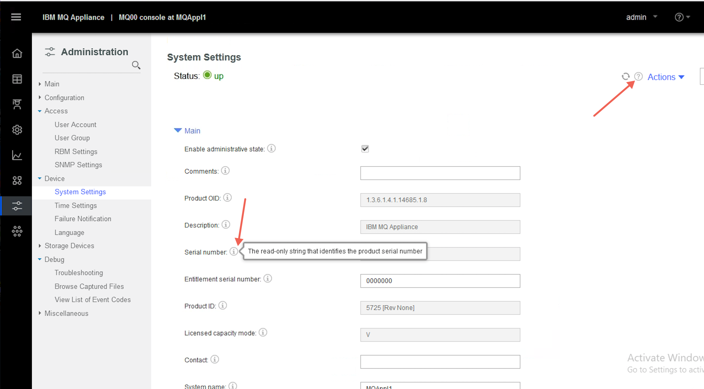

5. Make a small change to the configuration.

    In the **Comments** field, enter a comment of your choice.

    Notice that the **Apply** button is no longer greyed out.

    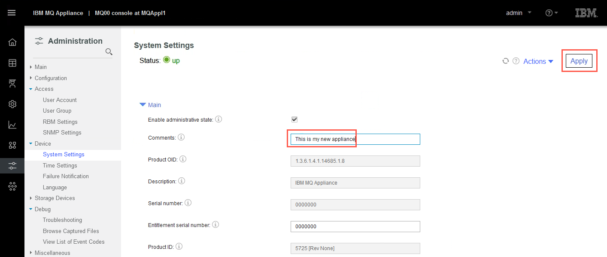

6. There is an Apply button at both the bottom of the page and the
    top. Click **Apply** at the top of the page to apply the change.

7. Actually saving changes is a two step process. A yellow box appears at the top of the screen, warning you to save the changes (changes are not actually saved to the system until this is done). Click **Review changes** to see a window
    detailing the changes that will be made. (If the box is not shown, simply click **System Settings** again or click on any other
    option, which forces the interface to recognize the need to save the
    changes there were made.) 

    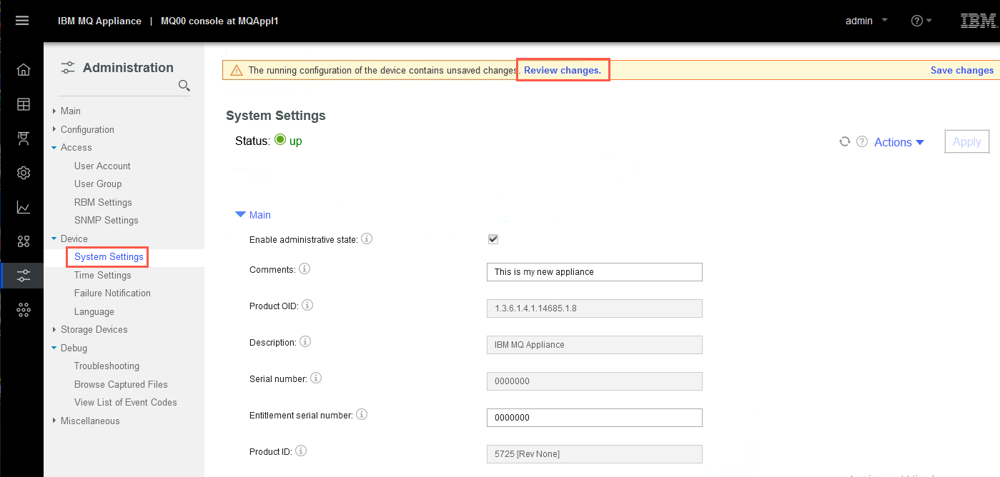

8. The window shows an entry for the change, showing what property is
    being changed (the "Comments" property in the "System" settings on
    the "System Settings" group), shows the "From" (which was blank) and
    "To" values, and the type of modification (in this case it is being
    "added" since it was blank -- as opposed to). Close the window.

    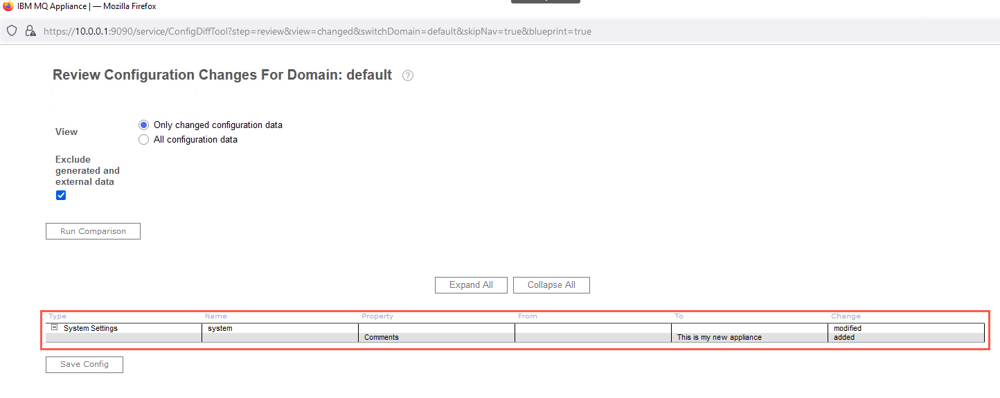

9. Now click **Save changes**.

    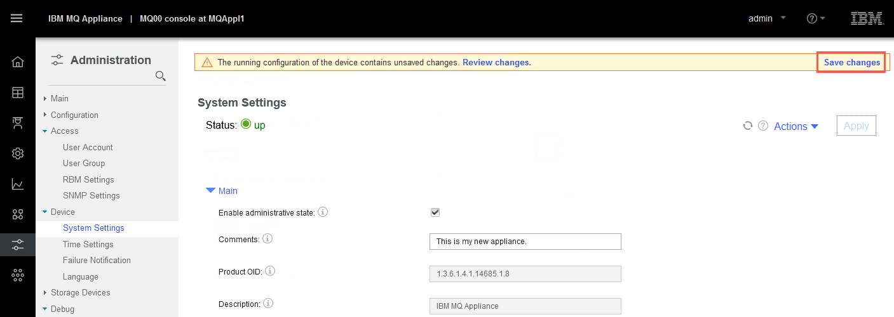

10. The screen will show a progress box while the change is saved, and
    then refresh to show the current, updated, settings.

    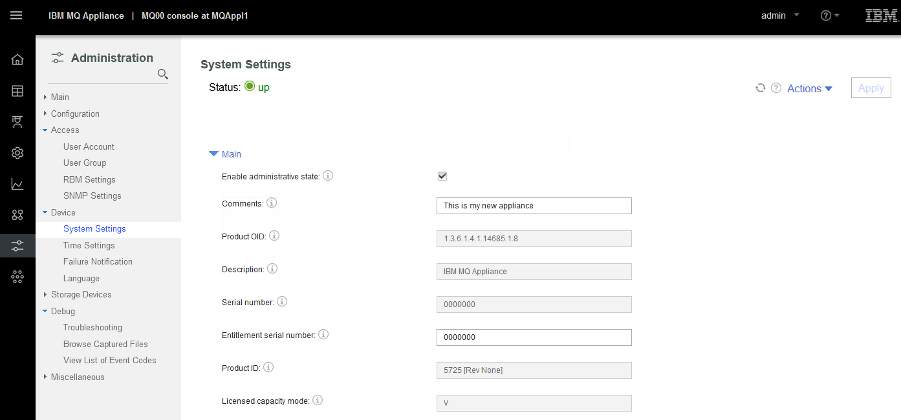

	When using the various administration tools, it is important to
    remember to click the "*Save changes*" button to actually make the
    change.

11. Within the Administration page is the File Management tool. This is very useful for copying files on (such as certificates or firmware)
    and off (logs, FDCs, backups, etc.) the appliance. This is where
    within the GUI you can access error logs (in the mqerr: URI), etc.
    
    Click the **Main** twisty and then click **File Management**.
    Folders that have content are indicated with a plus sign on the
    folder, such as 

    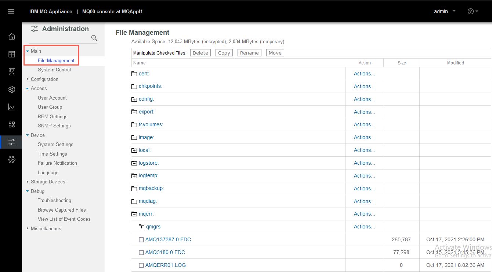

12. Notice the ability to delete, copy, rename, and move checked files
    as needed. You should be careful with this access to be sure you do
    not lose a file (move it accidentally or delete it) that you need.

    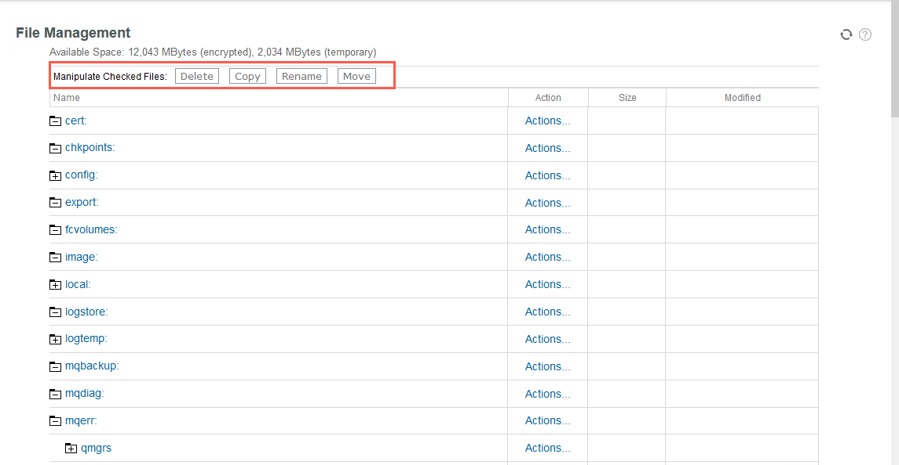

13. Click the **mqerr:** folder, then the **qmgrs** folder, and finally
    the **QM1** folder. Click one of the .LOG files that has content (a
    non-zero size), such as in the below **AMQERR01.LOG**.

    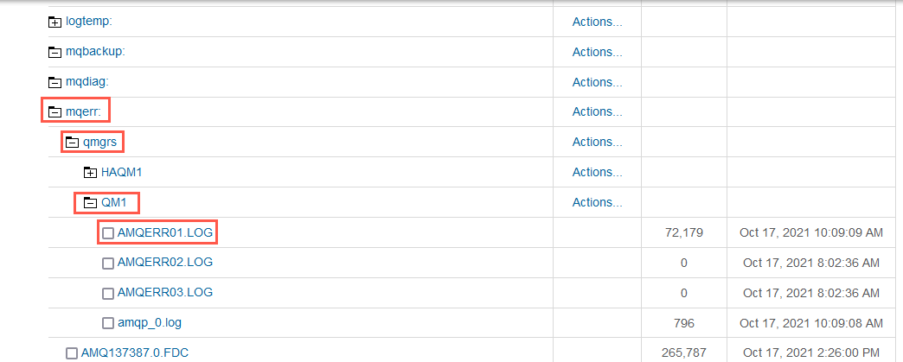

14. Since it is a text file, we can open and view the file. Clicking the hyperlink for the file opens it in a new tab in the browser. Close the browser tab and return to the MQ Appliance Web GUI.

    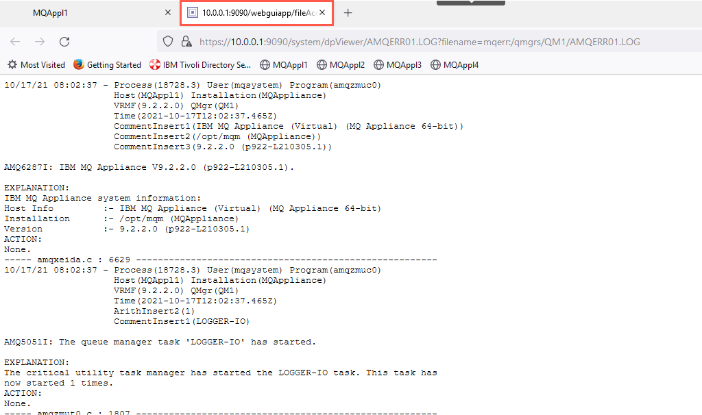

15. If you want to save any file on your system, then you will use the
    standard browser facilities to save a file. Right click the same
    file you opened in the previous step (AMQERR01.LOG), then click
    **Save Link As...**.

    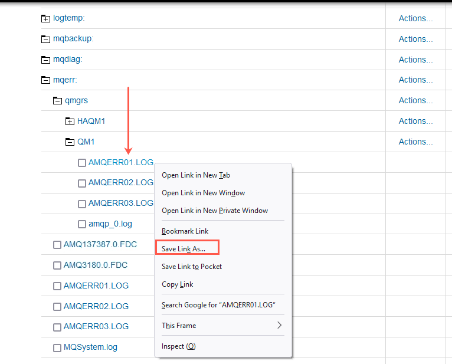

16. Select the **Local Disk (C:)** > **Users** > **ibmdemo** as the destination, then click **Save** to save the file on your local system. This is how you can save backup files, logs and FDCs, etc. off the appliance.

    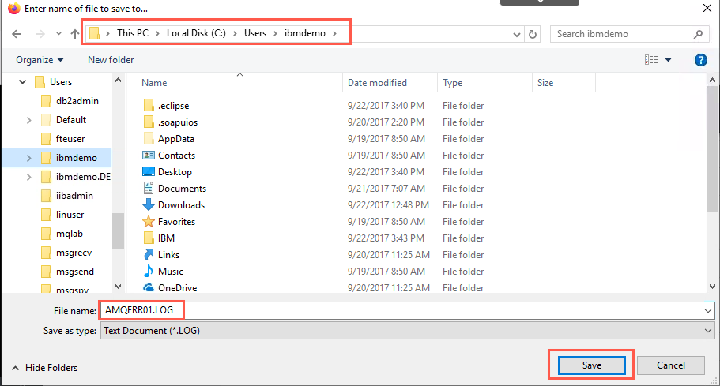

17. If you wanted to upload a file, such as a new firmware image into
    the **image:** folder, you would click **Actions...** in the Action
    column within the row representing the folder where we want to
    upload to, and then click **Upload Files**. That opens a dialog that allows you to browse files from your computer, to select to upload to
    the appliance. You will see this in another lab.

    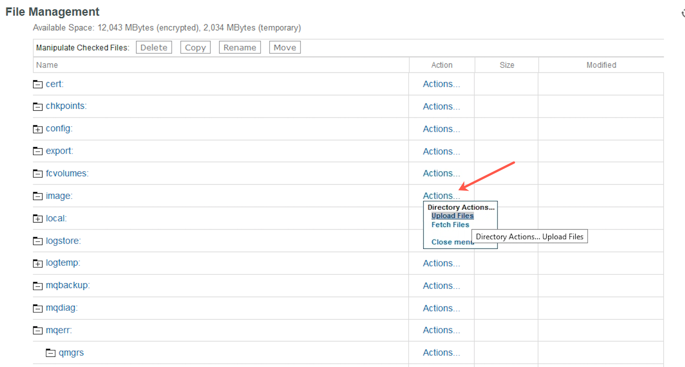

	Other files offer different actions, such as "Edit" where
    appropriate.

### Explore the Objects page

1. Click the **Objects** icon. The Objects page allows you to manage
    all the appliance objects. Note some objects here are duplicated in
    other options, but there are some specific objects that are only
    found here too. 
    
    
    
2. Click the **Device Management** twisty and then
    click **REST Management Interface**. You notice that the SSH Service
    and Web Management Service options are duplicated, as they can be
    accessed in the Network page under Management. However, this is the
    only place you can access the REST Management Interface.

    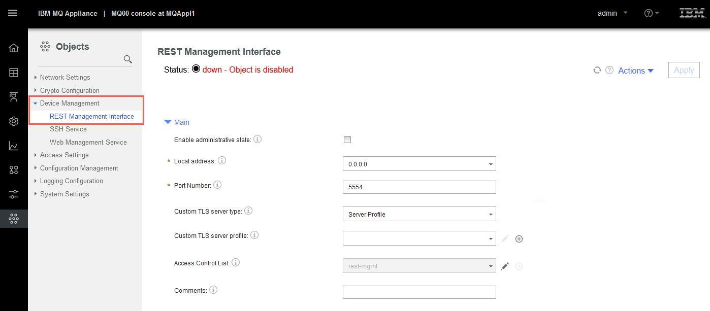

    All the configuration settings reviewed in this section apply to the
    M2002 appliance as a whole.

    In later labs, you will return to some of these appliance
    administrator views and explore these in more detail.

    The rest of this lab will focus on the MQ administrative role of the
    MQ Console.
    

## The MQ Console dashboard

### Explore the MQ Console for managing queue managers

1. Now let us return to the MQ Console. Click the **MQ Console** (Home) icon in the Web GUI. 

	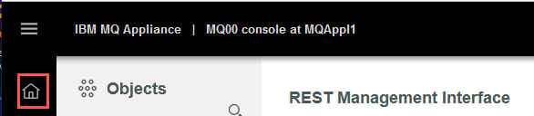
	
1. Then click **Manage**. Let us now complete exploring the functionality in
    this page.
    
    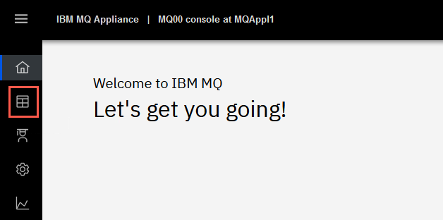

2. Notice the buttons across the top of the page:

    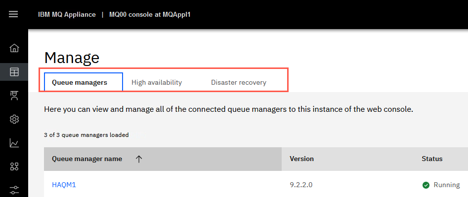

3. Click the **High Availability** button. This provides an overview of your HA configuration. The green checkmarks are a quick signal that high availability is configured and working, meaning that the *HA group* is configured correctly and both appliances in the HA group are running. 
    
> <span style="color: red">**Important:** <br>What you see here depends on if you started both MQAppl1 and MQAppl2 as instructed.</span>

    If one appliance was shutdown or suspended from the HA group, you would
    see it show the status appropriately. 
    
    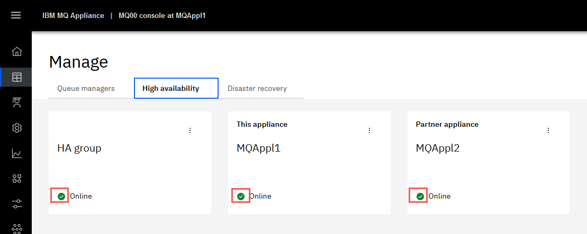
    
    Assuming the appliance is online, you can suspend the appliance from the group. If the appliance is suspended, you have the option to resume the appliance.
    
    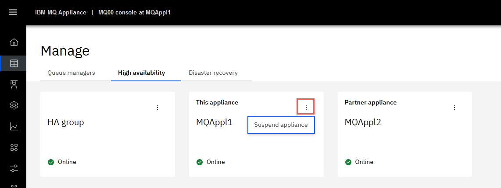
    
    You also have the option there to delete the HA group. You can also manage the 'keys' for the HA group.
    
    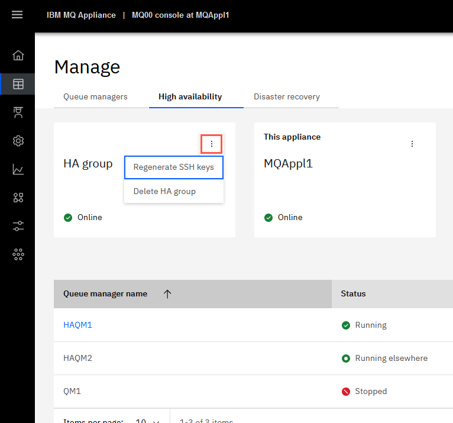    
     
    The other options here are to get the details on the HA queue manager status and to show if the
    queue managers are in a normal state or if they are partitioned.
     
    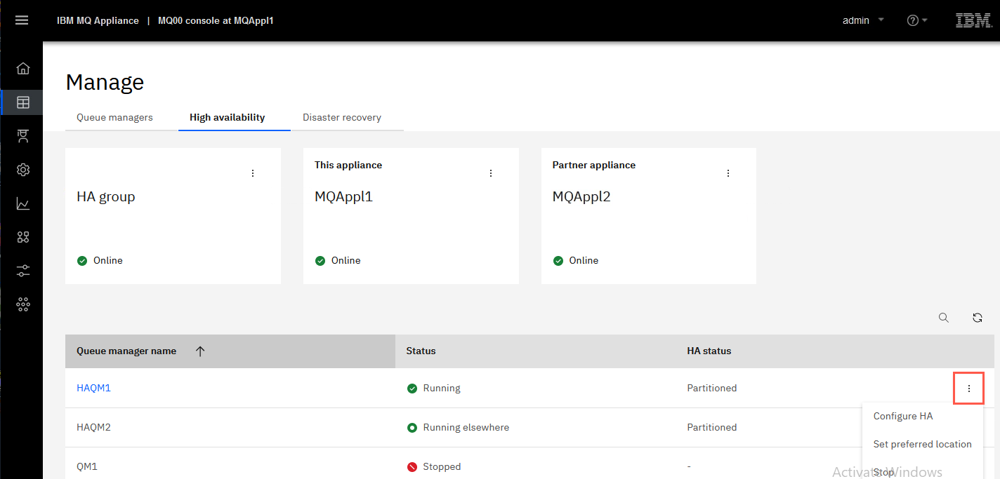

4. Click the **Disaster Recovery** button. Here are options to get the
    DR queue manager status and where you can use the GUI to create the
    DR secondary (more on this in the DR lab).
    
    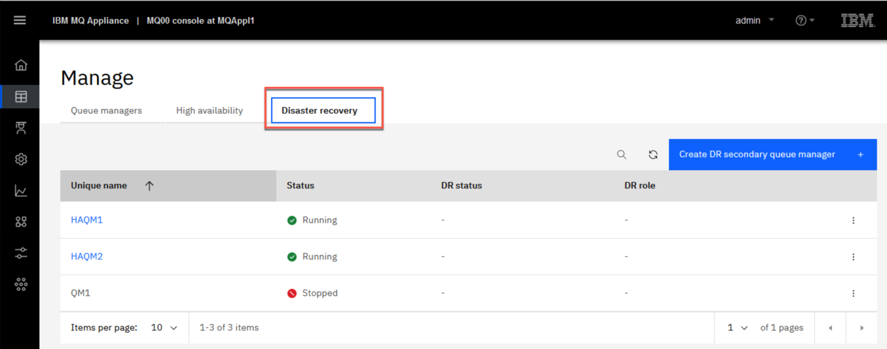

### Local Queue Managers

1. Click the **Queue managers** button to work with the local queue managers. Remember that you are on **MQAppl1's** console. By default, all queue managers on the appliance will be displayed. You should see the queue manager that was created in Lab 1 (QM1), and Lab 2 (HAQM1 and HAQM2). 

	This display shows all queue managers that have been defined on this appliance and their statuses. *HAQM1* is currently running on this appliance. QM1 is a local queue manager, but not part of the HA group. It is currently stopped. *HAQM2*, since it is part of the HA group, was defined on this appliance, but it is currently running on its preferred location - MQAppl2.

	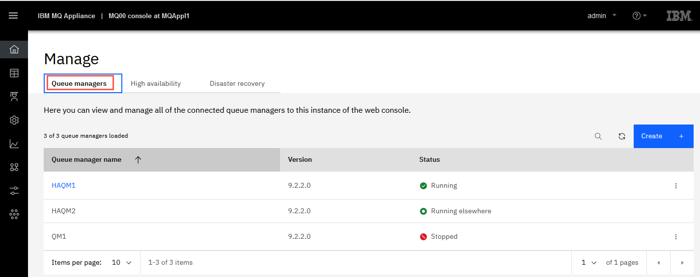
    
    > <span style="color: Blue">**Note:** <BR>If QM1 does not have a status of Running, that is not a problem. You will start it shortly.</span>

1. Click the hyperlink for **HAQM1**. 

	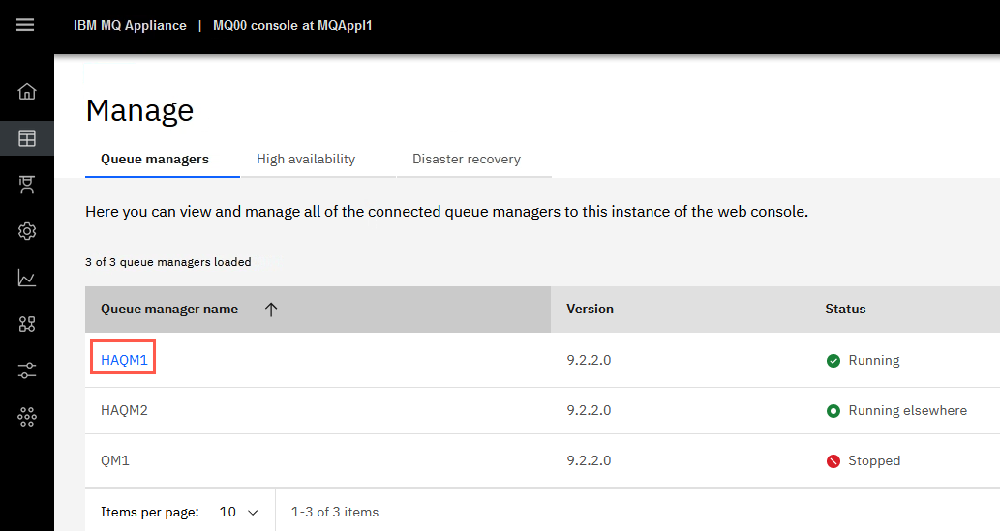
	
	This should look familiar as you used this during Labs 1 and 2. Here find MQ objects such as queues, topics, subscriptions, and communication channels. 
	
	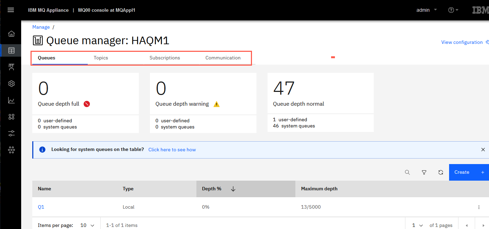	
1. Click the **Manage** breadcrumb to return to *Queue managers*. 

1. Click the elipsis on the far right of *HAQM1*. Here you can stop or start the queue manager or view the configuration (properties) of the queue manager. Click **View configuration**.

	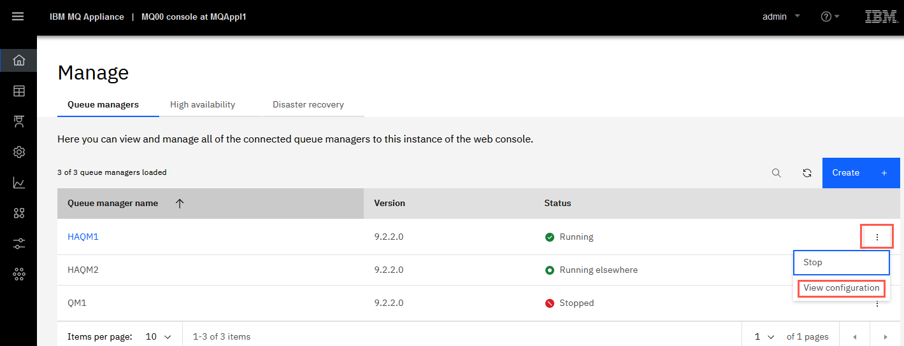
	
1. This page should also look familiar from Lab 1 where we looked at queue manager properties and security. If you look closer, you see two new tabs since we now have an HA group - *High availability* and *Disaster recovery*. Click **High Availability**.

	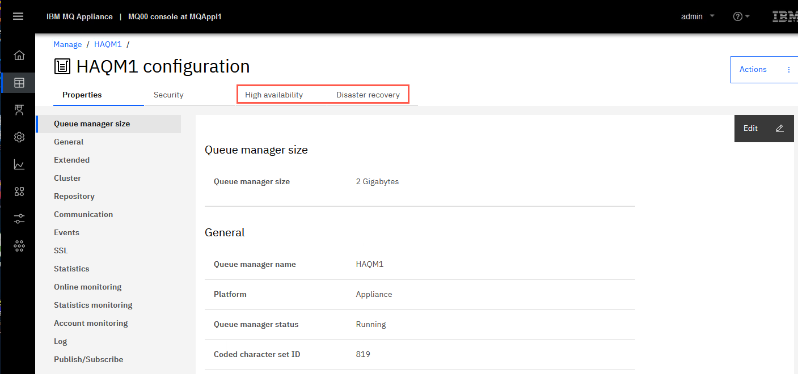
	
1. You ran *mqcli* commands to display the status of HA queue managers in Lab 2. This is where you find those statuses in the MQ Console. You can see that HA is enabled and the preferred location is this appliance - *MQAppl1*. 

	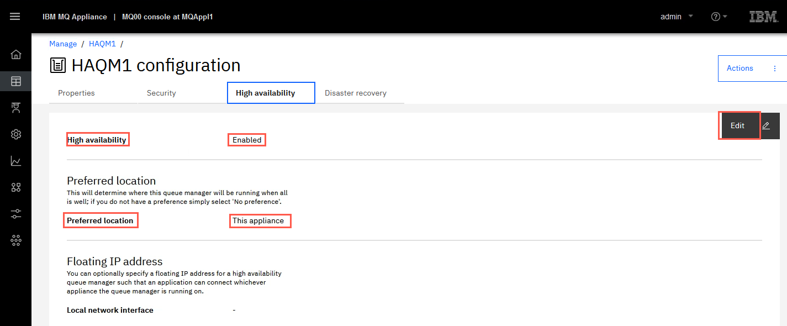
	
1. This not only displays statuses, but you can click the **Edit** button and change those properties. Don't make any changes at this time. Click **Cancel**.
	
	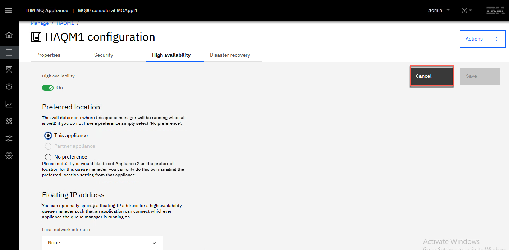
	
	> <span style="color: Blue">**Note:** <BR>Since HAQM2 is running on MQAppl2, you would need to use the MQ Console for MQAppl2 to see HAQM2 status or change its HA config.</span>
	
1. Click **Disaster recovery**. This is where you can setup the disaster recovery between appliances. There is a disaster recovery lab which will cover the setup. Click the **Manage** breadcrumb.

	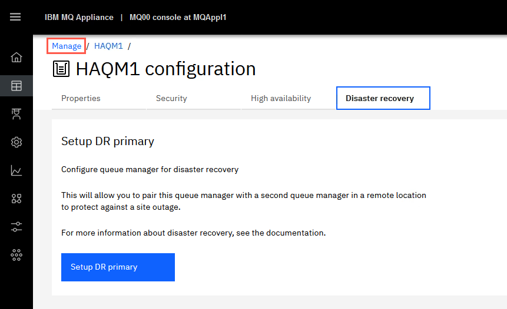	
### Remote Queue Managers   

In the previous section, you managed local queue managers by using a separate browser tab and connecting to the dedicated console port for each server. Then you could manage all "local" queue managers on that server. For example:

```sh
https://10.0.0.1:9090
``` 

or 

```
httpsL//10.0.0.2:9090
```

IBM MQ 9.2.3 introduced the ability to manage queue managers running on multiple remote systems from a single IBM® MQ Console. These queue managers are referred to as "remote" queue managers. This allows you to manage local and remote queue managers from the same web browser. For example:

```
https://localhost:9443/ibmmq/console
``` 


You must prepare the queue manager on the remote system so that it can be administered remotely. This was previously done in the previous labs when queue managers were created on the MQ Appliances and the appropriate channel configurations were defined for remote connections.

You must also set up a configuration file that controls how you can use remote connections from the IBM MQ Console. You create the configuration file by using the setmqweb command with the remote parameter. You cannot edit the configuration file directly. Alternatively you can use the MQ Console to connect a remote queue manager. In the exercise you will connect two remote queue managers using both methods.

You use a client connection definition table (CCDT) in JSON format to specify the remote connection details. You can create a JSON CCDT by using a text editor or you can create one by using the IBM MQ Console. You can use *Notepad++* to create the ccdt. 

Alternatively, you can create the CCDT from the IBM MQ Console by specifying connection details directly as you add the remote queue manager.

#### Start MQ Appliance queue managers

Let's start the queue managers we will add to the console. You may use the MQ Appliance command line, the command using *Putty*, or the MQ Console for each appliance on the *Firefox* browser.

1. Using your choice of methods, start queue managers **QM1** on *MQAppl1*, **QM2** on *MQAppl2*, and **QM3** on *MQAppl3*.

#### Start the web server and MQ Console

1. From the Windows command prompt start the web server with the following command: 

	```
	strmqweb
	```
 
1. Once the server is started display the properties of the web server with the following command: 

	```
	dspmqweb
	``` 
	
	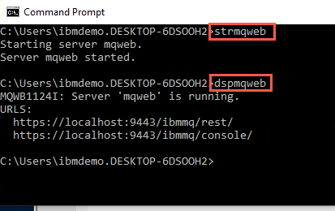

1. When you use the IBM® MQ Console, you can create connections to remote queue managers. That is, you can connect to queue managers that are not part of the same installation as the mqweb server that runs the IBM MQ Console.  

	We will use the *Chrome* browser for exercising the "central" MQ Console. Start the *Chrome* browser by double-clicking its icon on the desktop.

	

1. Navigate to the web server's URL:

	```
	https://localhost:9443/ibmmq/console
	```
	
	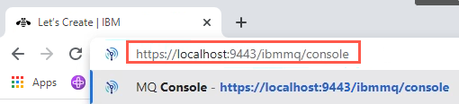
	
1. Sign onto the console with user **mqadmin** password **mqadmin**. Click *Login*.

	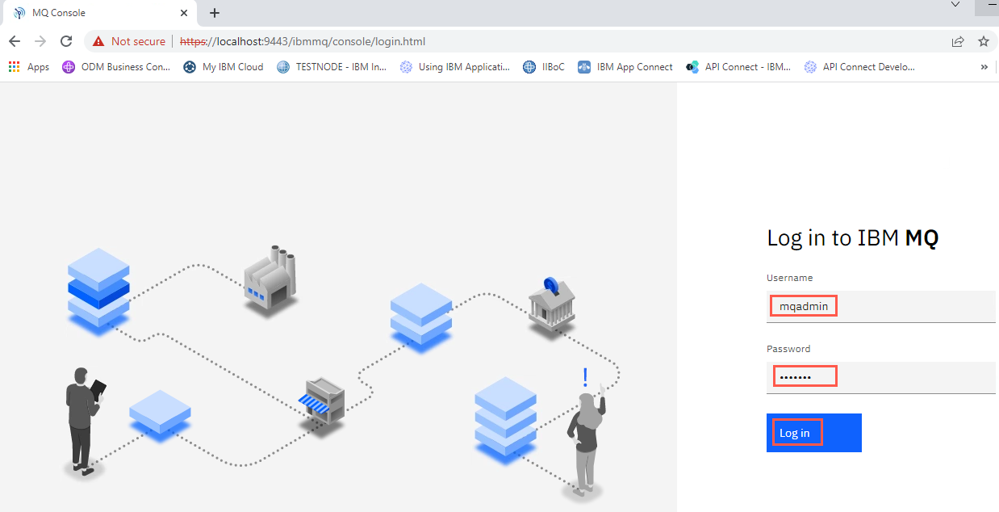

1. 	Review the *Home* page. Notice that there is no tile to add a remote queue manager. So you will use the command line to add a remote queue manager. Then we will fix the console to allow adding remote queue managers later. Also notice in the *Manage* tile that there is one queue manager running (that this console instance knows about). Is that a "local" or "remote" queue manager?

	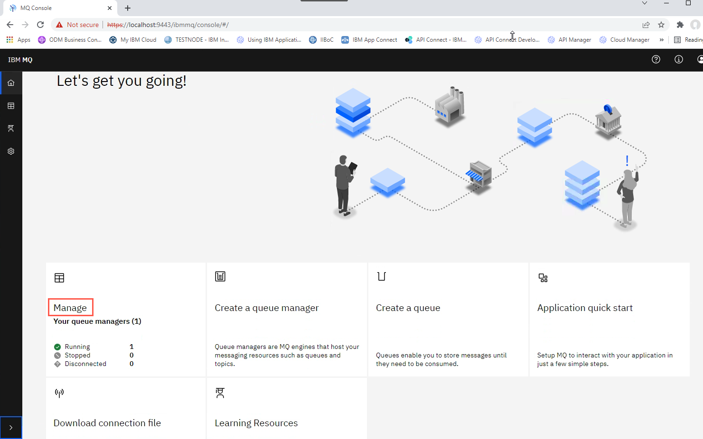
	
1. Click the *Manage* tile. It appears that there are no remote queue managers connected to the console. Click *Local queue managers*. 

	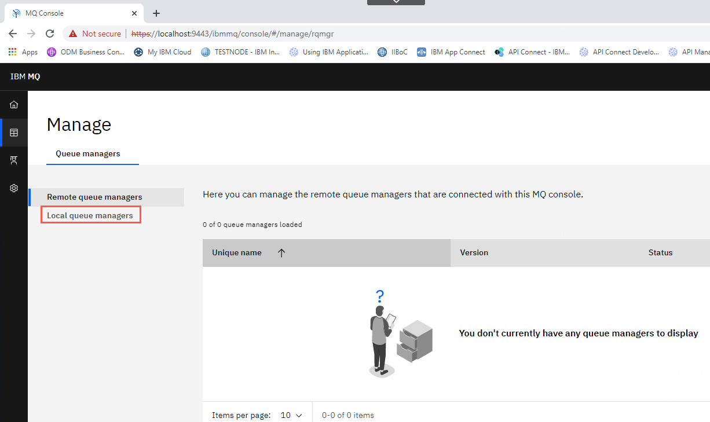
	
1. Now you see the active queue manager - *QMMFT*. But it happens to be running on your local workstation. This is not a queue manager that we are interested in as it is not running on the MQ Appliance.

	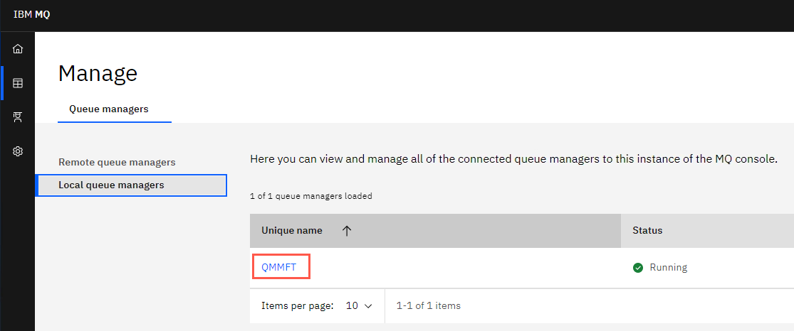

#### Add remote queue manager using the command line
	
1. Open the *Notepad++* text editor by double-clicking its icon on the desktop.

	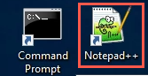
	
1. Click *File* > *New* to create a CCDT for QM1 on MQAppl1; copy the following text and paste it into the Notepad++ editor. 

```sh
	{
  "channel": [
    {
      "name": "USER.SVRCONN",
      "clientConnection": {
        "connection": [
          {
            "host": "10.0.0.2",
            "port": 1414
          }
        ],
        "queueManager": "QM2"
      },
      "transmissionSecurity": {
        "cipherSpecification": "",
        "certificateLabel": "",
        "certificatePeerName": ""
      },
      "type": "clientConnection"
    }
  ]
}
```

Then click *File* > *Save as* > **C:\MQ924\QM1-mqappl1.json**. Make sure to change the file type to *JSON file (\*.json)*. Click *Save*.

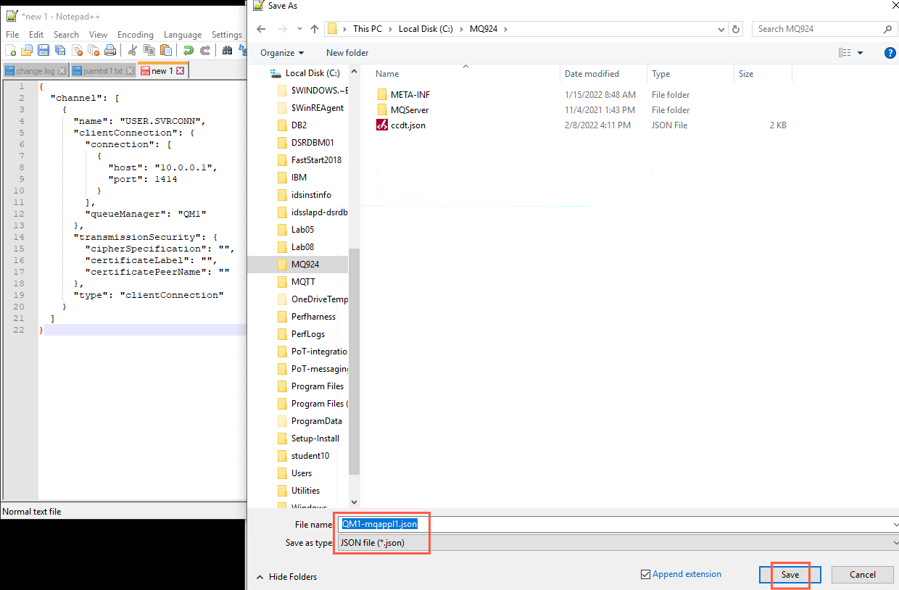

1. Now you have what you need to add the remote queue manager to the console using the command line. Return to the command prompt window. Enter the following command to add the queue manager: 

	```
	setmqweb remote add -uniqueName "QM1-mqappl1" -qmgrName "QM1" -ccdtURL "c:\MQ924\QM1-mqappl1.json" -username "ibmdemo" -password "passw0rd"
	```
	
	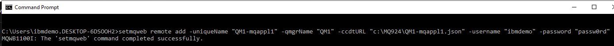
	
1. Return to the console in the Chrome browser. Click *Remote queue managers*.

	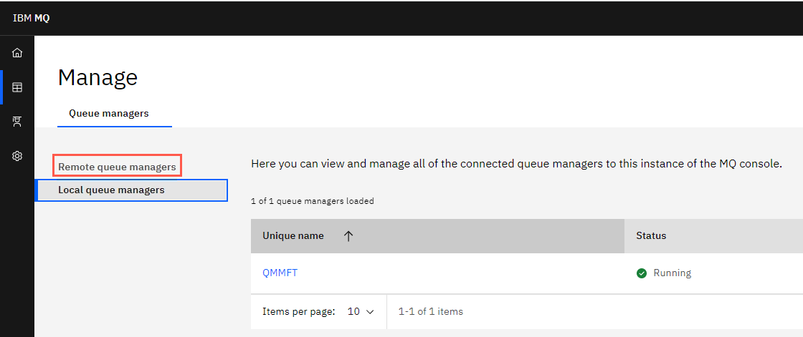
	
1. The remote queue manager has now been added to the console with the unique name you provided with the command. 

	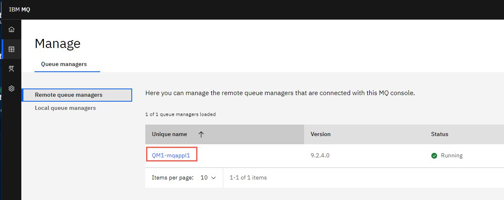
	
	The unique name is important because it is not the name of the actual queue manager. **QM1** is the queue manager that is running. Click the hyperlink for *QM1-mqappl1* and you will see the unique name beside *Queue Manager*.

	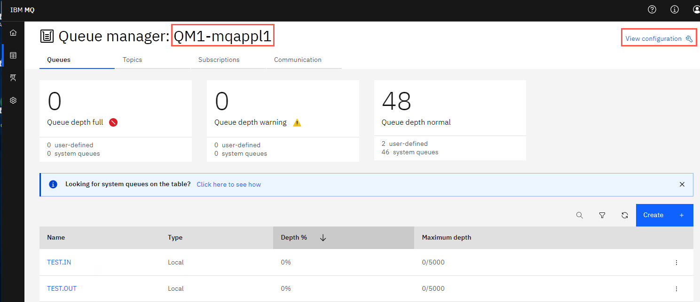

1. Click *View configuration*. Now you see the properties of the queue manager and the actual queue manager name - **QM1**.

	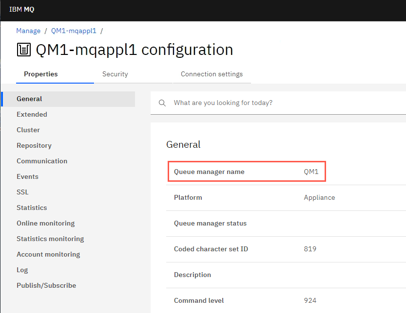
	
1. Click the *Manage* breadcrumb to return to the main display. Now you can see either the local queue managers or remote queue managers. You can see the status and manage multiple queue managers running on multiple servers or appliances.

	Next, you will add a remote queue manager using the console. 	
#### Add remote queue manager using the MQ Console

Remember when you first logged into the console you noticed that there was no tile to add remote queue managers. You need to add the tile to allow you to add remote queue managers. There are a number of configuration options you can set to control the behavior of the remote queue manager connections.

1. Return to the Windows command prompt and enter the following command to display the properties.

	```
	dspmqweb properties -a
	``` 
	 
1. Review the properties for *mqConsole...*. Look for the property **mqConsoleRemoteUIAdmin**. This property is to prevent or allow remote queue manager connections to be added by using the IBM MQ Console, or by only the command line. Notice it is set to *false*. 
 
	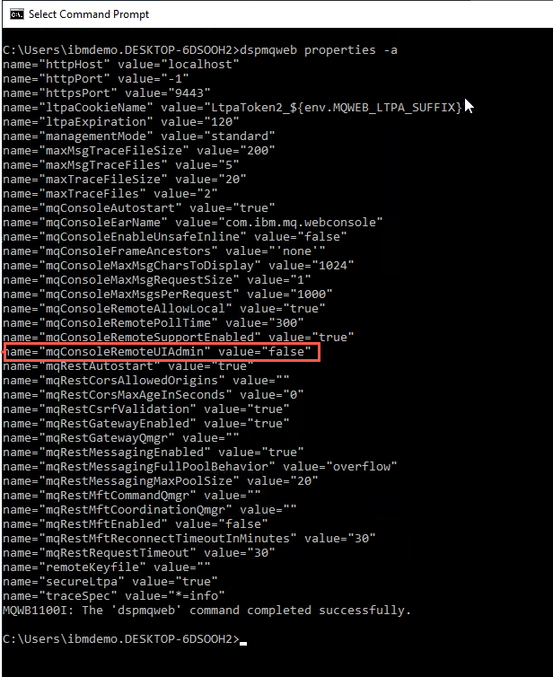
	
	You need to enable this property to add remote queue managers from the MQ Console. Enter the following command:


	```
	setmqweb properties -k mqConsoleRemoteUIAdmin -v enabled
	```

	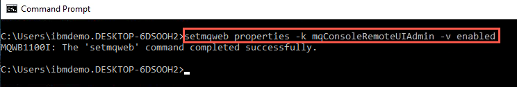

1. Now you need to restart the web server. In the command prompt enter the following command to stop the web server:

	```
	endmqweb 
	```
	
	Then restart the server with this command:
	
	```
	strmqweb
	```
	
	

1. Return to the Chrome browser where you are logged onto the console. Click the *Home* icon. If you are already on the *Home* page, refresh the page. You will now see the tile *Connect remote queue manager*.

	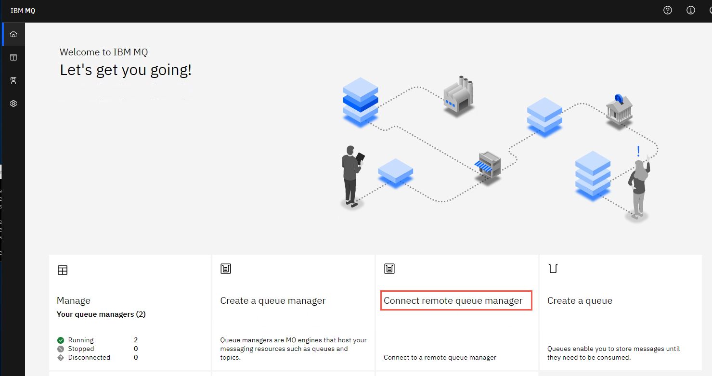
	
1. Click the *Connect remote queue manager* tile.

1. This time connect queue manager **QM2** which is running on *MQAppl2*. Enter **QM2** in the *Queue manager name* field. For the *Unique name* follow the *qmgr-hostname* naming convention so enter **QM2-mqappl2** in the *Unique name* field.
	
	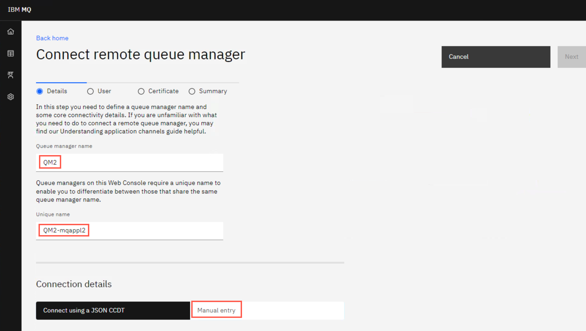
	
	You could create another *ccdt.json* file and upload it like you did previously. But this time try typing in the connection information. Click the *Manual entry* button.
	
1. Enter **USER.SVRCONN** for the *Channel name*, **10.0.0.2** for *Host name*, and **1414** for the port. Click *Add*.
	
	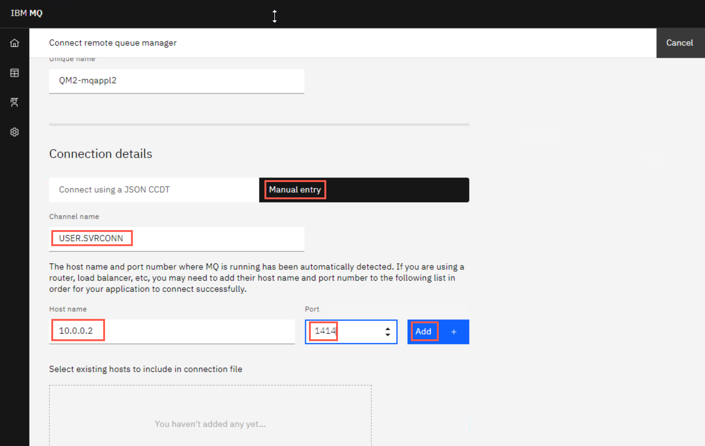
	
1. Click *Next*.

	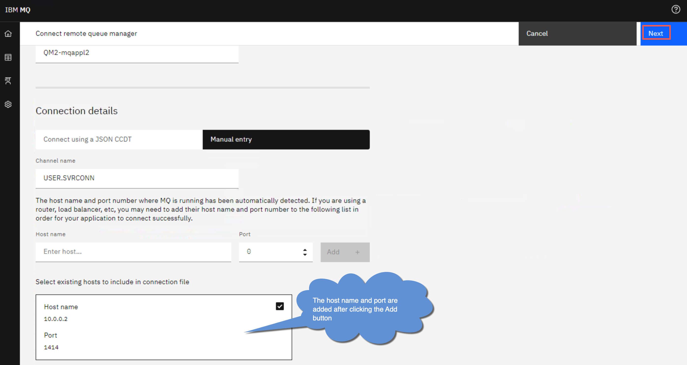
	
1. For the user information enter **ibmdemo** for *User ID* and **passw0rd** for *Password*. Click *Next*.

	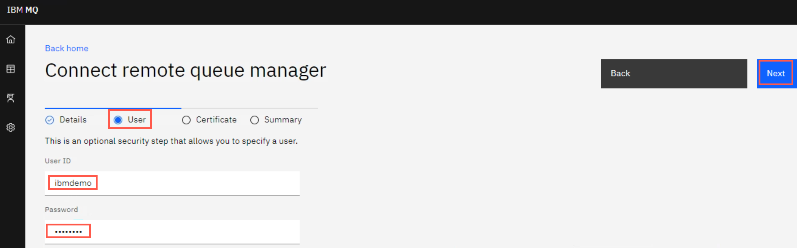

1. You will not use TLS for this queue manager so leave the defaults on *Certificate* page and click *Next*.

1. You are taken to the *Summary* page. Review the information to make sure it is correct. Click *Connect*.

	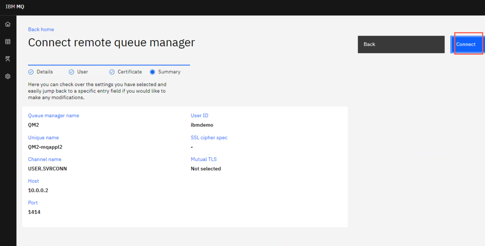
	
1. You receive the success message.

	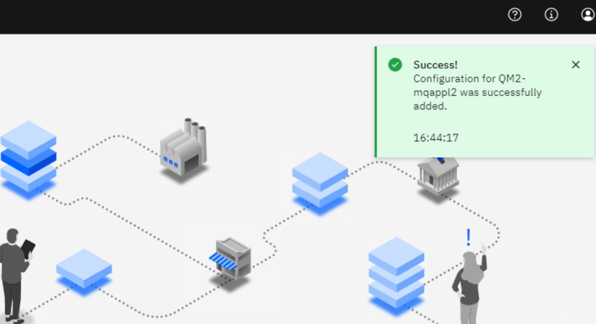
	
1. Click the *Manage* tile to see the queue managers. 

	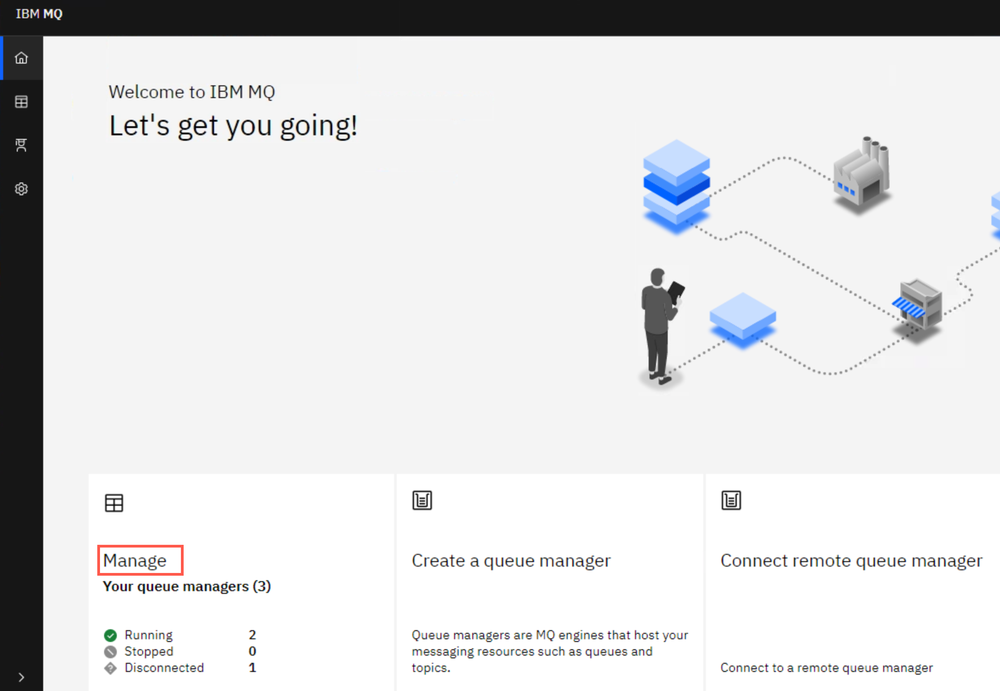

	You should now see that both remote queue managers have been added and are running.

	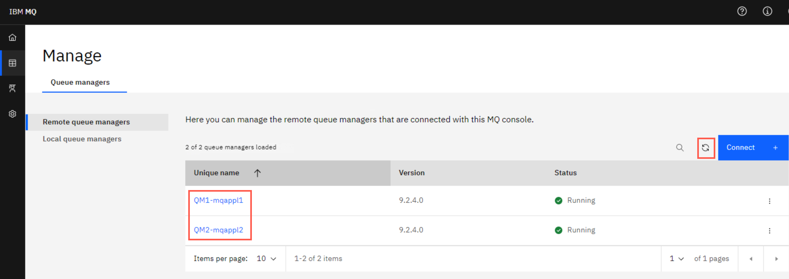
	
	If you receive a connection error, make sure that the queue manager is running then refresh the page. 
	
	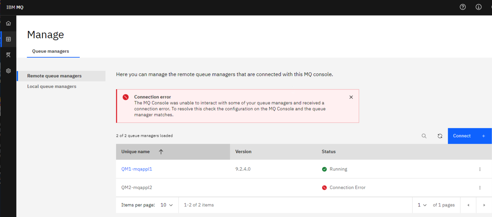

You have now used both methods to add a remote queue manager to the central console. You should have queue manager QM3 running on MQAppl3. If you have enough time you can try to add it with either method.

## Congratulations

This concludes the MQ Console lab.
You should now feel comfortable using the console to manage your appliances.	
	
## Clean Up

The only clean up required is to close the MQ Console browser tabs. 
However, if you plan to continue with more labs, you can leave them running.


This concludes the IBM MQ Appliance Web UI and MQ Console lab.

[Return MQ Appliance Menu](../index.md)

[Continue with Lab 4](../lab4/mq_appl_pot_lab3.md)

 