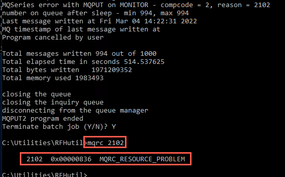

# Lab 4 - Monitoring and Troubleshooting

## Monitoring and troubleshooting

VMs required:

* **Windows 10 x64**
* **MQAppl1**

### Monitoring and reporting

For this lab, you will use one virtual appliance, MQAppl1, and a Windows environment to perform console operations. There are other virtual appliances (MQAppl2, MQAppl3, MQAppl4, MQAppl5, MQAppl6, and MQAppl7)cthat will not be used in this lab. You should suspend them.

You will be exploring some of the options available for monitoring the
MQ Appliance using a combination of command line and reporting in the MQ Console. You will also look at how you can implement the use
of the application activity trace for the MQ Appliance. Finally, you
will see some of the commands available for diagnosing and resolving
problems.

### Monitoring system resource usage

1.  Open the *MQAppl1* image, if it is not already running from previous
    labs, and login (**admin** / **passw0rd**) if needed.

	Before you investigate the MQ-specific resource monitoring, you will
start by monitoring the operation of the appliance itself. You can use
the *show* command to monitor different aspects of the appliance.

	You can use the show command to view information about how an aspect of
the appliance is configured or to monitor aspects of the appliance
operation. The status_provider argument specifies which information you
view. The show command is available at login, and in most configuration
modes.

	There is a large list of *status_provider* values available for the *show* command. The complete
list can be found in the IBM Documentation for the MQ Appliance.

	You will investigate a few of these.

2. If you are at the *mqcli* command prompt, exit from it.

3. First, enter the *show* command. This will give a list of all of
    the available *status_provider* values.
    
    > <span style="color: red">**Important:** <br>For this lab the appliance clock should be  synchronized with the Windows desktop VM time. Automatic time sync is not available on the virtual MQ Appliances. Therefore the time on the appliance will start from the time the VM was last shut down or suspended. You should make sure the appliance time is in sync with the Windows desktop VM time. Use the \"show clock\" to display the time. If it doesn't match, use the \"clock\" command to set the appliance time to sync with the Windows time.</span> 
    
4. Now enter *show version*. This will show the firmware and library version, similar to what is shown below.

	

	One of the other things that you can find out from the show command is
which users have been defined for the appliance.

5. Enter **show usernames**

6. You should see two users: the admin user, which was pre-configured,
    and the user that you set up in the first lab as the user authorized
    to reset passwords.

	

7. You can also use the show command to give a list of logged-on users.
    Enter **show users**.

	You can see below that the admin user is logged on via the serial
    port (which is you entering commands in to the console) and also
    logged on to the MQ Console (if you are not logged on, log on to the
    MQ Console [web admin] and rerun the command).

	

8. Next, get monitoring information about the MQ environment on the
    appliance.

    Go to the MQ command line interface.

	**`mqcli`**

9. Using **dspmq**, verify that the *QM1* from the first lab is running.
    If the queue manager is not running, start it.
    
    

	You will now use the status command to view information about resource allocation.
    
    You can use the status command to view the following information about the system resources on the appliance: 
    
    * the size and usage of the system memory of the system
     
    * the CPU usage of the system, the size and usage of the internal disk

     
    * the size and usage of the system volume

     
    * the number of FDCs and the disk space used

    
    * the disk space used by trace 


10. Enter the command: **status**

	You will see a response similar to the following:

	
	
	 More about the status command: 

    You can also use the status command to view the following information about the system resources that are used by a queue manager: 
    
    
    * the queue manager name
     
    * the queue manager status

     
    * an estimate of the CPU usage of the queue manager

     
    * an estimate of the memory usage of the queue manager

    
    * the amount of the queue manager file system used by the queue manager

    
    
    For a high availability queue manager, additional information can be viewed: 
    
    
    * the file system size for the queue manager
     
    * the replication status of the queue managers

     
    * the preferred appliance for the queue manager

     
    * whether a partitioned situation has been detected

    
    * if detected, the amount of 'out-of-sync' data held 


11. Enter the status command for QM1:

	**`status QM1`**

12. You should see a response similar to the following:

	
	
	You can use the amqsrua command to query metadata that is related to the
system resource usage of a queue manager.

	About amqsrua: 
    
    The **amqsrua** command reports metadata that is published by queue managers. This data can include information about the CPU, memory, and disk usage. You can also see data equivalent to the STATMQI PCF statistics data. The data is published every 10 seconds and is reported while the command runs. 
    
    
    * -n MaxPubs -- Specifies how many reports are returned before the command ends. The command publishes data every ten seconds, so if you enter a value of 50, the command returns 50 reports over 500 seconds.
	

    
    If you do not specify this parameter, the command runs until either an error occurs, or the queue manager shuts down.
	
        
    
    * -m QMgrName -- Specifies the name of the queue manager that you want to query. The queue manager must be running. If you do not specify a queue manager name, the default queue manager is used.   

<br>
13. You are going to report the metadata for a minute, while putting
    some messages on the TEST.IN queue from the first lab, and see the
    results.

14. Enter the command as follows:

	**`amqsrua -n 30 -m QM1`**

	with the following responses:

	**STATMQI** for the Class selection and **PUT** for the Type selection.

	
	
15. Either go to the MQ Console or to the MQ Explorer (in the Windows
    image) and put some messages on the **TEST.IN** queue.

16. Depending on which method you use, and how many messages you put on
    the queue, you will see results similar to the following:

	
	
17. Enter **CTRL-C** to end the amqsrua command.

18. Now you will move on to the MQ Console and see some of the reports
    that you can generate.

    If you are not already logged on to the MQ Console on the Windows
    VM, do so now.

19. Return to the **MQ Console > Manage > QM1**. Click the elipsis on far right for the **TEST.IN** queue and select **Clear queue**. 

	

20. Click **Clear queue** to confirm deletion of the messages.

	

### Resource Monitoring

As you are monitoring persistent messages, you need to ensure that the default persistence on the queue is set to persistent, because the MQ Console will put the message using persistent as per the queue definition.

1. As we already have all of the connectivity for this test set up for
QM1, go to the MQ console and create a new local queue on **QM1** named **MONITOR**.

	
	
	
	
	
	
		
12. Open the **Properties** of the **MONITOR** queue and change the
    default persistence to **Persistent** if it is not already set to
    that. Click **Save**.

	
	
	

1. As you saw in lab 1, some files and programs should have been provided
in the **perf** folder. These will again be used for this part of the
lab. The applications are part of SupportPac IH03. 

1. Go back to the command window you used earlier. If you closed it,
    open a **Command Prompt** window and change to the
    **C:\\utilities\\RFHutil\\** directory. 
    
    Open the **parmtst1.txt** parameters file in your favorite text
    editor, such as notepad.
    
    

7. Change the **qmgr** parameter to:

    **USER.SVRCONN/TCP/10.0.0.1(1414)**

8. Change the **qname** parameter to **MONITOR**.

	
	
9. Change the **msgcount** to **1000** and change the **qmax** to **6000**.

	

10. Go to the bottom of the file and change the file in the
    **\[filelist\]** to **\Setup-Install\BigFile.xml**

	

11. Save the file (**Ctrl+S**).

12. Close the editor (notepad) session.

13. Go back to the command window.

14. Execute the **driver.cmd** file. 

	You will notice once the program starts that the queue depth
    settings are as follows:

	

16. Below is the output from the example we have just run. You may not
    get the same result. If you did not receive an error, you may wish to increase the
    number of messages in the parmtst1.txt and rerun the driver.cmd.

	
	
	You have received an MQ error on the *MONITOR* queue. The reason code is 2102. If the 	script did not end, hit **CTRL-C** to end the job and reply *Y* to confirm. Make a note 	of the time the error occurred.
	
	Enter the following command to determine what the error means:
	
	```
	mqrc 2102
	```
	
	
	
17. Oops! You have run out of space for the queue manager!!! This is not
    likely to happen on a real appliance but you may recall that we have
    a very small queue manager file system size on our appliance). 

20. Go back to the MQ Explorer. Here you see the thousand
    (probably 994) messages you have just put on the queue. There may be
    more if you did not clear out messages from previous tests.
    
    

21. Clear the messages from the **MONITOR** queue on **QM1**.

1.  In the next section, *Troubleshooting*, you will check the MQ logs to find the error.

### Troubleshooting

As the last section of this lab, you will review the logs that are
available for troubleshooting. The MQ Appliance has a set of logs
similar to traditional MQ. In this section, you will understand where
they are stored on the MQ Appliance and how to access them.

First, look at where the MQ error logs are stored.

1. On the *MQAppl1* appliance command line, exit from any command if
    necessary and then exit from mqcli. This will take you back to the
    **mqa\#** prompt.

2. Enter the **config** command to take you into configuration mode.

	**`config`**

	

	Directory structures on the appliance are accessible in the form of
    URIs. There is a dedicated URI, *mqerr*, for accessing IBM MQ logs.

3. Enter the following command (make sure you put the colon at the
    end).

	**`dir mqerr:`**

4. You will see the structure of the log directories.

	

5. Enter the following command to see the QM1 queue manager logs. These
    will be familiar to anyone familiar with MQ:

	**`dir mqerr:qmgrs/QM1`**

	
	
6. Enter **exit** to exit configuration mode.

7. Go to the MQ command line interface -- enter **mqcli**.

	You can list or view the system error logs, queue manager error logs,
and first failure data captures (FDCs) by using the dspmqerr command.

8. Enter:

	**`help dspmqerr`**

9. This will list the options available for viewing the logs.

	
	
	About **dspmqerr:** 
    
    
    The command is based on the UNIX *less* command. The less command provides controls for navigating the contents of a file, and you can use these controls when you view system error logs.: 
    
    
    Try the following tips:

    
     
    * Use the arrow keys to scroll up and down the logs

     
    * Use the page, space, or return keys for simple scrolling

     
    * Enter *q* to exit at any time

    
    * Enter *h* to display full help while you view a log. The help lists further commands, for example, for searching for strings or jumping a set number of lines. 
    
	
10. Look at the AMQERR01.LOG for QM1. Enter:

	**`dspmqerr -m QM1 AMQERR01.LOG`**

	
    
1.  Review the log entries. Hold the space bar down to scroll to the end. When you ran the test you received an error for filling the *MONITOR* queue. You should see FDCs created at the end of the log. Notice that they were due to the write command.

	
	
11. When done reviewing the log, enter **q**.

12. Enter this command to see the system log.

	**`dspmqerr -s`**

	

13. When done reviewing the log, enter **q**.

14. It is possible to copy the error logs from the MQ Appliance. This is
    done from the configuration mode (the config prompt) using the
    **copy** command or from the MQ Console (using the File Management
    option).

We can also perform most of the file operations from the console. You did this in the Console lab -- if you did not get to it, take some time now to go back and complete the "tour" of the files.

You can also run *strmqtrc* from the command line interface, and after,
the *endmqtrc* command. The trace files (AMQppppp.qq.TRC) can also be
copied from the MQ Appliance.


copy command: 
    
    
You will not be doing this in the lab; however, the command can be used as follows: 
    
    
<https://www.ibm.com/docs/en/mq-appliance/9.2?topic=commands-copy>


## Congratulations
This concludes the Monitoring and troubleshooting lab.

[Return MQ Appliance Menu](../index.md)

[Continue with Lab 5](../lab4/mq_appl_pot_lab5.md)