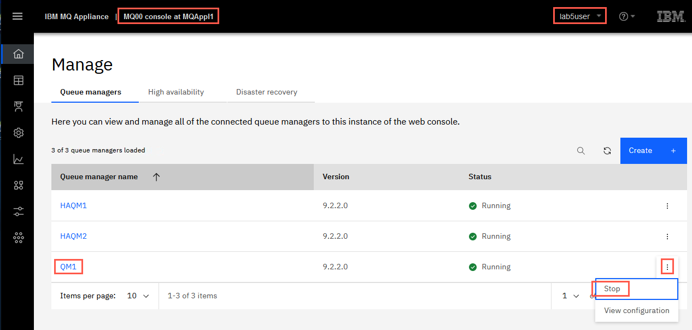
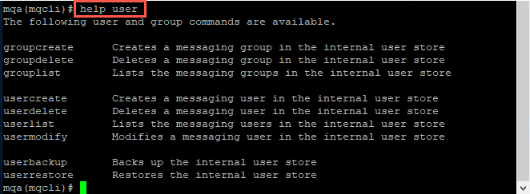
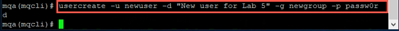
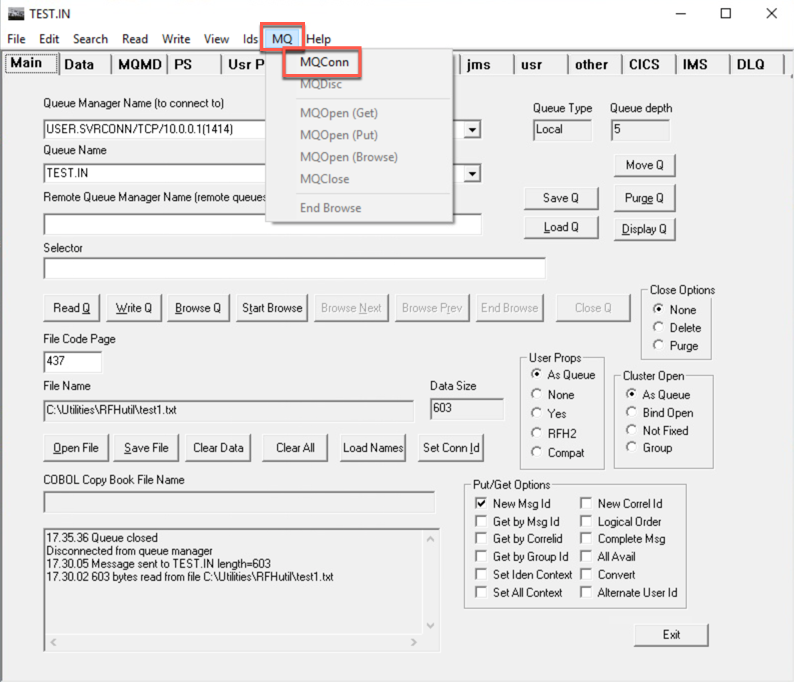
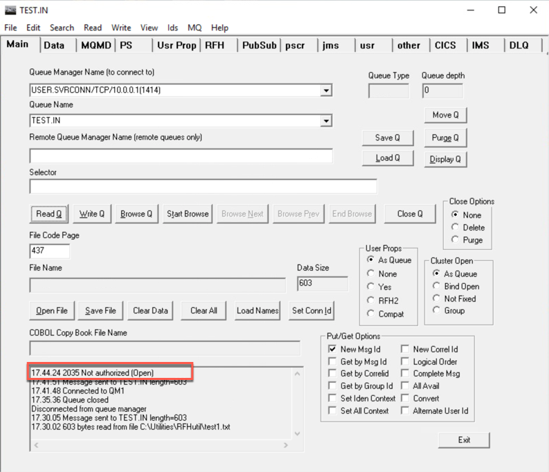
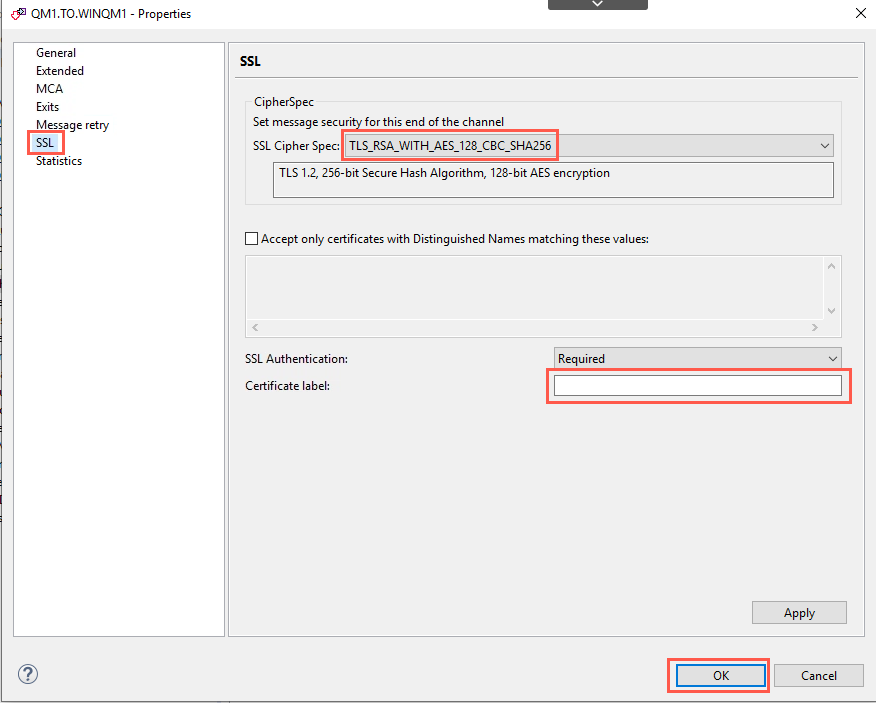
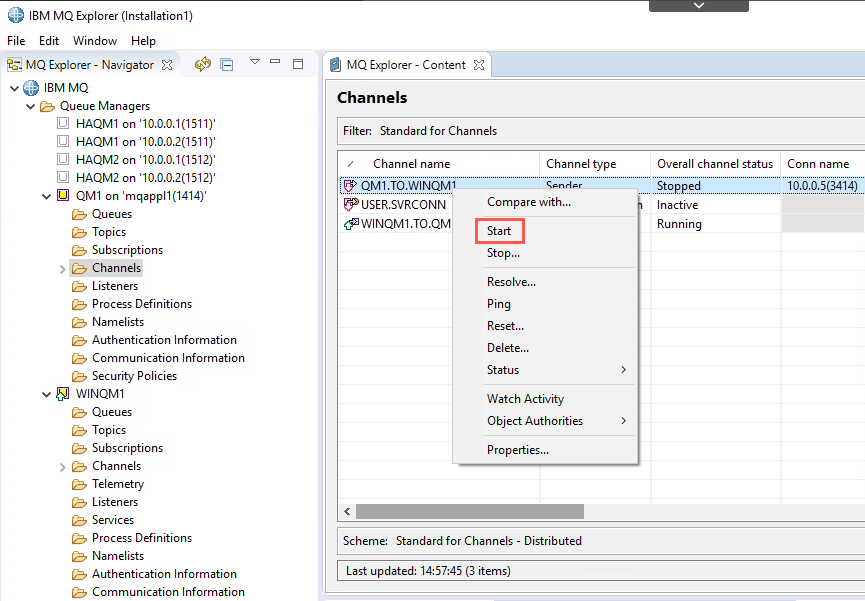

# Lab 5 - IBM MQ Appliance Security

In this lab, we will explore the unique security aspects of the MQ
Appliance compared to a standard IBM MQ installation. This lab assumes
that you are familiar with basic IBM MQ security functions.

VMs required:

* **Windows 10 x64**
* **MQAppl1**

The following instructions assume you are using **MQAppl1**. Any VMs not in use should be suspended or shut down. These include the virtual appliances **MQAppl2,** **MQAppl3**, **MQAppl4**, **MQAppl5**, **MQAppl6** and **MQAppl7**. The Windows image is
used to:

-   Demonstrate SSL/TLS protection of channels between queue managers on
    separate platforms.

-   Perform console operations and testing of the queue managers used in
    this exercise.

-   Host an LDAP server to support configuration and testing of MQ's
    support for using an LDAP repository for authentication and
    authorization functions.

## Prerequisites

-   The Skytap environment has been created and both VM images have been
    started. NOTE: The starting point for this lab reflects the
    completion of **Lab 1 -- Getting Started with the MQ Appliance**.
    You should have the lab guide for Lab 1 on hand in case you need to
    refer to steps that are referenced within this lab exercise.

-   Ensure that the clocks on both VM images are set to the current date
    and local time (required for SSL/TLS certificate generation and
    use.)

    -   For the Windows VM image, the clock should be set automatically.

    -   For the MQ Appliance VM image, you can verify the clock setting
        by logging on to the command line interface using the admin user
        ID and entering the **show clock** command.

        

    -   If necessary, set the clock by using the **clock yyyy-mm-dd**
        and **clock hh:mm:ss** commands.
        
        

-   Verify that the IP addresses for the Windows and Appliance images
    are 10.0.0.8 and 10.0.0.1 respectively. Otherwise, all the
    references to IP addresses, as well as the provided mqsc scripts,
    will need to be edited to reflect the proper addresses.
    
> <span style="color: Blue">**Note:** <BR>If you see a message that states 'Notice: startup config contains errors', you can ignore the message.

## Overview of security

Managing security of the IBM MQ Appliance may be considered from two
perspectives. First is identifying the users that are authorized to
access the Appliance and associated MQ resources. Second is configuring
security for MQ channel connections to the Appliance.

### User security

There are two types of users on the IBM MQ Appliance: *appliance* users
and *messaging* users.

-   *Appliance* users are users that can configure and administer the
    Appliance and IBM MQ resources.

-   *Messaging* users are users that can perform operations on messaging
    resources.

#### MQ Appliance users

Authentication of appliance users, and authorization of them to access
appliance resources is controlled by Role Based Management (RBM). RBM
defines how users are authenticated and authorized. You can specify the
following *authentication* methods:

-   Users can be authenticated by an LDAP server.

-   User details can be specified in an XML file.

-   You can specify local users on the appliance itself. In this lab, we
    will refer to this as the *appliance* user repository.

You can specify the following *authorization* methods:

-   Access policies can be defined in an XML file. 

-   Access policies can be defined in local user groups.

You can map user groups looked up in an LDAP directory onto groups
defined in an XML file.

Where you have locally defined users, RBM can specify password polices
and account policies for them. These policies define the rules governing
password (such as minimum length, character types, and expiration
periods) and those rules governing when accounts are locked out after
failed log in attempts.

#### Messaging users

Messaging users can connect to queue managers to perform typical MQ functions such as performing PUTs and GETs of messages. They may also be authorized to remotely manage some aspects of queue managers by using tools such as:

*   The web based MQ Console

*   The IBM MQ Explorer

*   Via the **runmqsc** command shell

Messaging users can be stored in the appliance's internal user store, or
in an external LDAP repository. In this lab, we will refer to this as
the *messaging* user repository.

> <span style="color: Blue">**Note:** <BR>Keep in mind: The local user ID repository for *messaging* users is separate from the local user ID repository used for *appliance* users.

Messaging users stored in the local *messaging* user repository are
created by using user administration commands from the MQ Appliance's
command line interface.

The scalability of the *messaging* user repository is limited, so in
situations where many messaging users are required, an external LDAP
repository would provide better performance.

### Connection security

#### Securing IBM MQ Appliance connections

The MQ Appliance is delivered in a completely locked down state. All of
the network ports as well as the IBM MQ Console are disabled. As part of
the initial configuration of the device, the installer must enable each
of the network ports that will be used, and must configure the IBM MQ
Console to enable access from one or more of the network connections.

> <span style="color: Blue">**Note:** <BR>Configuration of connection security for the MQ Appliance as well as the IBM MQ Console were enabled as part of **Lab 1 – Getting Started with the MQ Appliance**.

#### Securing IBM MQ channel connections

Connection security for each of the queue managers configured on the MQ
Appliance must be considered as well.

To control access to connecting systems at a channel level, MQ uses
channel authentication records. Channel authentication functions for
queue managers hosted on the MQ Appliance are similar to server based
queue managers so we will not focus on those in this lab.

Configuration of SSL/TLS protection for channels on the MQ Appliance is
slightly different due to the fact that that the MQ Appliance does not
support a traditional file system for storage of keystore and
certificate files. For this lab exercise, we will review the steps
required to enable SSL/TLS security on SENDER and RECEIVER channels to
protect messaging traffic between queue managers hosted on the MQ
Appliance and queue managers hosted on remote platforms.

## Securing access to the MQ Appliance

Since Lab 1 covered the initial tasks required to enable connections to
the MQ Appliance, we will not repeat those steps in this lab. Instead,
we will review the steps required to create an additional IBM MQ
Appliance user and utilize the appliance's Role-Based Management (RBM)
features to control which functions the user may access.

1.  Start the FireFox web browser in the Windows VM image and navigate to
    the MQ Appliance console for **MQAppl1**, which is located at
    **https://10.0.0.1:9090/**.

	> <span style="color: Blue">**Note:** <BR>Shortcut available. 
There is a shortcut to the MQAppl1 image on the FireFox bookmarks bar.

    Click **Allow** **exceptions** for any
    warnings that you may receive regarding untrusted certificates.

1.  Enter **admin** and **passw0rd** (or whatever you chose earlier) in
    the **User name** and **Passw0rd** text boxes.
    
    

1.  You are now logged on to the IBM MQ Appliance console.

    
    
1.  Click the *Manage* block to see *Queue managers*. Queue Manager **QM1** may still be running from previous labs. If it is not running, start **QM1** now.

	

1.  Click the **Administration** tab and then expand the **Access**
    settings menu. You will see a list of menu items that you may use to
    configure various access settings for the MQ Appliance.

    

1.  Click the **Objects** icon then expand **Access Settings**.

    

1.  Click the **User Account** menu item to display a list of the
    currently defined user accounts. Note that the default **admin**
    account is listed as well as the user account that was created in
    the Lab 1 exercise.

    

1.  Both of the accounts listed have **Privileged** access rights. That
    gives these users full access to all capabilities of the Appliance
    as well as full access to all MQ resources. In order to create an
    account with a restricted set of permissions you should first create
    a **User Group** that has the desired permissions. Once that group
    has been created, you may create and assign a **User Account** to be
    a member of that group.

    To create a group that contains a subset of privileges, select the
    **User Group** menu item and then click the **New...** button.
    
    

1.  Enter **LAB5GROUP** in the **Name:** and **Lab 5 Group** in the
    **Comments:** text boxes (do NOT click Apply yet).

    

1.  The default access profile for a new user group enables a member of
    the group to login to the MQ Appliance user interfaces and browse
    all appliance and queue manager resources, but not to administer any
    of the appliance's resources. Perform the following steps in order
    to enable a member of **LAB5GROUP** to perform some MQ Appliance
    related tasks.

    a.  Click the **Add** button to create a new access profile entry.

       
        
    b.  Click the **Build** icon next to the newly created access
        profile entry.

       
       
       > <span style="color: Blue">**Note:** <BR>**Resource Types** 
-- Refer to the following table for an explanation of the valid permissions that may be specified for the resource types listed in the popup field.
       
	| Resource Type | Privilege | Explanation | 
	|:-------------:|:---------:|:-----------:|
	| MQ CLI Administration | x (execute) | Enables “mqm” like authority to access queue managers and their objects from the mqcli command prompt.   This permission applies regardless of whether a queue manager has been configured to use LDAP or to use the appliance’s messaging users repository. | 
	| MQ Web Administration | a (add) | Enables “mqm” like authority to access queue managers and their objects regardless of whether a queue manager has been configured to use LDAP or the appliance’s messaging users repository. Utilizes the mqsystem reserved user ID. I.E. if a message is PUT to a queue, the User Identifier associated with the message will be *mqsystem*. | 
	| MQ Web User | r (read) | Provides read only access to access queue managers and their associated resources, but may not change any resources, or PUT or GET messages to/from queues. |
	| MQ Web User | x (execute) | Provides read only access to queue managers and their objects from the MQ Web Console.  NOTE: If a queue manager has been configured to use an LDAP repository for authentication and authorization, additional permissions may be granted to the MQ Web Console user under the following conditions -- *If the appliance user ID matches an entry in the LDAP repository* **and** *if specific OAM permissions have been granted to the user ID*. For example, if PUT authority has been granted to a queue for the user ID, then the MQ Web Console may be used to PUT a test message onto a queue. | 
	
	c.  A popup dialog will appear. Select **MQ Web User** as the **Resource
	    type** from the popup list that appears (you need to scroll to the
	    bottom of the list). 
	    
	    
	
	d. Now scroll towards the bottom of the dialog and select the **Execute** privilege. 
		Click the **Apply** button in the *Build* dialog when you have finished. 
	   
	    
	   
	e.  Click the **Apply** button to save your new group definition. 
	   
	   
	   
	f.  You may add additional **Access profile** entries as needed to configure the desired 
		permissions for the group. Note that these permissions are additive and are 'most 
		permissive', so plan and test your settings carefully. 
    
    g. Click the **Save changes** link.
     
     	

1.  Perform the following steps in order to create a **User Account**
    that will utilize the new group to perform authorized MQ Appliance
    related tasks.

    a.  Select the **User Account** menu item and then click the
        **New...** button.

       

    b.  Enter the following information as shown in these screen shots
        and then click the **Apply** button when all of the fields have
        been entered.
    
    > <span style="color: Blue">**Note:** <BR>**Usage tip**  
    The **User group**: section may not appear unless you first set the access level to **Privileged**, then select **Group defined**. 

	| Property                         |                Value                |  
	|:--------------------------------:|:-----------------------------------:|
	| Name                             | LAB5USER                            |
	| Enable administrative state      | *Leave checked to enable this user* | 
	| Comments                         | Lab 5 User                          | 
	| Password                         | passw0rd                            | 
	| Suppress initial password change | *Checked*                           | 
	| Access level                     | Group defined                       | 
	| User group                       | LAB5GROUP                           |

	 
	
	c.  Click **Apply**.
	
	d.  In the pop-up, click the drop-down for *Username* and select **LAB5USER**. Click *Save*.
	
	 
		
1.  Perform the following steps in order to test out the new User
    account and Group.

    a.  Logout of the MQ Appliance, then log on using the **LAB5USER**
        account.

       

    b.  Click the *Queue managers* block. Note that the **Queue managers** page allows the
        **LAB5USER** to view various properties of the queue manager,
        but does not allow the user to change any properties or start
        and stop the queue manager. Click the drop-down for **QM1** and select *Stop*.
        
        
       
       The command fails because LAB5USER does not have the correct authority.

       

    c.  Click the hyperlink for **QM1**. Click *Create* to add a queue then click *Local*. Name the queue **LAB5Q** and click the *Create* button. The command fails again due to lack of authority.

       

    d.  Try to perform various operations against any of the queues. You
        will find that with **MQ Web User** privileges, you can view
        various queue manager objects and their properties, but you are
        not able to make changes to any objects. Return to *Manage* > *Queue managers*. Click the 			drop-down for **QM1** and select *View configuration*.       
        
       
       
    e.  *LAB5USER* can view the queue manager properties. Click *Edit*. Try to change a property and click *Save*. The command fails again.
       
       

10. Log out of the MQ console.

	
	
## Securing access to MQ resources

### User repositories

The IBM MQ Appliance is based on IBM MQ V9.2.2.0 with several
modifications to enable support of an appliance form factor. One
modification that has been made to MQ is the management of messaging
users that are allowed to access IBM MQ objects.

Previous lab exercises have demonstrated how to manage MQ Appliance
objects using user ID's that are defined in the *appliance* user store.
In order to support a separation of responsibilities for management of
MQ resources from Appliance resources, the Appliance also provides a
separate user store for *messaging* users only. The users defined in
this message store may manage and access only MQ resources. They do not
have access to any of the MQ Appliance resources.

User ID repositories for appliance and MQ users are hosted on the
appliance by default. The appliance also supports accessing user ID's
that are stored in an external LDAP repository. The scalability of the
internal stores is limited, so for situations where many users exist an
external LDAP repository may provide better performance.

### SSL/TLS channel security

IBM MQ supports the configuration of SSL/TLS protection for message
channels. This support requires the use of keystores to hold public and
private certificates. The *concepts* for managing certificates and
keystores for queue managers hosted on the MQ Appliance are similar to
traditional MQ; however, since the Appliance does not enable traditional
command line or filesystem access, new *procedures* must be followed in
order to configure this support.

#### Exploring the MQ Appliance internal store for messaging users

**NOTE:** Access to the Appliance's internal user store for messaging
users is currently supported via a command line interface only. Either
you may use the Appliance's console window for entering commands, or if
you prefer, a copy of **Putty** has been provided in the
**C:\\Lab05\\Commands** directory. (HINT: Use Putty. It is a lot easier
to use!)

> <span style="color: Blue">**Note:** <BR>If you choose to use the MQ Appliance console window, you will notice there are no scroll bars for data that was displayed, but has since scrolled off the window. To view the older information, use the **shift+PgUp** keyboard combination to scroll up and **shift+PgDn** to scroll down.

1. Double-clock the Putty icon on the desktop and enter MQAppl1's IP address - 10.0.0.1 in the host name field. Click *Open*.

	
	
	
1. If you receive a security alert popup, click **Yes** to continue.

	
	
2. Hit Enter once, and then log on to the command line interface by using the **admin** user ID
    and associated password.

    

1. Execute the **mqcli** command to enter MQ command line mode.

    

1. The **mqcli** command prompt enables an *appliance* user to
    configure MQ resources. Use the **help** command to see a list of
    command categories that are supported by the Appliance.

    

1. Our goal in this section of the lab is to create *messaging* users.
    To see the list of available commands to create messaging users and
    groups use the **help user** command.

    

1. In lab 1, you created a messaging user to test the ability to PUT
    messages to the TEST.IN queue on QM1. Display a list of messaging
    users defined to the Appliance by entering the following command:
    
    ```
    userlist
    ```

    

16. Note that there is a single user named **ibmdemo** listed. To
    display details of this user enter the following command: 
    
    ```
    userlist -u ibmdemo
    ```

    

17. As you can see, **ibmdemo** is a member of the **mqm** group. Just
    like IBM MQ, being a member of the **mqm** group gives **ibmdemo**
    full access to all resources in a queue manager. We will want to
    create a new user and group that *does not* have full access.

18. Create a new group for messaging users by entering the following
    command:

    ```
    groupcreate -g newgroup
    ```

    

19. List all of the messaging groups that are now defined to the
    Appliance by entering the following command:

    ```
    grouplist
    ```

    

20. Now create a new user by entering the following command:

    ```
    usercreate -u newuser -d "New user for Lab 5" -g newgroup -p passw0rd
    ```

    

21. Now that you have created a new user, you will need to grant
    permissions for that user to connect to the queue manager and access
    various MQ resources. Switch to the **Windows** image and open the **MQ
    Explorer**. Connect to the **QM1** queue manager, if necessary. Right
    click **QM1** and select the:

    **Object authorities →** **Manage Queue Manager Authority
    Records...** menu item.

    

22. Click the **New...** button to add a new group record.

    

23. Enter **newgroup** in the **Entity name:** text box, then select the
    **Connect** and **Inquire** check boxes. Click the **OK** button
    when finished.

    

24. If prompted, select the **Do not show success messages in the
    future** checkbox and click the **OK** button to continue.

    

25. Click the **Close** button to close the window.

    

26. Now select the **Queues** folder for the **QM1** queue manager and
    right click the **TEST.IN** queue. Select the **Object Authorities**
    **→** **Manage Authority Records...** menu item.

    

27. Expand the **Specific Profiles** section and select the **TEST.IN**
    entry, then click the **New...** button.

    

28. Enter **newgroup** in the **Entity name:** text box, then select the
    **Put** check box. Click the **OK** button when finished.

    

29. Close the **Manage Authority Records** window and minimize the MQ
    Explorer window.

    

30. Now you will need to use the **rfhutilc** program to test the
    security settings you have defined. Refer to the steps in Lab 1 to
    launch the program and connect to the queue manager as **ibmdemo**.
    Continue through the steps in Lab 1 until you have successfully
    written a test message to the **TEST.IN** queue.

    

31. Disconnect from the queue manager by clicking on the **MQ** →
    **MQDisc** menu item.

    

32. Now change the user ID associated with the connection to **QM1** by
    clicking on the **Set Conn Id** button and using the
    **newuser** user ID and associated password. 
    
    
    
33. Reconnect to the queue
    manager by clicking on the **MQ** → **MQConn** menu item.

    

33. Click the **Write Q** button to send another test
    message to the **TEST.IN** queue. This message should be
    successfully written.

    

34. Now click the **Read Q** button. You will see a **Not
    authorized** error message.

    

35. Close the **rfhutilc** application.

### Prepare the queue managers to enable distributed queuing 

In order to enable SSL/TLS protection of messages flowing between queue
managers, a basic distributed queueing environment must first be
established. Once the initial configuration has been defined and tested,
you may configure the additional settings required to enable SSL/TLS
protection on the channels. In this portion of the lab, you will create
and configure a Windows based queue manager to connect to **QM1** on the
Appliance. You will also create appropriate queue manager objects on
**QM1** to connect to the Windows queue manager. Since configuration of
basic distributed queuing is assumed an existing skill, you will use
MQSC scripts to create the initial configuration.

The following steps should be performed on the Windows VM image.

1. Use the IBM MQ Explorer to create a new queue manager by right
    clicking on the **Queue Managers** folder and clicking on the
    **New** → **Queue Manager...** menu item.

    

37. Enter **WINQM1** in the **Queue manager name:** text box and
    **SYSTEM.DEAD.LETTER.QUEUE** in the **Dead-letter queue:** text box,
    then click the **Next** button.

    

38. Click the **Next** button two more times to
    navigate past the **Enter data and log values** and the **Enter
    configuration options** windows, then enter **3414** in the **Listen
    on port number:** text box and click the **Finish**
    button.

    

39. The mqsc scripts to create a starter set of MQ objects for the
    **WINQM1** and **QM1** queue managers are located in the
    **C:\\Lab05\\MQSC\\** directory. If the IP addresses of the Windows
    and MQ Appliance VM's are not 10.0.0.5 and 10.0.0.1 respectively,
    edit the files as necessary. Next, open a command prompt and
    navigate to that directory, then run the following command:
    
    ```
    runmqsc WINQM1 < WINQM1.mqsc
    ```    
    
    

40. Next, you will need to create a similar set of objects on the
    Appliance's **QM1** queue manager. The easiest means to do that is
    to use a client connection to **QM1** from the Windows image. To
    enable a client to connect, you must first set an environment variable
    to specify the connection parameters to **QM1**. Enter the following
    command to set the **MQSERVER** environment variable:
    
    ```
    SET MQSERVER=USER.SVRCONN/TCP/10.0.0.1(1414)
    ```

	> <span style="color: Blue">**Note:** <BR>Ensure you substitute the actual IP address of the MQAppl1, if necessary.
    
	

41. Next use the following command to create the appropriate
    configuration objects on **QM1**:
    
    ```
    runmqsc -c -u ibmdemo QM1 < QM1.mqsc
    ```

	> <span style="color: Blue">**Note:** <BR>Regarding redirecting input for runmqsc commands from mqsc files**: 
	This mqsc file contains the password for testuser as the first line of the file. This is necessary to enable the password to be passed blindly to the runmqsc command shell.

	

42. At this point, you should have a set of channels, local queues and remote queues that will enable sending messages between the two platforms and having the SENDER channels auto-triggered. 

	The IP address of the Windows VM has been changed since the MQSC file was created, so the properties of the sender channel need to be updated. Open MQ Explorer. Expand *Channels* under **QM1**. Right-click the channel **QM1.TO.WINQM1** and select properties. 
	
	. 
	
	Change the *Connection name* to **10.0.0.8(3414)**. Click *OK*. 
	
	 
	
	Refresh MQ Explorer. 
	
	 
	
	The channel should now be running. 
	
	
   
1.  Test your configuration by completing the following steps:

	 a. Expand the **QM1** queue manager entry. Right click the **WINTESTQ** queue and click the **Put Test Message...** menu item. 
	
	  
	 
	 b. Enter a simple message and click the **Put message** button. 
	 
	 
	 
	 c. Close the test window, then expand the **WINQM1** queue manager and right click the **WINTESTQ** queue. Select the **Browse Messages...** menu item.
    
     
    
    d. Your message should be listed in the browser window. Click the **Close** button to continue. 
    
    

    e. Repeat steps **a** through **d** to test triggering of channels from **WINQM1** to **QM1** by putting a simple message on **WINQM1**'s **MQAPPLQ** remote queue definition and ensuring it is PUT to the corresponding local queue on **QM1**. Correct any configuration issues before proceeding.

43. Stop the **SENDER** channels on both queue managers, setting their
    status to **Inactive.**

### Configure the Windows queue manager to support SSL/TLS channels

> <span style="color: red">**Important:** <br>It is **IMPORTANT** to note here that the following instructions have been tested and work. 99% Of the issues when setting up the SSL on the key-stores and channels ultimately are always cause my miss-spellings and bad typing. The configuration is very unforgiving in this area. Remember GIGO. Save yourself aggravation and time and please verify your typing, especially around spelling ‘qm’ and ‘mq’. ‘mq’ is a product designation while ‘qm’ is a Queue Manager Designation.

In order to enable SSL/TLS protection for channels, a queue manager
requires a keystore for the storage of personal certificates as well as
for signer certificates of any remote queue managers that
may need to be accessed.

Perform the following steps to create and configure the keystore for the **WINQM1** queue manager: 
    
1. Launch the IBM Key Management tool by clicking on its icon on the Desktop. 
	
	

1. Create a new keystore by clicking on the **Key Database File** → **New...** 
	menu item. 
	
	

1. When a queue manager is created, it will look for a keystore in a default 
	location. For this lab exercise, the **WINQM1** queue manager will look 
	for a keystore in the following location: **C:\\ProgramData\\IBM\\MQ\\qmgrs\\WINQM1\\ssl\\**. The default name for the keystore is assumed to 
	be **key.kdb**. Enter **key.kdb** in the **File 
	Name:** text box and **C:\\ProgramData\\IBM\\MQ\\qmgrs\\WINQM1\\ssl** in 
	the **Location:** textbox, then click the **OK** button. 
	
	

1. Enter **passw0rd** as the password for the keystore. Select the 
	**Expiration time** and **Stash password to a file** checkboxes. Enter 
	value of 3650 days in the **Days** text box (we do not want to deal with 
	certificate expiration anytime soon!) and click the **OK** button. 
	
	

1. Now you will create a self-signed certificate to use for protecting 
	messages. Ensure that **Personal Certificates** is selected then click the 
	**New Self-Signed** button. 
	
	

1. WebSphere MQ version 7 and earlier had specific requirements for the **Key 
	Label** entry. Although we are working with a Version 9 queue manager, we 
	will assign a label using the more stringent requirements. Enter a value 
	of **ibmwebspheremqwinqm1** in the **Key Label** text box. Enter a value 
	of **3650** in the **Validity Period** text box. 
	
	The content of the remaining fields are not used by IBM MQ; however, for 
	this lab enter **WINQM1** in the **Common Name** text box and select a 
	value of **US** in the **Country or region** drop-down list. Click the 
	**OK** button when ready. 
	
	

1. Next, you must extract the public part of **WINQM1's** certificate for the 
	**QM1** queue manager on the Appliance to use. Verify that **Personal 
	Certificates** selected from the drop-down list. 
	
	

1. Select the certificate for the WINQM1 queue manager and click the **Extract 
	Certificate...** button. 
	
	

1. Export the certificate to a location where we will be able to easily access 
	it for transfer to the Appliance. For this lab exercise, use 
	**winqm1\_cert.arm** for the **Certificate file name:** and **C:\\Users\\ibmdemo** for the **Location**. Click the **OK** button. 
	
	

1. Now review the SSL properties of the **WINQM1** queue manager to see where 
	various settings match the values in the keystore and personal 
	certificate. Open the MQ Explorer, right click the **WINQM1** queue manager, 
	and then click the **Properties...** menu item. 
	
	

1. Select the **SSL** entry in the list. Note the entry for the **SSL Key 
	repository:** text box. This entry specifies the path to the keystore file 
	as well as the file name of the keystore (without the .kdb) extension). 
	Also, take note of the **Certificate label:** entry. This label is used to 
	match the personal certificate found in the keystore. 
	
	

47. Click the **OK** button when done.

48. You must now specify which channels you would like to enable for
    SSL/TLS security. Expand the **Channels** folder for **WINQM1** in
    the MQ Explorer, right click the **WINQM1.TO.QM1** sender channel
    entry and then click the **Properties...** menu item.

    

49. Select the **SSL** entry from the list. Select an entry from the
    **SSL Cipher Spec:** list box that will match your selection on the
    other queue manager. Note there are a number of algorithms available
    in the list. For this exercise, select the
    **TLS\_RSA\_WITH\_AES\_128\_CBC\_SHA256** cipherspec.

    

    Note that there is a text box labeled **Certificate label:**. This
    allows you to specify different certificates for each channel. In
    this lab, we will use the default certificate specified at the queue
    manager level, so leave it blank.

50. Click the **OK** button to continue.

51. Repeat steps 13 through 15 for the **QM1.TO.WINQM1** receiver channel.

52. Since changes have been made to the SSL configuration for the queue
    manager, you will need to either restart the queue manager or refresh
    the SSL configuration settings. Right click the **WINQM1** queue
    manager entry in the MQ Explorer and click the **Security** →
    **Refresh SSL...** menu item.

    

53. Click the **Yes** button when prompted.

    

	Proceed to the next section to configure the **QM1** queue manager
    hosted on the Appliance.

### Configure the MQ Appliance queue manager to support SSL/TLS channels

55. Switch to the Putty session (or the appliance's console window) and
    ensure you are in MQ administration mode by entering the **mqcli**
    command (if necessary).

    

1. Create a self-signed certificate for the QM1 queue manager by
    entering the following command:
    
    ```
    createcert -m QM1 -dn "CN=MQAppl1, O=IBM, C=US" -label ibmwebspheremqqm1
    ```
    
    

    Note that you specified a value for **-label** that matches the
    **CERTLABL** value of **QM1**. 
    
    After the self-signed certificate is generated, the public part of
    the certificate is extracted to a file that is placed in the
    Appliance's **mqpubcert://** file system. The certificate's file
    name was generated for you by default. Note that the file name was
    displayed when the command completed. In the example above the name
    of the generated file is **QM1\_ibmwebspheremqqm1**.

    The certificate for **QM1** must now be transferred to the Windows server 
    so that it may be imported into **WINQM1**'s keystore file. Transfer the 
    certificate using the following steps: 

1. Logon to the MQ Appliance web console using the **admin** user ID. Click the 
	**Administration** tab and then expand the **Main** menu. Click the **File 
	Management** menu item to display a list of the file systems that are 
	configured on the appliance. 
	
	 
		
1. Click the **mqpubcert** entry to expand the contents of this file system. 
	Next right 
	click the **QM1\_ibmwebspheremqqm1** entry and select the **Save link 
	as...** menu item. 
	
	

1. Save the certificate file to the **C:\\Users\\ibmdemo** directory and 
	remove the file extension from the file name (remember to set the **Save 
	as type** to be **All files**, and remove the .txt from the name). 
	
	 
	
	The certificate must now be imported into **WINQM1**'s keystore to enable 
	the queue manager to be able to participate in SSL/TLS protected sessions. 
	Use the following steps to import this certificate.

1. Return to the **IBM Key Management** window and select **Signer 
	Certificates** in the drop-down list box. 
	
	

1.  Click the **Add...** button to select the certificate to import. Navigate 
	to the **C:\\Users\\ibmdemo** directory and select the certificate 
	for the **QM1** queue manager -- **QM1\_ibmwebspheremqqm1**. Click the 
	**OK** button. 
	
	

1. Enter **ibmwebspheremqqm1** for the label name and click the **OK** button. 
	
	

1. The public certificate for the **QM1** queue manager is now available for 
	the **WINQM1** queue manager to use. 
	
	

1. Close the **IBM Key Management** window.

   You must now refresh the SSL configuration (again!) for the
    **WINQM1** queue manager.

1. Return to the MQ Explorer window and right click the **WINQM1** queue 
	manager and then click the **Security** → **Refresh SSL...** menu item. 
	
	 
	
	a.  Click the **Yes** button when prompted. 
	
	 
	
	b. The amount of time required to refresh the SSL configuration will vary 
		depending on the activity level of the queue manager and its active 
		channels. You may get a warning message that states that the operation 
		timed out. Continue with the following steps while the operation 
		continues in the background.

60. You must now transfer the signer certificate for the **WINQM1**
    queue manager (exported earlier) to the Appliance. Use the following
    steps to transfer the certificate:

    a.  Return to the web browser and click the **Actions...** link next
        to the **mqpubcert:** item. The **Directory actions...** menu
        will appear. Click the **Upload Files** menu item.

       

    b.  Click the **Browse** button to open the file picker dialog
        and select the **C:\\Users\\ibmdemo\\winqm1\_cert.arm**
        file. Specify **ibmwebspheremqwinqm1** as the name of the file
        to save and then click the **Upload** button.

       

    c.  Click the **Continue** button to return to the **File
        Management** page.

       

61. Now you will add the public certificate for the **WINQM1** queue
    manager to the keystore of **QM1**. (Reminder: You must be in the MQ
    administration mode in order to complete this step.) Enter the
    following command to import the certificate: 
    
    ```
    addcert -m QM1 -label ibmwebspheremqwinqm1 -file ibmwebspheremqwinqm1
    ```

    

62. The sender and receiver channels must now be configured to support
    the same cipherspec that the **WINQM1** channels are using. Return
    to the MQ Explorer and expand the **QM1** queue manager entry. Click
    the **Channels** folder, then right click the **QM1.TO.WINQM1** sender
    channel entry, and then click the **Properties...** menu item.

    

63. Select the **SSL** entry from the list. Select an entry from the
    **SSL Cipher Spec:** list box that will match your selection on the
    other queue manager. Note there are a number of algorithms available
    in the list. For this exercise, select the
    **TLS\_RSA\_WITH\_AES\_128\_CBC\_SHA256** cipherspec.

    

    We will use the default certificate specified at the queue manager
    level, so leave the **Certificate Label:** field blank.

64. Click the **OK** button to continue.

65. Repeat steps 14 through 16 for the **WINQM1.TO.QM1** receiver channel.

66. Since changes have been made to the SSL configuration for the queue
    manager, you will need to either restart the queue manager or refresh
    the SSL configuration settings. Right click the **QM1** queue
    manager entry in the MQ Explorer and click the **Security** \|
    **Refresh SSL...** menu item.

    

67. Click the **Yes** button when prompted.

    

### Verify the SSL/TLS configuration 

1. In order to verify your SSL/TLS configuration is correct, you will need to start the 
	channels and verify that SSL attributes are in effect. Switch back to the Windows image, 
	then use the MQ Explorer to start the sender channels for each queue manager and verify 
	the SSL status. 
	
	a. Expand the tree for **QM1** to display **Channels**. Stop the **QM1.TO.WINQM1** 
		channel if it is not in **Stopped** or **Inactive** state, then start (restart) 
		the channel. 
		
	 
	
	b. After a few moments, the channel should reach a status of **Running**. Once it 
		has reached running status, right click the channel and click the **Channel 
		Status...** menu item. 
		
	 
	
	c. A status window will appear. This window has a number of columns that report on 
		the channel status. Scroll to the right until you see a column labeled **Short 
		peer name**. Presence of an entry in this column indicates that SSL/TLS 
		protection is in effect, and shows the serial number and other information of 
		the certificate this is in use. 
		
	 
	
	d. Repeat steps **a** through **c** for the **WINQM1.TO.QM1** channel that is part 
		of the **WINQM1** queue manager. 
   		
1. This completes this portion of lab exercise 5.

## Configure the QM1 queue manager to use an LDAP repository

### Overview of MQ usage of an LDAP repository

With the MQ Appliance, an LDAP repository may be used for authentication
and authorization purposes.

A queue manager may be configured to require an application to present a
user ID for authentication before granting access. The queue manager may
be configured to accept either an O/S or LDAP defined user ID when an
application connects to the queue manager. When using LDAP based
authentication, it is not necessary to have the LDAP user ID defined as a
local O/S user. 

> <span style="color: Blue">**Note:** <BR>**Reminder**  
The MQ Appliance provides two user repositories out of the box: the *appliance* user repository and the *messaging* user repository. For this portion of the lab, consider the users in the *messaging* repository as equivalent to a local O/S user.

Once the user ID has been authenticated, the queue manager's Object
Authority Manager (OAM) handles the authorization functions to manage
access to MQ objects. You can configure a queue manager to present one
of two user ID's to the OAM for authorization purposes:

1.  The user ID associated with the application that has connected to
    the queue manager. That is, the O/S user ID that the application is
    running under.

2.  The user ID used during the *authentication* phase of connecting to
    the queue manager. An application may authenticate to a queue
    manager with a different user ID and password combination from what
    the application is running under. The **ADOPTCTX** attribute on the
    **AUTHINFO** object that is active for the queue manager determines
    which method of authorization is used.

Changing the authorization processing method on a queue manager requires
careful planning to avoid accidentally blocking all users from accessing
a queue manager. OAM security authorizations are associated with the
authorization method in place when they are configured. If you change
from O/S authorization to LDAP authorization, any existing O/S
authorization rules that have been set become inactive and invisible.
Likewise, when switching back from LDAP to O/S based authorization, all
LDAP authorizations that had been defined become inactive and invisible,
restoring the original O/S rules.

### LDAP fundamentals

A user ID is stored as a record in an LDAP repository and has a number
of attributes associated with it. The specific attributes that are
available, and which of those are mandatory, are determined by the
**objectClass** that the records are derived from. For this lab, you
will be using user ID's that are part of the **inetOrgPerson**
objectClass and group ID's that are part of the **groupOfNames**
objectClass.

When configuring a queue manager to use an LDAP user repository, there is
more to be done than to just configure the queue manager to connect to
the LDAP repository. User ID records defined in an LDAP repository have
a hierarchical structure. In order to identify a specific record, you
must be familiar with the directory structure. You will then use this
information to properly configure the queue manager.

The following graphic illustrates the hierarchy you will use in this
lab:


An example of identifying a specific user using a fully qualified domain
name (**FQDN**) would be:

**cn=potuser1, ou=users, ou=ibmpot, o=ibm, c=us**

So an MQ application could connect to the queue manager and present an
**FQDN** as its user ID. This, however, is a lot to provide and it would
be simpler if you could configure the queue manager to assume all user
ID's that are presented are found in one specific branch of the
hierarchy, and have the queue manager add that portion of the hierarchy
to any user ID that the application provides.

This is one of the purposes of a queue manager's **AUTHINFO** object.
The **BASEDNU** attribute of an **AUTHINFO** object is used to identify
the portion of the **FQDN** that is common for all user IDs. An
**AUTHINFO** object also has a **USRFIELD** attribute that may be used
to help compose an LDAP user ID. Refer to the following table to see how
the **AUTHINFO** attributes are used to compose LDAP user IDs.

| Application Provides                          | USRFIELD | BASEDNU                               | 
|:---------------------------------------------:|:--------:|:-------------------------------------:|
| cn=potuser1, ou=users, ou=ibmpot, o=ibm, c=us |          |                                       |
| cn=potuser1                                   |          | Adds ou=users, ou=ibmpot, o=ibm, c=us |
| potuser1                                      | Adds cn= | Adds ou=users, ou=ibmpot, o=ibm, c=us |
	
**NOTE:** There are a similar set of attributes to manage group ID's.

### Gather LDAP server data

Like many other software components, an LDAP server has a wide range of
options that may be used to store and retrieve entries. In order to
enable a queue manager to utilize an LDAP repository you must configure
queue manager objects to properly match LDAP objects. An instance of
IBM's Tivoli Directory Server V6.2 is installed in the Windows image to
support this lab exercise. Before starting this exercise, note the
following information about the LDAP server: 

| Entry                     | Description                                  | Value                 | 
|:-------------------------:|:--------------------------------------------:|:---------------------:|
| **LDAP server name:** |  Host name / IP Address of server. Include the port number in parenthesis if it is not the default. | 10.0.0.8 |
| **User name:** | A valid user ID that the queue manager may use to query the LDAP | cn=root |
| **Password:** | The password for the above user | db2admin |
|**Equivalent short user:** | The LDAP attribute that is used to map between an LDAP entry and the underlying O/S. Examples for the **inetOrgPerson** LDAP object class would be either **sn** or **uid**. |  sn |
| **User object class:** | The LDAP object class that the user ID record is derived from. | inetOrgPerson |
| **Qualifying user field:** | The LDAP attribute that is used to identify the user. Refer to the previous section for an example of how to determine what value to use.| cn |
| **Use secure communications:**  | Determines whether to configure SSL/TLS communications between the queue manager and the LDAP repository. For this lab exercise, leave this value at **NO**. | NO |
| **Authorization method:** | Used to determine how the queue manager should query for user and group ID's. For this exercise specify **SEARCHGRP** to indicate you will search for users and groups in an LDAP directory, and that the queue manager should use the **Qualifying group field** attribute to identify which group attribute to use to search for group membership. | SEARCHGRP |
| **Allow nested groups:** |  Used to determine if access rights may be aggregated through a group's hierarchy. | YES |
| **User base DN:** | Used to compose an FQDN for a user ID as described above. (Note this is a single field.) | ou=users, ou=wmbv8, o=ibm, c=us |
| **Group base DN:** | Used to compose an FQDN for a group ID as described above. (Note this is a single field.) | ou=users, ou=wmbv8, o=ibm, c=us |
| **Group object class:** | The LDAP object class that the group ID record is derived from. | groupOfNames |
| **Qualifying group field:** | The LDAP attribute that is used to identify the group. Refer to the previous section for an example of how to determine what value to use. | cn |
| **Group membership field:** | The LDAP attribute that is used to identify the members of the group. Refer to the previous section for an example of how to determine what value to use. | member |

The LDAP server used for this lab contains five user ID's and one group.
The user ID's are:

|                  User ID                      | password  | 
|:---------------------------------------------:|:---------:|
| cn=potuser1, ou=users, ou=ibmpot, o=ibm, c=us | passw0rd  |
| cn=potuser2, ou=users, ou=ibmpot, o=ibm, c=us | passw0rd  |
| cn=potuser3, ou=users, ou=ibmpot, o=ibm, c=us | passw0rd  |
| cn=potuser4, ou=users, ou=ibmpot, o=ibm, c=us | passw0rd  |
| cn=potuser5, ou=users, ou=ibmpot, o=ibm, c=us | passw0rd  |
  
The group used for this lab exercise is named **authorized**. It
contains the following users:

-   cn=potuser1, ou=users, ou=ibmpot, o=ibm, c=us

-   cn=potuser3, ou=users, ou=ibmpot, o=ibm, c=us

-   cn=potuser5, ou=users, ou=ibmpot, o=ibm, c=us

### Prepare the queue manager 

1. As mentioned earlier, the use of an LDAP directory for authentication is 
   not limited to queue managers hosted on an MQ Appliance. This support was 
   added to MQ V8.0.0.2 and later releases. 
   The following steps are **only** required if you are configuring a server 
	based queue manager that was created on a version *earlier* V8.0.0.2 and 
	then migrated to the appliance. 
	
	a. In order to support the use of an LDAP, a queue manager needs to be 		running at COMMAND LEVEL 801 or higher. By default, an *appliance* 
		based queue manager runs at COMMAND LEVEL 924. To verify the COMMAND 
		LEVEL of the queue manager, use the **runmqsc** command shell and enter 
		the following command: 
	
	```
	DIS QMGR
	``` 
	
	 
	
	b. If the **CMDLEVEL** is not at a minimum level of 801, run the following 
	commands to set it: 
	
	```
	endmqm -i <queue_manager_name> 
	
		strmqm -e CMDLEVEL=924 <queue_manager_name> (Or specify a higher CMDLEVEL 
	if the installed MQ version supports a higher version)
	 
	strmqm <queue_manager_name>
	```

1. Follow these steps to configure the queue manager to connect to the LDAP 
	server.

    > <span style="color: Blue">**Note:** <BR>For convenience, you can cut and paste these 	commands from **C:\\Lab05\\Commands\\Command Snippets.txt** into the Putty 	session (not the Appliance's console window).
    
	a. From your Putty session, enter the **runmqsc QM1** command to enable entry 
	of mqsc authorization commands.

	b. Use the following command to create a new AUTHINFO object to reference the 
	LDAP directory. Note you will need to substitute values in the command 
	with those you collected from the LDAP server that you will be connecting 
	to: 
	
	```
	DEFINE AUTHINFO(USE.LDAP) AUTHTYPE(IDPWLDAP) ADOPTCTX(YES)
   CONNAME(10.0.0.8) CHCKCLNT(REQUIRED) CLASSGRP('groupOfNames')
   CLASSUSR('inetOrgPerson') FINDGRP('member') BASEDNG('ou=users,
   ou=ibmpot, o=ibm, c=us') BASEDNU('ou=users, ou=ibmpot, o=ibm,
   c=us') LDAPUSER('cn=root') LDAPPWD('passw0rd') SHORTUSR('sn')
   GRPFIELD('cn') USRFIELD('cn') AUTHORMD(SEARCHGRP) NESTGRP(YES)
   ```

	c. Use the following command to modify the queue manager to use the new 	AUTHINFO object: 

	```
	ALTER QMGR CONNAUTH(USE.LDAP)
	```

	d. Use the following command to refresh the security settings of the queue 	manager: 
	
	```
	REFRESH SECURITY TYPE(CONNAUTH)
	```

	> <span style="color: red">**Important:** <br>Do not exit the **runmqsc** command shell until you have completed the next 2 steps. Otherwise, you may irrevocably block all access to the queue manager.
	
	e. Now that the queue manager has been configured for LDAP and security for 
	the queue manager has been refreshed, you will need to use valid user ID's 
	from the LDAP for both authentication and authorization. At this point in 
	your configuration none of the LDAP user ID's will have any access to the 
	queue manager or any of its objects until you start granting explicit 
	authorities to all of the necessary objects. 
	
	Also, keep in mind that the MQ "superuser" group of **mqm** is known 
	only to the O/S that the queue manager is running on. You will no longer 
	be able to utilize membership within that group as you work with the queue 
	manager's objects. 
	
	For this lab exercise we will use an LDAP group named **authorized** to 
	function the same as the **mqm** group does in an O/S based authorization 
	configuration. 
	
	Complete the following steps to configure the **authorized** LDAP group to 
	act as an MQ superuser. Use the following command to enable a member of 
	the **authorized** group to connect to the queue manager: 
	
	```
	SET AUTHREC OBJTYPE(QMGR) GROUP('authorized') AUTHADD(ALL)
	```
    
    > <span style="color: Blue">**Note:** <BR>Reminder - All references to LDAP attributes are case sensitive.

	f. Use the following commands to enable access to the queue manager from 
	the MQ Explorer and **runmqsc** command shell: 
	
	```
	SET AUTHREC PROFILE(SYSTEM.MQEXPLORER.REPLY.MODEL) OBJTYPE(QUEUE) 
	GROUP('authorized') AUTHADD(ALL) 
		
	SET AUTHREC PROFILE(SYSTEM.ADMIN.COMMAND.QUEUE) OBJTYPE(QUEUE) 
	GROUP('authorized') AUTHADD(ALL) 
		
	SET AUTHREC PROFILE(SYSTEM.MQSC.REPLY.QUEUE) OBJTYPE(QUEUE) 
	GROUP('authorized') AUTHADD(ALL) 
		
	SET AUTHREC PROFILE(USER.SVRCONN) OBJTYPE(CHANNEL) 
	GROUP('authorized') AUTHADD(ALL) 
		
	REFRESH SECURITY
	```
	g. Exit the **runmqsc** command shell.

	h. There are a number of additional authorizations that need to be set in 
	order to provide the **authorized** group full queue manager 
	administrative rights. To simplify this task, the remaining 
	authorizations have been added to an mqsc script. Open a Windows 
	command prompt and navigate to the **C:\\Lab05\\MQSC** 
	directory, then enter the following commands: 
	
	```
	SET MQSERVER=USER.SVRCONN/TCP/10.0.0.1(1414) 
	runmqsc -c -u potuser1 QM1 < SET_authorized_ACCESS.mqsc
	```
		
	> <span style="color: Blue">**Note:** <BR>Regarding redirecting input for runmqsc 
		commands from mqsc files. This mqsc file contains the password for the 
		**potuser1** user ID as the first line of the file. This is necessary 
		to enable the password to be passed blindly to the **runmqsc** command 
		shell.

### Verify LDAP authentication and authorization

Now that LDAP authorization has been configured, the user ID's that are
members of the **authorized** LDAP group should be able to access the
queue manager and all of its objects, whereas the user ID's that are not
in the **authorized** group should not have any access to the queue
manager. Perform the following steps to test your configuration.
	
72. Open the MQ Explorer and right click the **QM1** queue manager, then click the 
	 **Connection Details** → **Properties...** menu item. 
	 
	 

73. Select **Userid** from the list. Ensure the checkboxes are selected
    as shown, then enter the user ID you want to test from the list of
    LDAP users found in the table in Section "Prepare the queue manage" in the 
    **Userid:** text box and click the **Enter password...** button to enter the
    password. Enter the password (**passw0rd**) and click **OK**. Click the **OK** button when done.

    

74. Right click the **QM1** entry and click the **Connect** menu item.
    Your access to the queue manager should be granted or denied based
    on the user ID you entered. **potuser2** and **potuser4** should not be permitted access. 

    

75. Disconnect from **QM1**, remove **QM1** from MQ Explorer and retry using a different user ID. You should see that your access rights are now controlled by the LDAP
    server.
    
    potuser1, potuser3, potuser5 - permitted 
    
    potuser2, potuser4 - denied.

### Clean up

> <span style="color: red">**Important:** <br>Reminder - You must complete the following steps to ensure that any additional lab exercises that you plan to complete are working with a local security repository. 
 
You have now completed this lab exercise. Perform the following steps to
reset your queue manager to use a local security repository for any
additional lab exercises you plan to complete.

1. Enter the following commands to use the original AUTHINFO object:

    ```
    runmqsc QM1

    ALTER QMGR CONNAUTH(SYSTEM.DEFAULT.AUTHINFO.IDPWOS) 
    ```
    
1.  Use the following command to refresh the security settings of the
    queue manager:

    ```
    REFRESH SECURITY TYPE(CONNAUTH)
    ```

2.  Exit the runmqsc command shell.

3.  Close all windows.

## Summary

This lab has focused on a number of the unique security features of the
MQ Appliance. Keep in mind that many of the security features you have
explored in this lab are also available in the latest versions of the
software versions of MQ. You should now have an understanding of how to
implement MQ security functions for the appliance form factor.

Congratulations, you have now completed this lab exercise. Please close
all windows.

