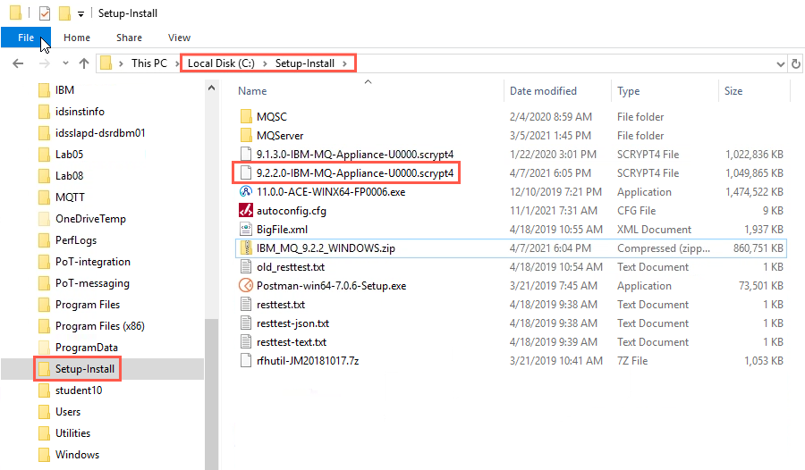
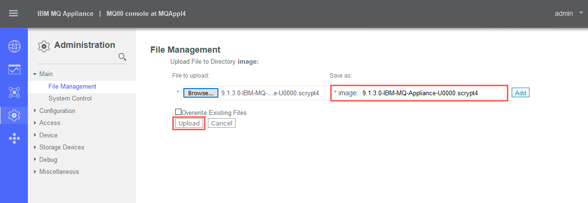
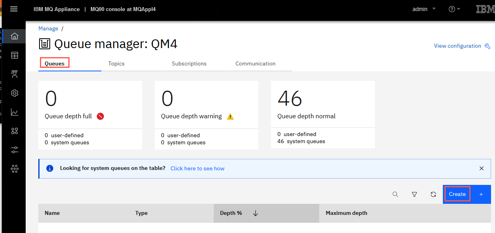
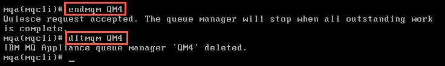
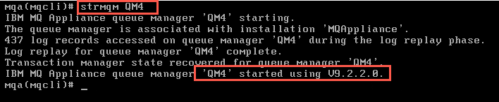
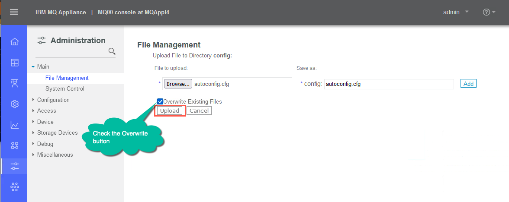

# Lab 7 - Service and Maintenance

In this lab, you will explore how to maintain the appliance. You will
learn how to back up and restore the configuration, backup and restore
an individual queue manager, and how to execute service procedures such
as upgrading the appliance firmware.

## The virtual environment

VMs required:

* **Windows 10 x64**
* **MQAppl4**

The lab environment consists of one virtual appliance **MQAppl4** and the Windows image, **Windows 10 x64**, to perform console operations and testing. There are other virtual appliances (MQAppl1, MQAppl2, MQAppl3, MQAppl5, MQAppl6, and MQAppl7) that will not be used in this lab. You should suspend them.

The MQAppl4 appliance is currently running version 9.1.3.0 of the
firmware. In this lab, you will upgrade the firmware to V9.2.2.0, before
reverting to V9.1.3.0 again.

## Back up the IBM MQ Appliance configuration

You can back up various features of your IBM MQ Appliance and restore
these features to the same or to a different appliance, if required.

After you back up an appliance, you must restore it to the same or
another appliance that is running the same firmware level.

To back up your IBM MQ Appliance, you back up the following features:

-   Configuration of the IBM MQ Appliance

-   Messaging users and groups

-   Key repository

-   Queue manager configurations and data

-   IBM MQ Appliance UI configurations

You use URIs to copy the backed-up information from the appliance to
safe storage. You also use URIs to restore backed-up information to a
target appliance. You restore an appliance in the following order:

-   Restore configuration of the IBM MQ Appliance

-   Restore messaging users and groups

-   Re-create the queue managers

-   Restore key repository

-   Restore queue manager configurations

-   Restore IBM MQ Appliance UI configurations

Commands are available to back up and restore a queue manager. You can
back up a queue manager to an archive file that can subsequently be
restored. The queue manager configuration is saved, together with log
files and queue data.

For this lab, you will first back up the IBM MQ Appliance configuration,
in preparation to upgrade the firmware. After upgrading the firmware,
you will then try using the commands to backup and restore a queue
manager. You will then restore the MQ Appliance configuration after you
have reverted the firmware back to V9.1.3.0.

### Performing the backup of the appliance configuration

You use the write memory command to write the current appliance
configuration to the *autoconfig.cfg* file. You can then copy the
autoconfig.cfg from a URI on the appliance to secure storage on another
system. In this lab, you will use the accompanying Windows system as the
external storage.

> <span style="color: Blue">**Note:** <BR>The backup you take is not secure, so sensitive data, such as appliance user IDs and passwords are not included. You must re-create these items manually if you use the backup to restore an appliance.</span>

1.  Go to the command line interface of your IBM MQ Appliance --
    **MQAppl4**.

2.  If not logged in, use the user name **admin** and password
    **passw0rd** to log in to the administrators group.

3.  Display the current firmware details with the command (ensure you
    are at the high-level prompt):

	**`show firmware`**
	
	

	The installed firmware is at the 9.1.3.0 level. You will upgrade the
    firmware to v9.2.2.0.

4.  Type the following command to enter configuration mode:

	**`config`**

5.  Type the following command to write the current configuration to the
    backup file autoconfig.cfg:

	**`write memory`**

6.  When prompted, reply **y** that you want to overwrite the current
    autoconfig.cfg file. 
    
    Overwrite existing autoconfig.cfg? **y**. 
    
    

7.  Go to the Windows image (login if needed). Open the **Firefox** browser
    and connect to **MQAppl4** (use the shortcut or use
    <https://10.0.0.4:9090>). Login as **admin** (password =
    **passw0rd**).

8.  Remember this is the old version of the GUI, running at V9.1.3.0. In
    this version, there are two primary options: *Manage Appliance* and *MQ
    Console*. By default the UI opens to the MQ Console with *Local Queue Managers*. You see *High Availability* and *Disaster Recovery* across the top of the page.
    
    
    
1. Click the *Administration* icon. Expand *Main* and click on **File Management**. 
    
    

9.  The *File Management* tool opens. You used the V9.2.4.0 File Management
    tool in Lab 3 and Lab 5. It enables you to upload a file from the
    system running your browser to the MQ Appliance; save a file from
    the MQ Appliance to your system; and move, copy, rename and delete
    files on the appliance.

	 We want to copy the updated and saved autoconfig.cfg for back up of
    the appliance. The autoconfig.cfg file is in the **config:** folder
    (URI) on the appliance. Click the **config:** folder in the File
    Management tool.
    
	The **config:** folder opens and you see all of the files contained
    within that folder.

	

12. To copy the autoconfig.cfg file to a location on another system,
    from where you can write it to back up storage and later recover it
    if necessary, you use the facilities provided by your browser.
    **Right-click** on the **autoconfig.cfg** file and the browser popup
    menu should appear.

	Click **Save Link As...**
	
	

14. Then *Enter name of file to save to...* dialog box opens up. Select
    **C:\\Setup-Install** as the location to save the file. The file
    name of **autoconfig.cfg** and file type of **Text Document
    (\*.cfg)** should be set for you. Click **Save**. 
    
    

	The file should be saved on your Windows system.
   
   > <span style="color: Blue">**Note:** <BR>Using the File Management tool keeps you from having to use a SCP tool and issue a command on the appliance, using the appliance URIs, such as this: </span>
    
    
    **copy config:///autoconfig.cfg scp://username\@ipaddress/[/]directorypath**  
      

## Firmware upgrade

To upgrade your IBM MQ Appliance, you install the latest level of
firmware on the appliance.

New function, security updates, and maintenance fixes for the IBM MQ
Appliance are made available through firmware releases. Additional
maintenance through iFixes are made available, as necessary, on the most
recent firmware level release.

You can also revert to a previous level of firmware to back out of an
upgrade, if required.

Fixes are cumulative, so you should always download the most recent
firmware that is available on the IBM Fix Central website.

All queue manager information persists through upgrades and rollbacks.

The standard rules of applying upgrades to IBM MQ apply when firmware is
upgraded and queue managers restarted. If the new firmware moves the IBM
MQ installation to a new command level, any queue managers that are
started at the new command level are no longer able to start under a
lower command level, even following a firmware rollback.

### Performing a firmware upgrade

You upgrade the IBM MQ Appliance by downloading a new version of the
firmware, copying it to the appropriate URI on the appliance, and
issuing the appropriate command to reboot the appliance with the new
firmware.

Normally you would use a computer with web access to download the
required image from [IBM Fix
Central](http://www-933.ibm.com/support/fixcentral/). This website is a
repository for all available and supported firmware images for IBM MQ
Appliances. The fixes are cumulative, so always choose the most recent
image.

In the lab environment, the download of Fix Pack V9.2.2.0 has already
been done for you and is stored in the directory C:\\Setup-Install\\. 



Fix Packs are delivered via a scrypt\* file. The file with the scrypt3
extension is the Fix Pack for the physical appliance. The file with the
scrypt4 extension is the Fix Pack for the virtual appliance. Use the
file with ***scrypt4*** in this lab.


> <span style="color: Blue">**Note:** <BR>If the appliance that you are upgrading is part of a high availability configuration, you should pause the first appliance, upgrade and resume the appliance. Then pause, upgrade, and resume the second appliance. </span>

The first step in a firmware upgrade is to back up your IBM MQ
Appliance. You have already done that in the first part of this lab.

You will again use the File Management tool to copy the firmware
    file to the MQ Appliance. The firmware .scrypt4 file needs to be
    placed in the **image:** folder (URI) on the MQ Appliance.

1. Return to the Windows system and go back to your browser window and
    the *File Management* tool. If the **config:** folder is still open,
    you might want to click on the **config:** folder again to close it.

2. In the *File Management* tool, click on the **Actions...** link to the
    right of the **image:** folder. A popup menu opens. Click the
    **Upload Files** link. 
    
        
   
3. An upload dialog opens. Click the **Browse...** button. 

	
	
4. Navigate to the **C:\\Setup-Install** directory. Select the **9.2.2.0-IBM-MQ-Appliance-U0000.scrypt4** file. 

	Click **Open**. 
	
	
    
5. The file will be displayed in the dialog as the file to upload and
    as the file name to save in **image:**. We do not need to rename the
    file. Click **Upload**.
    
	
    
6. The browser tab will show that the browser is busy, showing the
    spinning circle to the left of the tab name. Wait for the upload to
    complete. 
    
    When the upload completes, the display will show a status message
    stating the upload was successful. Click **Continue**. 
    
        

8. You will notice that the File Management tool now shows a  (**+** sign) next to the **image:** folder, signifying that the folder has some content. 

		
9. Click on **image:** and you will see the .scrypt4 file in the
    folder.
    
	

10. You are now ready to update the firmware file. This could be done at
    any time, now that you have the firmware file stored on the MQ
    Appliance.

	Return to the MQAppl4 appliance command line. If you are still in Global 	configuration mode, type **exit**.

11. Ensure that all the queue managers are stopped.
    
    Enter the followig commands:
    
    ````
    mqcli
    
    dspmq
    ````
    
	
	    
    The dspmq command should not return anything since there should be
    no queue managers currently defined on the appliance.

12. Enter **exit** to exit the mqcli shell.

13. Get the current firmware version of the appliance by entering one of
    the following commands:
    
    **`show firmware`**
    
    or
    
    **`show firmware-version`** 
    
    or

	**`show version`**

	

14. Type **config** to enter configuration mode.

15. Type **flash** to enter the correct mode for the firmware upgrade.

	

16. Restart the appliance with the new image by typing the following
    command:

    boot image accept-license *firmware\_file*

    where *firmware\_file* is the name of the file that contains the new
    firmware image. For this lab the command will be:

    **`boot image accept-license 9.2.2.0-IBM-MQ-Appliance-U0000.scrypt4`** 
    
    
  
17.  The appliance will then restart and the new firmware will be loaded. 

      Be patient. This will take a few minutes and the appliance will reboot. Wait for the **Login:** prompt to come back, then log in as before using the login **admin** and password **passw0rd**.

18. After you are logged in, verify that the firmware image is upgraded
    by entering the following command:

    **`show firmware`**

    which shows the following results. You should see a version of
    9.2.2.0 and a 'build date' of 2019-06-12. 
    
    

    Or use one of the following commands, which show more information.

	**`show version`** 
	
	or
	
	**`show firmware-version`** 
	
	
	
	> <span style="color: Blue">**Note:** <BR>The device must be attached to the network to do a firmware upgrade. The upgrade image is downloaded from IBM Fix Central on a separate computer and then copied to the appliance using the appliance command line interface or File Management tool. </span>

## Queue manager backup and restore

IBM MQ includes commands to provide an easy way to back up and restore a
queue manger. You connect to the MQ Appliance by using the command line
to use the mqbackup command, and save the queue manager to a file. The
queue manager configuration is saved, together with log files and queue
data.

Before you do the first backup of a queue manager on an appliance, you
must create the target directory for backup files, and allocate storage
for it in the appliance RAID volume.

> <span style="color: Blue">**Note:** <BR>A backup of a high availability (HA) queue manager does not contain any HA configuration data, so if you restore the queue manager from a backup file, it is restored as a stand-alone queue manager. Similarly, disaster recovery (DR) configuration data is not preserved when you back up a DR queue manager. You can redo this configuration after restore. </span>

You can back up a queue manager while it is running, but this requires
sufficient unallocated space on the disk to contain a temporary snapshot
of the queue manager. This space is not required if the queue manager is
stopped before the backup is taken. If you are backing up so that you
can use an archive file to migrate the queue manager, or if you want to
be able to restore a queue manager to the state it was in at a
particular time, then you should stop the queue manager before you back
it up.

If the queue manager is running when you run the mqbackup command, a
warning message is displayed. If a queue manager is stopped before you
take a backup, it is locked during the backup and cannot be started,
deleted or otherwise changed while the backup is running.

### Performing a queue manager backup

1. Go to the command line interface of your IBM MQ Appliance --
    **MQAppl4**.

2. Enter **mqcli** to go to the MQ shell.

3. Create a queue manager to test with. Issue the following command:
    
    **`crtmqm -p 1418 -u SYSTEM.DEAD.LETTER.QUEUE -fs 1 QM4`**
    
    

4. Start the queue manager:
    
    **`strmqm QM4`**

    

5. Return to the Windows image. Refresh the browser to reconnect to the
    appliance (after the appliance reboot) and login. 
    
    
    
    If you receive an information box concerning the upgrade from the V9.1.3
    version of the MQ Console configuration to the current version, you
    may click on the **X** at the far right of the box to dismiss the
    message.
    
    If the browser connects and the MQ Console has constant spinning wheel, attempt     	 the following to correct this issue. 
    
    a. Select the hamburger menu, then click *New Private Window*. 
    	
       
       
    b. Select the hamburger menu, then select *Options*. 
    
      
    	
    c. Select *Privacy & Security* then click *Clear Data*. 
    
       
    	
    d. Click *Clear*. 
    
        
    	
1.  You should have the *Manage* home page visible with the
    one queue manager shown as running.
	 
	 
	 
	 Click the *Manage* square.  

7. The **QM4** queue manager should be selected as the Queue Manager already. Click the hyperlink for **QM4**. 	

	

8. You are taken to the *Manage* > *Queues* page. There are no application queues defined. Click the *Create* button to create a queue. 

	
	
1. Click the *Local* block.

	

9. Enter **MYQUEUE** as the Queue name, ensure the Object type is Local, and click 	**Create**. 

	

10. *MYQUEUE* should now be visible on the page. 
    
    
    
1. Click the elipsis for **MYQUEUE** then click **View configuration**.

	 

11. Click *Edit*. Use the dropbox to set the **Default persistence** to
    **Persistent**. Click **Save**.
    
    

12. When you return to the properties page, click *Actions* > *Create message*. 

	    

13. Enter a message (e.g. **Test persistent message 1**) in the **Application Data** field and click **Create**.

	

14. Click the 'x' to remove the success message. Repeat the previous step two times, so you have three messages on the queue.

15. Click the breadcrumb *QM4*. The *MYQUEUE* queue should now have a Queue depth of **3**. 
    
    Now that we have a queue manager with some objects and queue data, proceed with the backup of it.

16. Switch back to the command line for **MQAppl4**.

17. Since this is the first time you have backed up any queue manager on
    this appliance, type the following command to allocate storage for
    your backup:

    **`createbackupfs -s 2`**
    
    **where "-s" is the *size* of the space that is allocated in GB** (you
    can use the "**m**" modifier to signify a size in megabytes if desired). 
    
    

1.  In the browser tab for *MQAppl4* > *Administration* > *File management* you will see a new directory that is named **mqbackup:///QMgrs** has been created and allocated that storage.

	

18. Now that we have a queue manager with some objects and queue data, as well as 	space allocated, let us proceed with the backup of it. Enter the following command:
    
    **`mqbackup -m QM4`**
    
    
    
    A backup file named **QM4.bak** is created and stored in the
    **mqbackup:///QMgrs** URI.
    
    
  
	> <span style="color: Blue">**Note:** <BR>The backup can take some time to|run, during which period you cannot use the CLI. By default, the archive file is named *QM\_name*.bak, but you can add the **-o outfilename** argument to the mqbackup command to specify a file name, if required.</span>

    You can of course copy the .bak backup file off the appliance, and copy it back on the appliance when needed.

### Restoring a queue manager from a backup file

You use the mqrestore command to restore a queue manager, including all
its log files and data, from a previously taken backup. The command
cannot run if there is already a queue manager with the same name on the
appliance. The archive file must be located in the backupfs location,
**mqbackup:///QMgrs**.

You can only restore one queue manager at a time.

1. The queue manager must be stopped before it is deleted. From the
    **mqcli** command line, enter:
    
    **`endmqm QM4`**

2. Wait a minute to ensure the queue manager ends, then enter:
    
    **`dltmqm QM4`**
    
     

    If you receive a message of "*IBM MQ Appliance queue manager 'QM4'
    ending.*", then wait some more then try the dltmqm command again.

3. Now to restore the queue manager, enter the following:
    
    **`mqrestore -f QM4.bak`**
    
     
     
     The restore should complete successfully.
     
     > <span style="color: Blue">**Note:** <BR>With a real world queue manager with larger logs and queues, the restoration might take some time, during which time the CLI is not available.</span>   
     
4. Start the queue manager.
    
    **`strmqm QM4`**
    
    

5. Return to the Windows image and the browser. In *Manage* > *Queue managers*, refresh the browser if necessary. *QM4* should be shown as running in the *Queue managers* window.

1.  Click the hyperlink for *QM4*. *MYQUEUE* with a queue depth of **3/5000** should be seen
    in the *Queues on QM4*.

    

6. Click the elipsis for **MYQUEUE** and select **View messages** to browse the messages.

        
    
7. The messages should look familiar. Check the timestamp to prove
    these are the messages you put on the queue before you deleted the
    queue manager.  
    
    

8. To prepare for the next step, stop the QM4 queue manager. Click the *Manage* breadcrumb. Click the elipsis for **QM4** on the **Queue Managers** page, and select **Stop**.

    

9. The status will change to *Stopping*, then **Stopped** and you receive the green success pop-up.

    

## Reverting to the previous level of firmware and restoring configuration

You will now revert the appliance back to the previous, V9.1.3.0 level
of the firmware, and restore the configuration of the appliance.

### Reverting to the previous level of firmware

When you upgrade the IBM MQ Appliance firmware by using the boot image
command, the appliance retains current configuration data. This feature
is used to restore the appliance to a known, stable state if required.

-   The previous firmware image and associated configuration data is the
    secondary installation.

-   The newly installed firmware image and associated configuration data
    is the primary installation.

When you switch between firmware images, the switch can take some time.
During this switch operation, do not power off or restart the appliance.

1. You should still be on the command line of the MQ Appliance. If not,
    log in to the appliance as an administrator.

2. Ensure that all queue managers are stopped.

3. Type **exit** if necessary to exit mqcli mode.

4. Type **config** to enter configuration mode.

5. Type **flash** to enter the correct mode for firmware rollback.

6. Restart the appliance with the original image by typing the
    following command:

	**`boot switch`**
	
	

7. Wait for the appliance to reboot, and then login.

8. Enter **show version** to check the firmware level. Notice the
    return to the previous V9.1.3.0 level.
    
    

### Restore the IBM MQ Appliance configuration 

You can restore the configuration of an IBM MQ Appliance to the same or
to a different appliance.

If you are restoring to the same appliance, it will have the same IP
address and the same name. The first steps are the same as initially
configuring the appliance when you first installed it.

If you are restoring to a different appliance, it must be running the
**same** firmware level.

Copy a previously saved autoconfig.cfg file to the target IBM MQ
Appliance and then restart the appliance.

1. Return to the Windows image. Refresh the browser if necessary, and
    then login as **admin**. You will need to login in again since the
    appliance rebooted.

2. Click on **File Management**.

    

3. Click on the **Actions...** link to the right of the **config:**
    folder. On the popup menu, click **Upload Files**.

    
    
4. Click **Browse**.
    
    

5. In the **File Upload** dialog, navigate to **C:\\Setup-Install** and
    select the **autoconfig.cfg** file. Note the date modified to ensure
    this is the file you copied earlier. Click **Open**.

    

6. Note the **autoconfig.cfg** file as the name to upload and the name
    to save the file in the **config:** folder. Click the **Overwrite
    Existing Files** checkbox, and then click **Upload**.
    
    
    
7. Note the Status confirmation, then click **Continue**.
    
	

8. Return to the **MQAppl4** command line..

9. Shut down and restart the appliance by entering the following
    command:

	**`shutdown reboot`**

10. Answer **y** to the prompt for reboot.

	
   
    You can move on to the next section and start reading, but you will
    have to wait for the reboot to complete before taking the next lab
    step.

## Factory reset

A factory reset restores the IBM MQ Appliance to its default state. Be
aware that a factory reset deletes all queue managers and messages that
are hosted on the appliance. The reset forcibly ends all queue managers
and detaches any applications that are connected to them. After the
update, you require direct console access to reinitialize the system.

### Performing factory reset

To do a factory reset on a physical appliance, you need to complete the
following steps:

-   Connect the appliance to the network.

-   Connect a terminal to the appliance as shown below.

-   Connect cabling on the physical appliance:

    -   Black is the terminal USB cable to a PC.

    -   Red is the Ethernet port ETH10 connected to the network.
 


> <span style="color: Blue">**Note:** <BR>This example uses the RJ45 to USB cable and PuTTY for the terminal  window. To do this you need a USB serial driver such as the one here:  <http://www.prolific.com.tw/US/ShowProduct.aspx?pcid=41> </span>

Because you are using a virtual appliance, you will simulate the above steps. You will still use PuTTY from the Windows machine and connect to **eth0 -- 10.0.0.4**.

2. Double click the **Putty** icon on the desktop to open the configuration window.
    
    

4. In the PuTTY window, click **Session** and enter **10.0.0.4** for the Host Name (or IP address). The port should already be set to 22. Click **Open** to start the session.
    
    

5. Reply **Yes** to allow any security alerts.
    
    

6. Hit **Enter** when you get the first **login as** prompt, then log
    in as the default administrator: use the login **admin** and
    password **passw0rd**.

    
    
7. Enter config mode by typing:

	**`config`**

8. Enter flash mode by typing:

	**`flash`**

9. Check the firmware version:

	**`show firmware-version`**

	

10. Verify the firmware image is in the image directory:

	**`dir image:`**

11. If the image directory is empty or the correct image is not present,
    go to [IBM Fix Central](http://www-933.ibm.com/support/fixcentral/)
    and obtain the latest firmware release. The download has been done
    for you and is located in the directory C:\\Setup-Install. The
    normal extension for the firmware is \*.scrypt3. However for the
    virtual appliance, the firmware has the extension \*.scrypt4. 
    
    
    
    We will use the 9.2.2.0-IBM-MQ-Appliance-U0000.scrypt4 file.

12. Refresh your **Firefox** browser to reconnect to the **MQAppl4** appliance
    after the appliance reboot. Login as **admin**.

13. Click *Administration* > *Main* > **File Management**.

14. Click the **Actions...** link to the right of **image:**, then click
    **Upload Files** on the popup menu.

    

15. Click **Browse**.

	 In the **File Upload** dialog, navigate to **C:\\Setup-Install**
    directory.

    Select **9.2.2.0-IBM-MQ-Appliance-U0000.scrypt4**. Click **Open**.
    
    

17. Click **Upload**. 

	
    
18. Wait for the upload to complete. It is complete when you receive the
    confirmation message. Click **Continue**.

	

19. Return to your **PuTTY** window.

20. In order to reinitialize the appliance, the file must be in the
    **image:** directory. Once the firmware file is copied into the
    **image:** directory, you can reinitialize the firmware.

    Verify the firmware image is in the image directory:

	**`dir image:`**

	

21. Type the following command:

	reinitialize *firmware\_image\_file*`

	*For example:*

	**`reinitialize 9.2.2.0-IBM-MQ-Appliance-U0000.scrypt4`**

22. You will be prompted to verify that you want to reinitialize the
    device as this will wipe out everything. Enter **y** to confirm.

    

    All queue managers will be stopped and deleted as will all services
    such as the Web GUI, HA clustering, and syslog.

      
    
    > <span style="color: Blue">**Note:** <BR>On the virtual appliance, the factory reset function is not a supported function; therefore, it does not complete the same as it would on a physical appliance. On the physical appliance, the factory reset will take a few minutes and then the appliance will reboot. The factory reset would then be complete. You would wait for the *Login:* prompt to reappear. 
    
    
    After reinitialization is complete, you must log in as admin, using the password admin, and follow the initial setup procedure described in initializing the appliance in the KnowledgeCenter (the steps you performed in Lab 1). 
    
    
    Note that after files are deleted, they cannot be recovered. If you might need any of these files after you reinitialize the appliance, ensure that you have copies of these files.
    
    
    The network configuration is removed too, so you can no longer access the appliance through the former IP address. You can connect to the appliance only through a serial cable. </span>

## Summary

You have seen how to do a backup of the IBM MQ Appliance, including how
to backup and restore a queue manager. You also have upgraded the MQ
Appliance firmware from V9.1.3.0 to V9.2.2.0. You tested the factory
reset option, loaded the latest firmware and restored the configuration
from a backup.

1. Shutdown the **MQAppl4** image.

Congratulations, you have finished Lab 7 Service and Maintenance.
