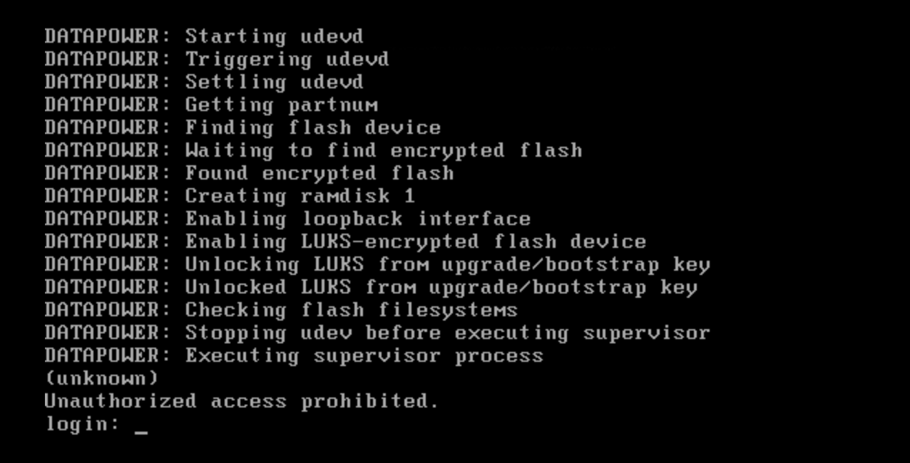
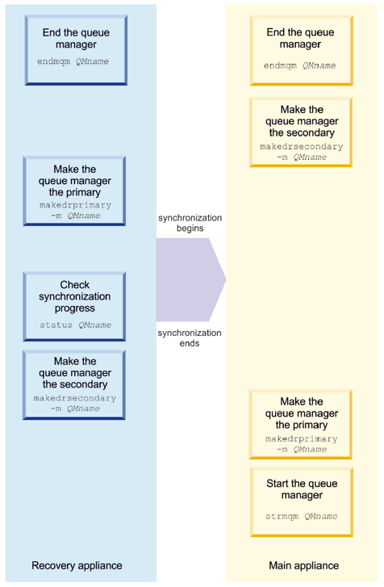
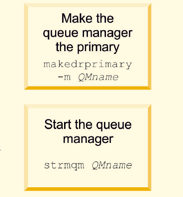
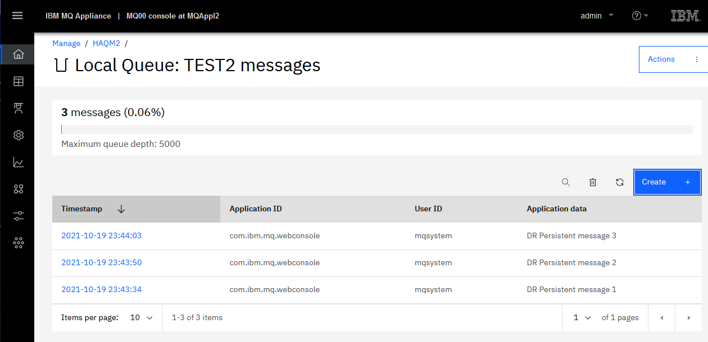

# Lab 8 - IBM MQ Appliance Disaster Recovery (DR)

VMs required:

* **Windows 10 x64**
* **MQAppl1**
* **MQAppl2**
* **MQAppl3** 

The lab environment consists of three virtual appliances, **MQAppl1**, **MQAppl2**, and **MQAppl3**, and the Windows image, **Windows 10 x64**, to perform console operations and testing. There are other virtual appliances (MQAppl4, MQAppl5, MQAppl6, and MQAppl7) that will not be used in this lab. You should suspend them.

## Introduction

The MQ Appliance Disaster Recovery (DR) feature supports flexible DR
topologies consisting of 'live' appliances at multiple sites. DR support
is provided at the Queue Manager (QM) level, so they can be configured
independently according to DR policy -- e.g. using a simple
main/recovery site DR strategy or multi-site main/recovery strategy.

Just one network connection is required for DR between the MQ Appliances
hosting the Queue Managers. The appliances are designed to tolerate a
level of network latency between distant sites -- different than High
Availability on the MQ appliances, which tend to be in close proximity,
and are designed for automatic takeover with no data loss.


In a simple scenario, if a 'main' site fails, the recovery process
begins to ensure business continuity. One or several of the Queue
Managers on the 'main' appliance are to be recovered on a 'recovery'
appliance, which could be many miles away. The secondary DR Queue
Managers on the remote site are converted to Primary QMs and thus become
Primary instances on the recovery appliance or appliances, as policy
dictates. Also, an HA Queue Manager (e.g.
where the HA site is 'taken out') can be DR enabled and the HA site can
be recovered to the designated recovery site.

In this lab you will configure a pair of IBM MQ Appliances to provide a
Disaster Recovery (DR) solution.

This solution provides for the situation where a complete outage or
disaster happens in a primary location and the work must be resumed
using another IBM MQ Appliance at another location.

The lab consists of:

-   Configuring the IBM MQ Appliance hardware for disaster recovery

-   Configuring a queue manager for disaster recovery

-   Performing a disaster recovery test

Note that an appliance can support a mixture of HA, DR, or standalone
Queue Managers and which can all co-exist quite happily.

Finally, it may be worth noting that 'ports' or 'interfaces' mentioned
in this lab (e.g. eth0, eth4) are mapped differently than those on the
physical MQ appliance, that may be rack-mounted in the real world. The
diagram below provides a pictorial representation:


The M2002 introduced several additional network interfaces, including
two new 2 x 40 GB QSFP+ ports as well as two additional 10GB SPF+ ports.
  
> <span style="color: Blue">**Note:** <BR>The MQ Appliance allows either a 10GB or 40GB Ethernet port to be used for replication on each appliance to configure DR. On the physical appliance that port by default is **eth20**, on the virtual appliance it is **eth4**.</span>

Refer to **IP Addresses** in the [Overview the IBM MQ Appliance PoT](../mq_appl_pot_overview.md)
document, to determine the
network adapters and IP addresses assigned to each appliance. Pay
particular attention to **eth4** as it is the adapter used for DR on the virtual appliance. 

### Start the Environment

1.  Start the environment and wait until all three virtual machines have started. You may shut down **MQAppl4**, **MQApp5**,**MQAppl6**, and **MQAppl7** as they will not be used in this lab.

2.  The MQ appliances will have fully started when they reach the
    **login** prompt.

    

### Configure Hardware for Disaster Recovery 

In this activity, you will verify the hardware configuration necessary
to connect the two appliances via the network.

1.  Select the first appliance (**MQAppl1**) to access the console and
    login using the administrator credentials, user-id **admin** and
    password **passw0rd**.

2.  Issue the **show ip** command to display the list of the Ethernet
    interfaces and their IP assignments (ensure you are at the **mqa\#**
    prompt).
    
    

3.  Take note of the IP addresses for both **eth0** and **eth4**. The
    other IP addresses are not used for Disaster Recovery.

    *Note that your IP addresses may be different than the ones shown
    above.*

4.  Repeat this on **MQAppl3** and record the addresses.

    

### Configure Disaster Recovery Queue Managers

In this activity, you will perform the configuration to make a queue
manager part of a disaster recovery configuration.

> <span style="color: Blue">**Note:** <BR>A disaster recovery configuration is setup by defining a primary and secondary queue manager. The primary appliance is **MQAppl1** and the secondary appliance is **MQAppl3**. You will use existing queue manager **QM1**. During the configuration, the queue manager must be in a stopped state. </span>
  

1.  Switch to the Windows VM and start a **Firefox** web browser using
    the icon on the Desktop.

    

2.  Enter the IP address for **MQAppl1** (<https://10.0.0.1:9090>) to
    log onto the MQ console.

    

    **Note:** If you get a warning about a potential security risk, click
    the **Advanced...** button, then click **Accept the Risk and
    Continue**.

3.  Sign in with **admin** / **passw0rd**.
    
    

	We will use QM1 which was created previously.

    QM1 uses port 1414 and has a file system size of 2GB. Remember that
    the available file system on the virtual appliance is very limited.

4.  To prepare the disaster recovery configuration, the queue manager
    must be stopped. If QM1 is running, highlight it in the **Manage** > 
    **Queue Managers** page and stop it by clicking the elipsis and select **Stop**.
    
    
    
5. You receive a green confirmation that the command was successful.

    

6. Refresh the queue manager status to make sure it is stopped.

     

1. Click the *Disaster recovery*.

	 
	   
1. Click the  icon for *QM1* and select *Configure DR*. 

	

8. Click the **Setup DR primary** option.
    
    
    
9. MQAppl3 will be the recovery appliance, so fill in the fields as
    shown below:
    
    **Standby appliance name: MQAppl3**
    
    **Standby appliance IP address: 10.0.4.3** (or appropriate *eth4*
    address of *MQAppl3*)

    **Disaster recovery port: 2014**
    
    **Replication type: Asynchronous** 
    
    **Floating IP address**: not configured
    
    Click the checkbox to agree. 

     
    
    > <span style="color: Blue">**Note:** <BR>10.0.4.3 is the IP address of eth4 (physical eth20) network adapter on MQAppl3 (refer to table at the top of this guide).</span>
    
10. Click **Save**.

	> <span style="color: Blue">**Note:** <BR>The information used to generate the command: 
    
    
    **crtdrprimary -m QM1 -r MQAppl3 -i \<MQAppl3-eth4-IP\_Address\> -p 2014** 
    
    
    * The queue manager name **(-m)** is passed to the command along with the name (**-r**) and IP address (**-i**) of the secondary (recovery) appliance. A port number (**-p**) used for replication must be specified.
     
    * The port number must be in the 1025-9999 range, unused, but not 2222.
    </span>
    
	If the command is successful, you will receive a green message
    indicating that the queue manager is prepared for disaster recovery
    replication.

	On successful completion of the command, the command generates and outputs the associated **crtdrsecondary**
    command to be run **AS IS** on the secondary (**MQAppl3**) appliance.
    
    Use the copy icon to copy the command in the pop-up "**Create DR secondary command**"
    box, as you will need to run it on the recovery appliance *MQAppl3*.
    
    

12. Close the pop-up. 

	If you receive the error below, contact your instructor for help in
    making space available.
    
    
    
13. Open a new browser tab and enter the IP address for **MQAppl3**
    (<https://10.0.0.3:9090>) to log onto the MQ console.

    Note: If you get a warning about a potential security risk, click
    the **Advanced...** button, then click **Accept the Risk and
    Continue**.
    
    

14. Log in with **admin** / **passw0rd**.

15. Click the *Manage* icon then **Disaster Recovery** button at the top of the page. 
    
    
    
1. Click **Create DR secondary queue manager**.

	
	
16. Paste the *copied* **crtdrsecondary** command in the "**Enter command to setup secondary**"
    box on appliance **MQAppl3**.
    
    Once you paste the command, the other fields will automatically fill
    in.

	For example: **crtdrsecondary -m QM1 -s 2048 -l MQAppl1 -i 10.0.4.1
    -p 2014**
    
     
    
17. Click **Create**.

	You should see a green confirmation box at the top of the console. 
	
	 

	You can click the **X** to dismiss the box.
	    
18. You should see **QM1** show up in the **Queue Managers** with status *Stopped*. Notice that the *DR Status* is **Synchronization in progress**. You may need to click the refresh button for **Queue Managers** if you get an error message.
    
    
    
    Once synchronization is complete the *DR status* will change to **Normal**.
    
    
         
     > <span style="color: Blue">**Note:** <BR>The information used to generate the command: 
     
	The **crtdrsecondary** command creates a secondary version of the queue manager on the recovery appliance in a disaster recovery configuration. All parameters are supplied by the equivalent **crtdrprimary** command and should be entered exactly as shown in the output from that command. After this command is run, synchronization of data from the main to the recovery appliance begins. The queue manager status is shown as stopped, and initial synchronization progress can be followed by using the **status** command. </span>
  
21. Run the **status** command to inquire about the synchronization
    status.

	This command can be run on either appliance.

    Remember you must be at the **mqcli** shell.

    Command entered on **MQAppl3**:
    
    **`status QM1`**

    

    Command entered on **MQAppl1**:

    **`status QM1`**

    

22. While at the **MQAppl1** appliance command line, start queue manager
    **QM1** on appliance **MQAppl1** in **mqcli** mode:

	**`strmqm QM1`**

    

The DR configuration for queue manager QM1 is now complete. From
    this point on, both MQ definitions and data are asynchronously
    replicated to the secondary appliance.

### Perform a Disaster Recovery Test 

In this activity, you will perform a Disaster Recovery test to validate
the disaster recovery configuration that you just put in place.

The test includes the following steps:

-   Create a messaging user-id

-   Generate some MQ object definitions for the messaging application

-   Generate some persistent message traffic to queue manager **QM1**

-   Shutdown of the primary **MQAppl1** appliance

-   Recovery of the **QM1** queue manager on the secondary **MQAppl3**
    appliance

-   Get messages previously sent from queue manager **QM1**

Now let's start the test.

1. Return to the **MQAppl1** appliance.

2. Create a messaging user on the appliance

    **`usercreate -u potuser -g users`**

   
   
   If you receive an **AMQ6618: The userid 'potuser' already exists message**, you can ignore it and continue.
   
   > <span style="color: Blue">**Note:** <BR>The commands are stored in a text file in C:\\Lab08\\Commands\\Commands Snippets.txt. <br><br>
   You may copy and paste the commands if you don't want to type them. However, you cannot paste in the mqcli command line, so you will need to log on to the appliance using putty, which will allow you to paste the commands. 
	</span>
    
  
3. Create some MQ objects on the appliance with the following commands:

	```
	runmqsc QM1
	
	def channel(APP.CLIENT) chltype(SVRCONN)
	
	def ql(TEST.Q)
    ```
    
    
    
4. Grant authorizations to the MQ objects on the appliance.

	```
	set authrec objtype(qmgr) principal('potuser')
    authadd(connect,inq)
    
    set authrec objtype(queue) profile(TEST.Q)
    principal('potuser') authadd(put,get)
    
    end
    ```
    
    
    
5. Switch to the Windows environment (**Windows 10 x64)** and double
    click the **potuser** icon. This will open a Windows command prompt.

    
    
6. Send some persistent messages to queue manager **QM1**.
	
	From the Windows command prompt:
	
	```
	cd \Utilities\MA01
	
	set MQSERVER=APP.CLIENT/TCP/<MQAppl1-eth0-IP>(1414)
	```

	Replace \<MQAppl1-eth0-IP\> with the correct IP address -- normally
    10.0.0.1.

7. Now we use the **q** program to put some persistent messages.
	
	`q -o TEST.Q -ap -mQM1 -lmqic`

	*parameters:* 
	
	*-o output queue name (small o)*

	*-a options: p=persistent*

	*-l library: mqic=32bit (small l)*

	

8. Enter **three** messages.

9. Finally, **CTRL-C** out of the program.

10. Shut down the **MQAppl1** appliance using the Skytap dashboard
    shutdown button. Wait a minute or so for the action to work.

    

11. Switch to the **MQAppl3** appliance and display the status of queue
    manager **QM1**.

    **`status QM1`**

    
    
    You should see a DR status now of **Remote appliance(s)
    unavailable** as the unavailability of
    MQAppl1 is recognized.
    
    If you do not see this status, wait a few seconds and try again.

12. In the browser session for **MQAppl3**, notice that **QM1** is still
    **Stopped**. The DR functionality does not automatically start the
    queue manager.

    Click  for **QM1** and select **Configure DR**. Select **DR Status**.

    

14. Make queue manager **QM1** on MQAppl3 primary.

    Click **Make primary**.

    
    
    Click **Confirm** to make QM1 DR primary.

    You should receive a green bar with the **Successfully performed
    disaster recovery action** message. You can click on the **X** to
    dismiss the message.

    
    
     **OR**
         
    You can also run the command from the **MQAppl3** command line, enter the command:

    **`makedrprimary -m QM1`**
    
      
      
15. Start queue manager **QM1** on MQAppl3.

	From the web browser tab for MQAppl3 MQ Console:
   
    Click the *Manage* breadcrumb to return to *Manage Queue managers*. Click the
     button for **QM1** and select **Start**.

	
	
	**OR**
	
	From the command line:

    **`strmqm QM1`**

    
	
	 The queue manager has now been recovered on the secondary appliance and it is ready to accept connections and process messages.
 
16. Switch back to the Windows environment (**Windows 10 x64**) browser
    session for **MQAppl3** if necessary.

17. Click the hyperlink for **QM1**.

    

    Note that **QM1** still has *three* messages on the **TEST.Q**.

    

    There may be messages on other queues left from previous labs too.

18. Browse the messages by clicking the hyperlink for **TEST.Q**. 

	These messages will look familiar, as they are the ones you created
    on **QM1** on **MQAppl1**.

    

19. Click **Close**.

20. Retrieve messages previously put to the **TEST.Q** queue.

	Return to the Command Prompt and repoint the MQSERVER variable to
    the recovery appliance (at your **eth0** IP address).

    **`set MQSERVER=APP.CLIENT/TCP/<MQAppl3-eth0-IP>(1414)`**

    Replace \<MQAppl3-eth0-IP\> with the correct IP address -- normally
    10.0.0.3.

    Retrieve the messages:

    **`q -ITEST.Q -mQM1 -lmqic`**

	*parameters:*
	
	*-I input queue name (**capital i**)*

	*-a options: p=persistent*

	*-l library: mqic=32bit (small l)*

	

	**OOPS!** What happened? 2035... Security error, not authorized!
    Let's investigate....

21. On **MQAppl3**'s MQ Console, click the **Administration** icon.
    
    

22. Expand the **Main** tab and select **File Management**.

    
    
23. Navigate to **mqerr: \> qmgrs \> QM1**, then click on
    **AMQERR01.LOG**. The log file opens in a new tab in your browser.
    
    

24. Scroll to the bottom and review the error.

    

	The problem is that messaging users are **not** replicated
and must be re-created during DR time. Note that MQ authorizations are
part of the queue manager and are replicated.

25. **Close** the error log by closing the browser tab.

26. Re-create the messaging user-id **potuser** on MQAppl3.

	Switch back to the **MQAppl3** command line and enter:

	**`usercreate -u potuser -g users`**

	

27. Switch back to the Windows environment.

28. Again attempt to retrieve the messages in the potuser command
    session:

    **`q -ITEST.Q -mQM1 --lmqic`**

    *parameters:* 
    
    *-I input queue name (**capital i**)*

    *-a options: p=persistent*

    *-l library: mqic=32bit (small l)*

    

	Voila! The DR test is successful and complete!

### Remove a queue manager from a disaster recovery configuration

1. Switch to the **MQAppl3** browser tab and click the *Manage* icon. 

	Stop queue manager **QM1**, by clicking the elipsis and select **Stop**.
    
    

2. You receive confirmation of the stop action. 
	
	Then click *Disaster recovery*.

    

3. Click the elipsis for **QM1** and select *Configure DR*. 

    

    Click **Make secondary**.
    
    

    Click **Confirm** on the pop-up to make QM1 secondary.
    
    
    
    You receive the green confirmation pop-up.

4. From the Skytap dashboard, start **MQAppl1**.

    

5. Return to browser tab for MQAppl1. Wait for MQAppl1 to initialize. You will know initialization is complete when the login: prompt is displayed on the MQAppl1 console or you are prompted to refresh the browser on the MQAppl1 browser tab.

    

    

6. Login and start **QM1** on **MQAppl1**.
    
    

7. On the Windows VM, return to the browser tab for *MQAppl1*. You will be required to sign-in again since MQAppl1 was restartred. Click *Manage*. **QM1** will display a **Starting** status, then **Running**.
    
   

8. Click the hyperlink for **QM1** then **Queues**. You will see that the three persistent messages are still on **TEST.Q**.
    
   

10. Click **TEST.Q** to browse the messages.

    

11. You have verified that your messages are still on **TEST.Q** on
    queue manager **QM1** when QM1 has been restored on the main
    production appliance.

12. On **MQAppl3**'s MQ Console **QM1** on the **Disaster Recovery** pane, **Delete DR secondary**.

    
    
    Click *Confirm* on pop-up.

    

    You will receive the green succes message pop-up. Click the **X** to dismiss the message.

13. Wait a few seconds and you will see *QM1* disappear from the MQ
    Console. QM1 has been removed from the disaster recovery configuration.
    
    

14. On **MQAppl1**'s MQ Console click the *Manage* breadcrumb, then *Queue Managers*. Click the elipsis for **QM1** and select *Stop*.
    
    

15. You will receive the green success pop-up and **QM1** shows a *Stopped* status. Once *QM1* is stopped click **Disaster Recovery** and then **Delete primary**.
    
    

17. You will receive the green successful operation message. QM1 is now
    completely removed from DR configuration on any appliance. Click the
    **X** to dismiss the message.

    

## Configuring disaster recovery for a high availability queue manger

You can specify that a high availability queue manager also belongs to a
disaster recovery configuration.

The following exercise provides insight into DR support for High
Availability Queue Managers and allows us to explore recovery of Queue
Managers running on designated HA appliances (e.g. at one site), to a
remote Disaster Recovery site (until such point as the main site is
recovered).

Both appliances in a high availability pair are typically located in the
same data center. If some disaster befalls the data center, and both
appliances are unavailable, you can manually start the queue manager on
a recovery appliance located in another data center. In this
environment, assume MQAppl3 is in another data center and will be the
disaster recovery appliance.


The MQ Appliance DR feature supports flexible DR topologies consisting
of 'live' appliances at multiple sites. DR support is provided at the
Queue Manager (QM) level, so they can be configured independently
according to DR policy -- e.g. using a simple main/recovery site DR
strategy or multi-site main/recovery strategy.

Just one network connection is required for DR between the MQ Appliances
hosting the Queue Managers. The appliances are designed to tolerate a
level of network latency between distant sites -- different than High
Availability MQ appliances, which tend to be in close proximity, and are
designed for automatic takeover with no data loss.

In a simple scenario, if a 'main' site fails, the recovery process
begins to ensure business continuity. One or several of the Queue
Managers on the 'main' appliance are to be recovered on a 'recovery'
appliance, which could be many miles away. The secondary DR Queue
Managers on the remote site are converted to Primary QMs and thus become
Primary instances on the recovery appliance or appliances, as policy
dictates. In the latest update to DR support, a HA Queue Manager (e.g.
where the HA site is 'taken out') can be DR enabled and the HA site can
be recovered to the designated recovery site.

Note that an appliance can support a mixture of HA, DR or standalone
Queue Managers, which can co-exist quite happily.

Finally, it may be worth noting that 'ports' or 'interfaces' mentioned
in this lab (e.g. eth0, eth4) are mapped different to those on the
physical MQ appliance, that may be rack-mounted in the real world.

The diagram below provides a pictorial representation:


Note that on the physical MQ appliance, the physical port (interface)
numbers are different to those ports shown in this hands-on lab, using
the Virtual Appliance. The mappings of the virtual ports are in
parentheses.

### Disaster Recovery sequence of events

The following diagrams provide the detailed sequence of events in
graphical form between the main appliance and fail over appliance in a
disaster recovery configuration.







### Prepare for HA group in DR configuration

If **QM1** was deleted in the previous exercise, you can skip the first two-three steps (depending on if QM1 is deleted from both appliances).

1. Since space is limited on virtual appliances, you need to delete
    **QM1** as we will not use it in this exercise and need the space.

    On **MQAppl1**, use the MQ Console and go to *Manage* > *Queue Managers*. Click the elipsis for **QM1** and select *Stop*. 

    

2. Once *QM1* is stopped, click the elipsis again and select *View configuration*. 

	

1.  Click **Delete queue manager**.

    
    
    Type the name of queue manager and click *Delete*.
    
    
    
    Refresh the page to see that QM1 has been deleted.
    
3. Logon on to the **MQAppl2** MQ Console and repeat the previous step to delete the
    queue manager **QM2** (if it exists) on **MQAppl2**. Make sure the
    only queue managers you see on MQAppl2 are HAQM1 and HAQM2. Delete
    any others.

    

4. Staying on **MQAppl2**'s MQ Console, add a local queue named
    "**TEST2**" on queue manager **HAQM2**.

    

    

5. Open the properties for **TEST2** by clicking the elipsis and select *View configuration*. 

    

6. Click *Edit* and change the **TEST2** queue default persistence to be  **persistent**. 

    Click **Save** to save the change.

      
    
     

7. Click the hyperlink for **TEST2**, and put **three** messages on
    **TEST2**.

    

   You are now ready to test DR.

### Configure DR for HA queue manager

1. On the **MQAppl1** MQ Console, navigate to *Manage* > *Queue managers*. Click the elipsis for **HAQM1** then click **Stop** to end the queue manager **HAQM1**.

    
    
    You will receive the green success pop-up.

3. Repeat the previous steps to stop **HAQM2** on **MQAppl2**.

    

### Create a DR primary and backup QM on recovery device

The next task is to create a DR primary (MQAppl2) queue manager and a
backup queue manager on the recovery site (MQAppl3). Note that the HA
appliance pair MQAppl1 and MQAppl2 need to be running also.

1. Make sure that the HA queue managers are not in split-brain status.

    On **MQAppl2**'s command line, enter the command:

    **`status HAQM2`**

    

    If the HA status shows **Normal**, skip to [Partitioning Resolved - Continue](#partitioning_resolved).

    In this instance, the HA status for **HAQM2** shows **Partitioned**
    which is also called split-brain. The amount of data which is out of
    sync is shown to be 137284KB (what you see might differ slightly).
    This is easily resolved. Click this link to [Resolve Partitioning](#resolve_partitioning). Then return here.

4. Check the status for **HAQM2** again on MQAppl2's command line.
    Status is now **Normal**.

    
 
<a name="partitioning_resolved"></a>   
#### Partitioning Resolved - Continue

6. On the **MQAppl2** browser session in *Manage* > *Queue managers*, click *Disaster recovery*. 

	
	
1. Click the elipsis for **HAQM2** (stopped) and select *Configure DR*. 

    

7. Click **Setup DR Primary**.

   

8. Specify that the **HAQM2** queue manager is the primary instance in a
    disaster recovery configuration and include a floating IP address
    that can be used by either of the appliances in the HA pair.

    Complete the dialog (below) with the IP address of eth4 from the DR
    site (MQAppl3) in the information as follows:

    **Standby appliance name: MQAppl3**
    
    **Standby appliance IP address: 10.0.4.3** (or appropriate eth4
    address of MQAppl3)

    **Disaster recovery port: 2023**

    **Floating IP address: 10.0.4.14**

    Click **Save**. 
    
    
    
     If entering the command manually on the appliance CLI it would look like this:
   
   **`crtdrprimary -m HAQM2 -r MQAppl3 -i 10.0.4.3 -p 2023 -f 10.0.4.14 -t -a `**
   
   The parameters are as follows 
    
   -   *-m*  queue manager name

   -	*-f*	Floating IP address of the high availability (HA) queue manager

	-	*-r*	name of the recovery appliance

	-   *-i*  ip address of DR replication interface on the recovery appliance

	-   *-p*  data replication listener port 
	
	-   *-t*  replication type:

	-	*a*		asynchronous
   
   The DR creation task can take a bit of time, wait at least a minute or two.
      
   This generates the *crtdrsecondary* command which you need to run on MQAppl3. Copy the command in the pop-up window so that you can submit it on MQAppl3.
   
    

1. Logon to the **MQAppl3** MQ Console via the browser. Navigate to *Manage* > *Queue managers*, then click *Disaster recovery*.

	
	
1. Click *Create DR secondary queue manager* button.

	 
	
1.	Paste the command you copied from MQAppl2 into the field where it says to "Enter command to setup secondary". Notice the fields below are populated when you paste the command. You could also click the hyperlink and enter the fields manually if you didn't copy from MQAppl2. But it is much easier to copy from MQAppl2 and paste on MQAppl3. 
	
	Click *Create*.  
	
	
	
	The command configures the queue manager on both appliances in the DR pair, and reserves storage for the data snapshot on both appliances. The command would look like this if entered manually on the appliance CLI:

    **`crtdrsecondary -m HAQM2 -l MQAppl2 -i 10.0.4.14 -p 2023 -t -a`**

	The parameters are as follows

	-   *-m*  queue manager name

	-	*-l*	name of the main appliance

	-   *-i*  ip address of DR replication interface on the main appliance

	-   *-p*  data replication listener port 

	-	*-fs*	file system size in megabytes (MB)
	
	-   *-t*  replication type:

	-	*a*		asynchronous	
   
	The floating IP address is an IPv4 address that is used to replicate
    queue manager data from *whichever HA appliance the queue manager is
    currently running on* to the queue manager on the recovery appliance.
    The floating IP address must be in the same subnet group as the
    static IP address assigned to the replication port -- eth4 (eth20
    for physical appliances) -- on both appliances. It also must be at
    least one greater than eth4's address and unused.

    Note that you do not physically configure an Ethernet port with this
    address. Select a free IP address in the same subnet as the
    replication ports on the two appliances, and specify it in the
    crtdrprimary command to make it the IP used for replication with the
    recovery appliance. You must specify a different floating IP address
    for each of the HA queue managers that you configure disaster
    recovery for.

13. Wait for the command to complete (a few seconds) and you will see
    that **HAQM2** is added to the *Local Queue Managers*. Note that its *DR status* is *Secondary*.
    
    

14. Return to the **MQAppl2** browser and click *Disaster recovery*.

	

1.  You will now see that **HAQM2** has a *DR status* of *Normal* and *DR role* of *Primary*.
    
     
    
    If the DR status for HAQM2 shows *Normal* 'Synchronization in progress', wait a few seconds for it to complete.

16. Click the elipsis for **HAQM2** and select *Configure DR* to display the DR details. 

	

	The display will reflect what you entered on the DR Create Primary command. It shows that the status is *Normal* and there is 0 data out-of-sync.

    
    
17. Repeat the DR Status command on **MQAppl3**'s MQ Console. Click the elipsis for **HAQM2** and select *Configure DR*. 

	 
	
	The status shows *Normal* on MQAppl3 also. 
	
	

### Test DR for HA group

You can simulate a disaster at the primary data center by shutting down
the MQAppl1 and MQAppl2 virtual appliances.

1. On the **Skytap** dashboard, shut down **MQAppl1** first, then
    shutdown **MQAppl2**. You only need to wait between shutdowns as
    long as it takes Skytap to return control. 

    

2. When **MQAppl2** has been shut down, return to the **MQAppl2** MQ Console. Wait for the "*Lost communication with the server*", "*Problem loading page*", or "*The connection has timed out*" message.

    
    
3. Now you can return to the **MQAppl3** MQ Console. In *Manage* > *Queue managers*, click *Disaster recovery*.
    

    
    
1. Click the elipsis for **HAQM2** and select *Make primary*.

	 
	
	You could also select *Configure DR*, which takes you the status page where you can click the hyperlink for *Make Primary*. 
	
	 

4. You will receive the green successful operation message. HAQM2 is
    now primary on MQAppl3 and can be started. Before you start the
    queue manager, check the DR status once more to see that it in fact
    shows DR primary. The status display shows that the remote appliance is no longer
    available and the recovery appliance is now the primary.
    
    

5. Now start the queue manager **HAQM2** on the recovery appliance
    **MQAppl3**.

    

    Once it is started, display its DR status:

    
    
1. Click the elipsis for **HAQM2** and select *Configure DR*. This will display the overall disaster recovery status for the queue manager.  
    
     
    
    HAQM2 is now running and is now the DR Primary.

6. Click *HAQM2* in the breadcrumbs. 

    
    
    This will take you to the MQ Console for *HAQM2* while it is now running on *MQAppl3*. By default *Queues* are displayed first.
    
7. Oh look! There are three messages on the **TEST2** queue. This is
    expected since you gave TEST2 default persistence.

    

8. Browse those message by clicking the hyperlink for *TEST2*. As you would expect they are the messages you put on the queue while HAQM2 was running on MQAppl2. 

    
    
	HAQM2 has successfully failed over to the disaster recovery site and all
messages are available for processing. Client applications will need to
reconnect to 10.0.0.3, and they would connect automatically if the CCDT
has both addresses coded.

Congratulations, you have completed Lab 8 Disaster Recovery.


<a name="resolve_partitioning"></a>
## Resolve Partitioning

### Resolving a partitioned problem in a high availability configuration

A partitioned problem occurs when the two appliances in a high availability configuration lose the ability to communicate with each other. If both the primary and secondary connections are lost, the queue manager will run on both appliances at the same time.

If the two appliances in your high availability configuration lose both primary and secondary interface connections, then replication no longer occurs between the two appliances. After the connection is restored, the data replication system detects that there have been independent changes to the same resources on both appliances. This situation is described as a partitioned situation, because the two appliances have two different views of the current state of the queue manager (it is sometimes called a 'split-brain' situation). When the first connection is restored (either primary or secondary), the queue manager is stopped on one appliance but continues to run on the other. The HA status is shown as partitioned.

### Choosing the 'winner'

To resolve the situation, you must decide which of the two appliances has the data that you want to retain, you then issue a command that identifies this appliance as the “"winner"”. Data on the other appliance is discarded. The queue manager is then started on one appliance, and the data replicated to the other appliance.

To help you decide, you can run the status command for the affected queue manager on each appliance. The status command returns an HA status of partitioned together with a report of how much out-of-sync data the appliance has for that queue manager. See Viewing the status of a high availability queue manager.

You can also view the actual data associated with the affected queue manager on each appliance by interrogating the state of each queue manager. Stop all your HA queue managers and disable HA control by issuing the following command for each HA queue manager:

	```
	endmqm -w qmgr
	```
	
Then follow these steps to run each affected queue manager on each appliance, outside of HA control, so that you can interrogate the state of each version of the queue manager:

1. Display the HA status to confirm that the HA control field shows disabled, and that the queue manager is ended on both appliances:

    ```
    status qmgr
    ```
    
    See Viewing the status of a high availability queue manager. (If the queue manager is running on the other appliance, end it there too.) You can use the HA last in sync field in the status reports to help determine when the queue manager data diverged and the seriousness of the partitioning.

1. On the appliance that is the primary for the queue manager, restart the queue manager outside of HA control:

	```
	strmqm -ns qmgr
	``` 
	
	This command starts the queue manager without starting the listener, to prevent any applications connecting. (If you need a listener in order to connect to the queue manager from, for example, IBM MQ Explorer, then you should start a listener manually by using a RUNMQSC command. Start the listener on a different port to the normal one so that applications cannot connect.)

1. Display the HA status again and verify that the queue manager is running and that HA control still shows disabled:

	```
	status qmgr
	```

1. Interrogate the state of the queue manager, for example, by browsing messages.

1. End the queue manager once more:

	```
	endmqm -w qmgr
	```

1. Display the HA status again and verify that the queue manager is ended on both appliances:

	```
	status qmgr
	```

1. Suspend the HA group on this appliance by entering the following command:

	```
	sethagrp -s
	```

1. Display the HA status of this appliance to confirm that it is in the standby state:

	```
	dsphagrp
	```

1. Log in to the other appliance and start the queue manager:

	```
	strmqm -ns qmgr
	```
	
	(This command starts the queue manager without the listener. If you need a listener, see the advice in step 2.)

1. Check the status and confirm that the queue manager is running and that HA control is still disabled:

	```
	status qmgr
	```

1. Interrogate the state of the queue manager on that appliance, for example, by browsing messages.

1. End the queue manager:

	```
	endmqm -w qmgr
	```

1. Display the HA status and confirm that HA control is still disabled and that the queue manager is ended on both appliances.

1. Resume the suspended appliance:

	```
	sethagrp -r
	```

1. Display the HA status and confirm the suspended appliance is now active, and HA control is still disabled, and HA status is Partitioned on both appliances.

	```
	dsphagrp
	status qmgr
	```

### Implementing your choice of winning appliance

> <span style="color: Blue">**Note:** <BR>It is a good idea to take back ups of both sets of data before you implement your choice of 'winner', see Backing up a queue manager.</span>

You identify the winner by running the following commands on the chosen appliance:

1. Make the queue manager on the winning appliance the primary:

	```
	makehaprimary HAQMName
	```

1. Where HAQMName is the name of the queue manager. The data is then synchronized between the queue managers on the winning appliance and the other appliance.
Check the HA status to confirm that synchronization has finished and a status of Normal is reported on both appliances:

	```
	status qmgr
	```

1. Start the queue manager with HA control:

	```
	strmqm qmgr
	```

1. Whichever appliance that you start the queue manager on, it should run on the appliance that has been designated as its preferred appliance.
Display the HA status on both appliances and confirm HA control is enabled and the queue manager is active on only the preferred appliance:

	```
	status qmgr
	```

### Other situations

If the two appliances lose the replication interface, the HA status is reported as Remote appliance(s) unavailable. The running queue manager might accumulate out-of-sync data. The other queue manager remains in standby with no out-of-sync data. When the connection is remade, replication is resumed.

If your HA queue manager is configured for disaster recovery, and failed over to the recovery appliance when your HA group went out of service, then you might have to resolve data partitioning between the HA group and the recovery appliance. After you have restored your HA group, and resolved data partitioning between the primary and secondary appliances, you must follow the procedure described in Switching back to the main appliance.

[Partitioning Resolved](#partitioning_resolved)
