# Lab 9 - Using the REST Interface
 
In this lab you will explore the REST interface available for management
of the appliance.

VMs required:

* **Windows 10 x64**
* **MQAppl1**

The following instructions assume you are using **MQAppl1**. Any VMs not in use should be suspended or shut down. These include the virtual appliances **MQAppl2,** **MQAppl3**, **MQAppl4**, **MQAppl5**, **MQAppl6** and **MQAppl7**. You will use the Windows VM (**Windows 10 x64**) to perform console operations and testing.

The network adapters are described in **IP Addresses** in the [Overview the IBM MQ Appliance PoT](../mq_appl_pot_overview.md)
document. Addresses must be configured as indicated in that document.

## What is the REST Interface?

You can use the REST management interface to monitor the status of the
MQ Appliance.

When you use the REST management interface for this purpose, you send
HTTP requests to the REST interface port and receive JSON-formatted
responses with a payload and indication of success or failure. You can
incorporate requests into programs and automate interaction with the
appliance.

You must be a local user to use the REST management interface. If you
have configured role based management to use LDAP or XML file user
authentication, then configure a fallback user to access the REST
interface (for our lab you will use the admin user).

You use URIs to work with appliance resources. The root URI begins with
the */mgmt/* resource. All available resources are positioned below this
resource.

The GET [https://*address*:5554/mgmt/](https://address:5554/mgmt/)
request returns a structure with the available resources.

The appliance has a number of 'status providers'. You can retrieve
complete status provider data for all existing status provider classes
and retrieve individual property values of each status provider.

The REST interface uses a URI structure that makes the following
resources available to work with:

-   /mgmt/config/default/*configuration\_objects*

-   /mgmt/status/default/*status\_objects*

-   /mgmt/actionqueue/default/

-   /mgmt/filestore/

-   /mgmt/metadata/

-   /mgmt/types/

Let's start by enabling the REST interface.

### Enable the REST Interface

1.  If you have not already done so, start **MQAppl1**.

2.  Log on to the Web Console using the **admin** user and the password
    you set previously.

3.  On the left, select the **Objects** button as shown below.

4.  Then open the **Device Management** twistie.

	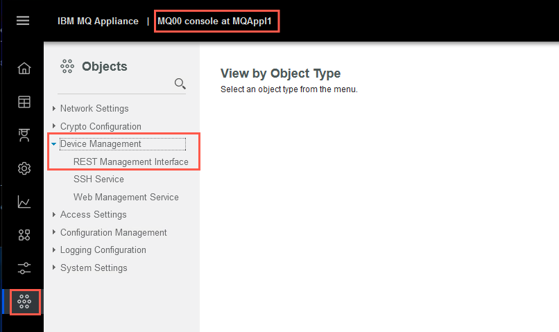

5.  Select the **REST Management Interface**.

6.  You will see that it is currently disabled.
	
	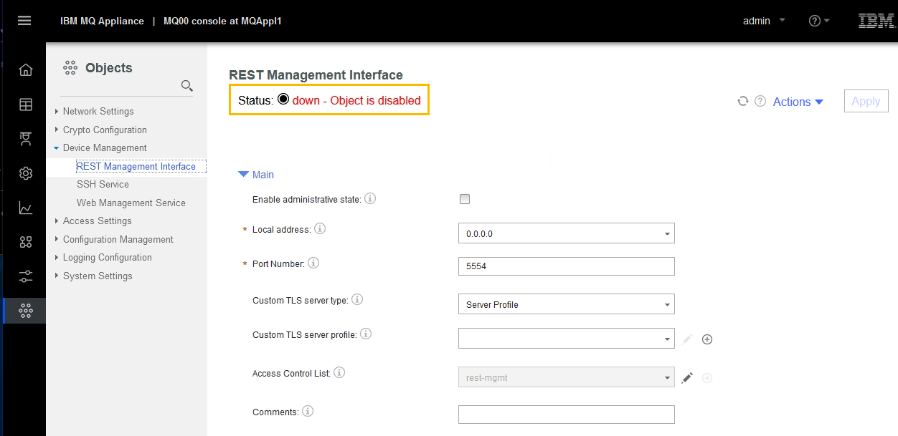

7.  Click the **Enable administrative state** checkbox to enable the
    interface.

8.  Enter the IP address of the management interface (**10.0.0.1**) in
    the **Local Address** field.

8.  Leave all the other defaults.

9.  Click **Apply**.

	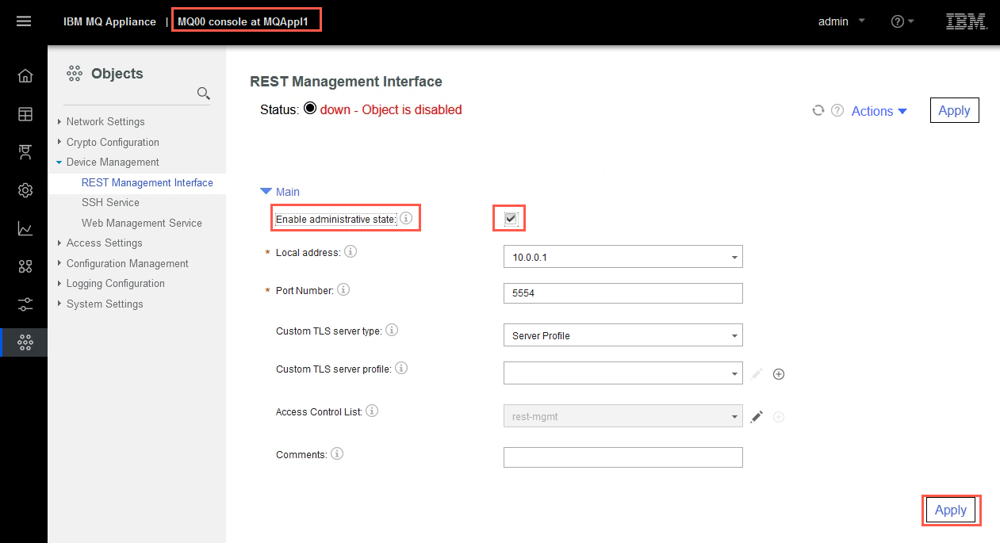

10. Click the *Save changes* button.

	
	
11. You will see the succesful message pop-up. The status has changed to *up*. The REST interface is now running.

	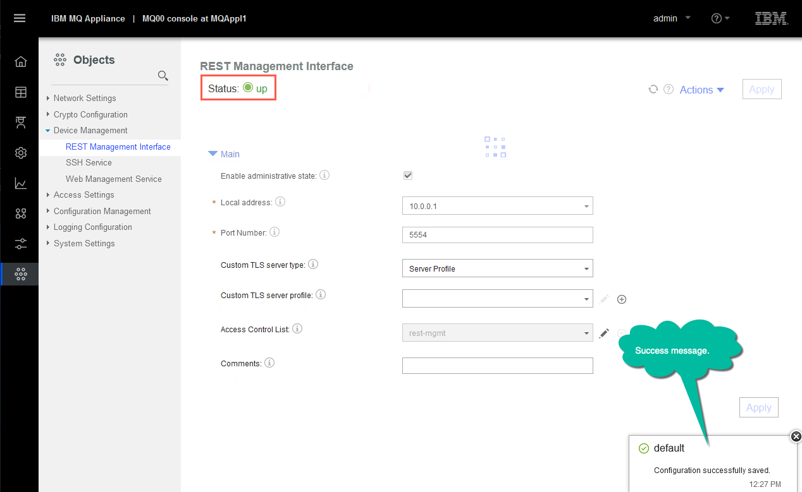

### Exploring some REST calls

This section helps to enhance your understanding of REST management
interface functionality and the process of constructing valid requests.
We will explore the Uniform Resource Identifier (URI) hierarchy of the
REST management interface and the overall structure and format of the
request and response payloads. We will use the *Chrome Postman* for
testing.

First we need to make sure we have no CORS problems.

1. Open up a **Chrome** browser.

    
    
1. If you are prompted that Chrome is not the default, click the *Set as default* button to make chrome the default browser.

	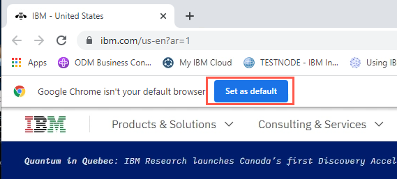
	
1.	Click the elipsis on the far right of the window, then click *Settings*.

	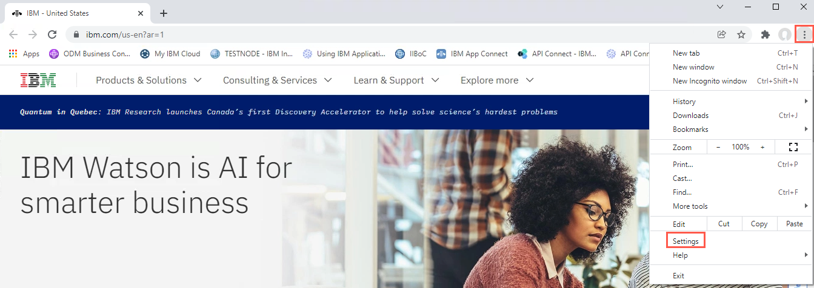

1. When the *Settings* panel appears, select **Default browser**. Click *Make default*.

	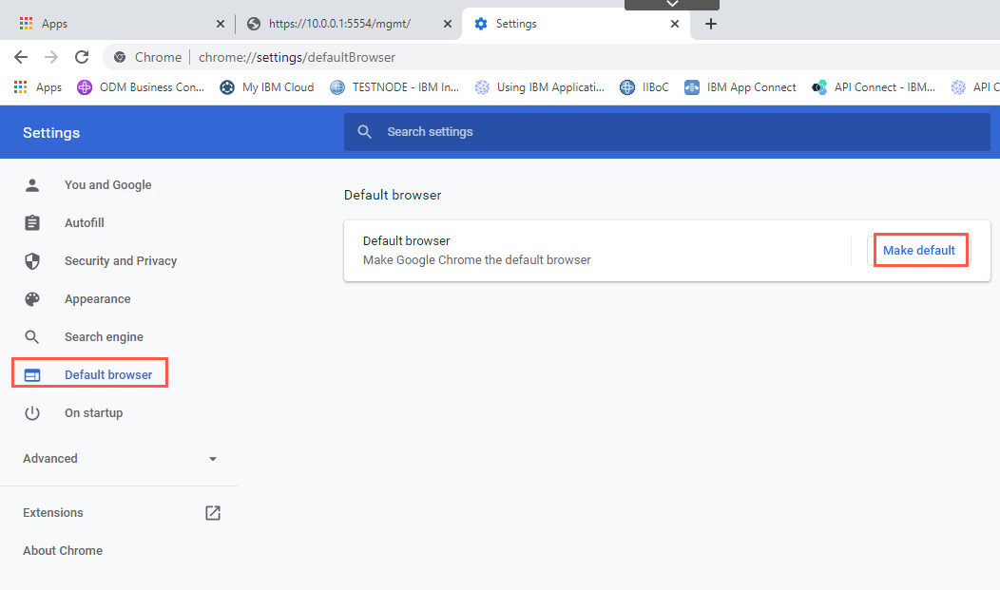
	
1. When the *Default apps* window appears, select **Google Chrome** as the default browser.

	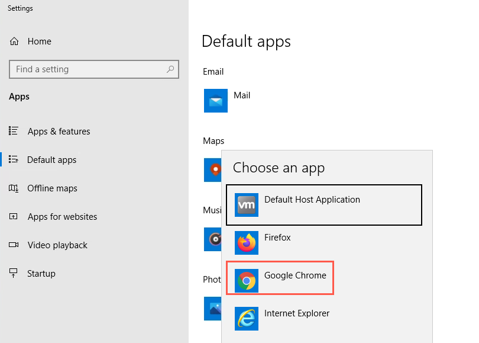
	
	Close the window. You can also close the *Settings* browser tab.
	
2. Enter the following URI into the browser:

	[**https://10.0.0.1:5554/mgmt/**](https://10.0.0.1:5554/mgmt/)
	
	Make sure to include the (/) slash at the end of the URL, otherwise you will receive an *invalid URI* response.

	This is the REST management interface root URI; you can obtain the list
of all available resource categories by sending a GET request to this
URI.

	Note: If you receive any warnings about unsafe addresses, accept the
exception and proceed (this will fix any CORS issues we may have).

3. If prompted, enter the **admin** userid and password.

	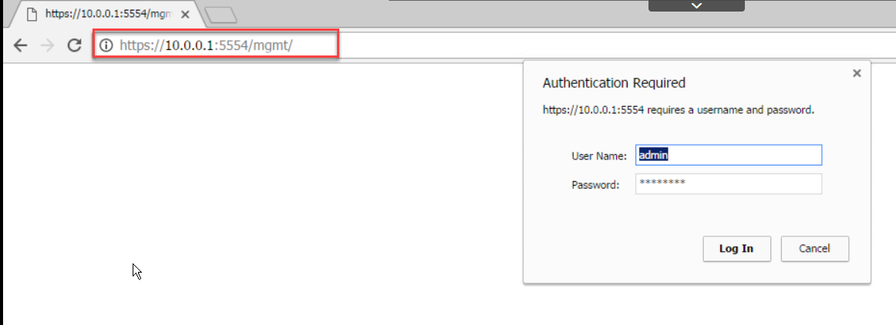

4. The figure below shows the response that is received from the root
    URI of the REST management interface. This list presents the
    available resource categories on the appliance. You can access
    individual resource URIs by issuing requests to the embedded href
    links, which include a trailing forward slash (/) character.

    Note: The trailing / character must be present only in top-level
    URIs that represent the available resource categories. The trailing
    / character is not allowed on all other URIs and it results in an
    error.

   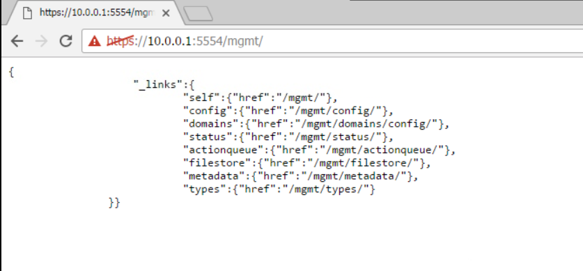    

5. We will now continue using the *Advanced Rest Client (ARC)*. This is a browser based REST
    testing tool from Chrome. Open a new tab in *Chrome*, then click **Apps**.

    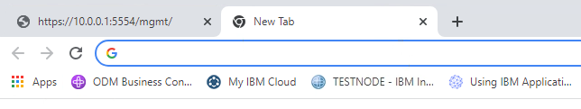
    
6. You will see the *ARC* icon. Click the icon to open the ARC tool.

	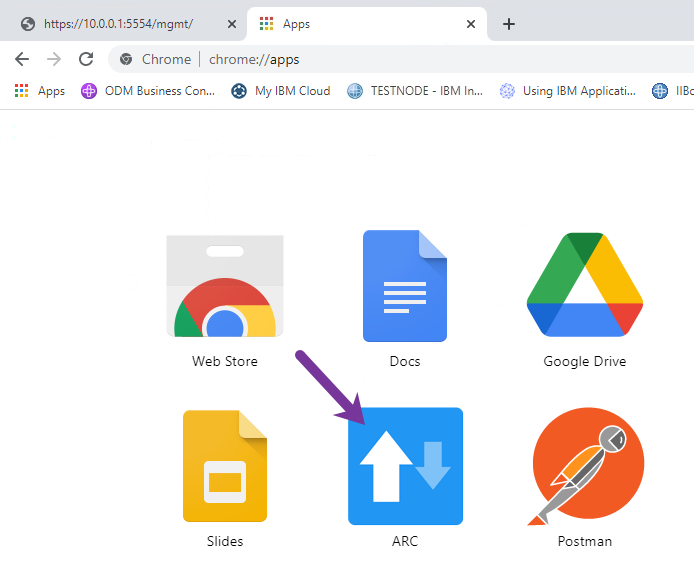

	The tool opens in a new window. You may close the Chrome browser tab after this.

7. Set the operation to **GET** from the drop-down list.

8. Enter the URI as before -- **https://10.0.0.1:5554/mgmt/**

9. All requests to the REST management interface require an HTTP basic
    authentication header. Click *Header name* and select the **Authorization**. 
    
     
    
1. Click the edit button (pencil) to add the **Basic Auth** (authentication method) credentials. 

	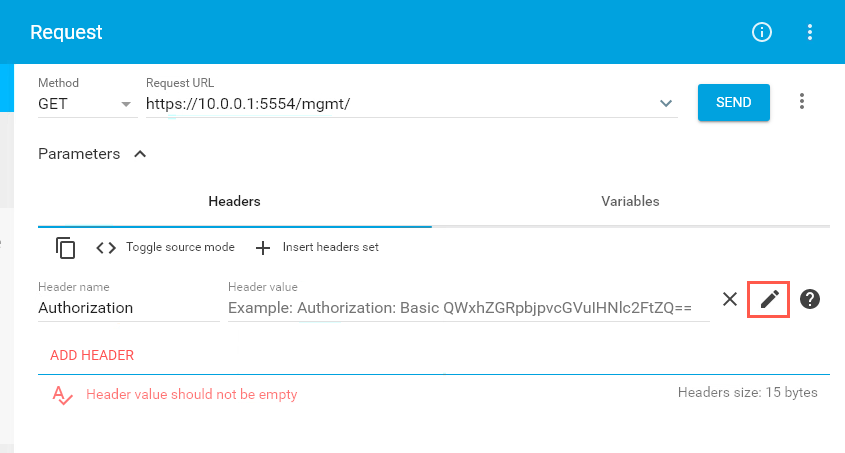

1. Enter the **admin** user and password you had previously set. Click *Accept*.

	

10. You need to set one more setting. Click the elipsis in the top right corner next to *Send*. 

	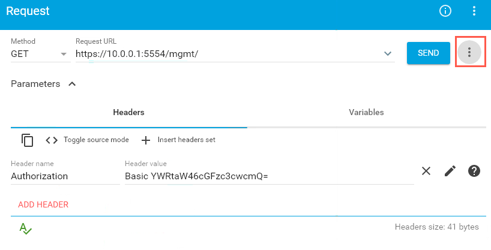
	
	Click the *Use XHR extension* to turn it on. This will generate a pop-up to install the *ARC Proxy Extension*. This will allow you to test by ignoring certificate and cookie errors. Click the install button.
	
	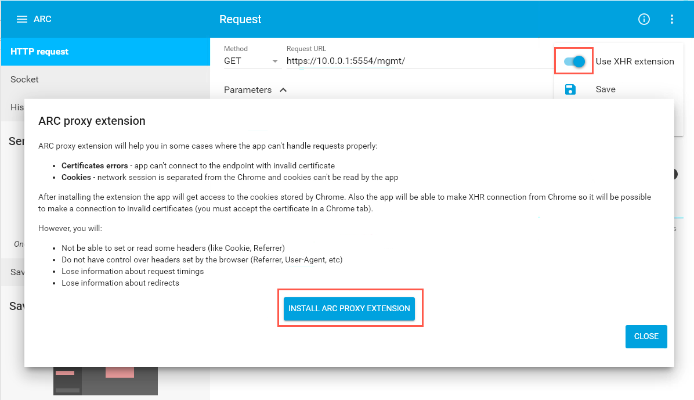	
1. Click *Add to Chrome*, then click *Add extension*.

	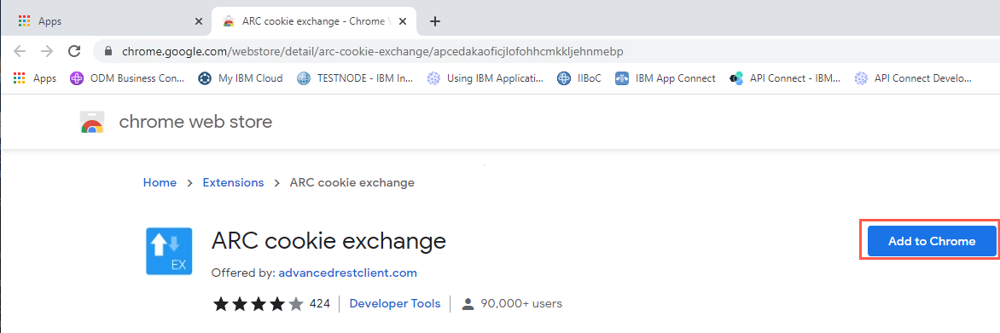
		
	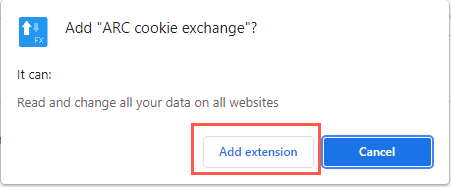
	
	Then close the *Turn on sync* pop-up. Close the Chrome browser tab and return to the ARC window. Click *Close*. 
	
	
### Check Resource Status Using REST Interface

As we can see from the diagram above, there are multiple management type
functions we can perform via the REST interface. One of these is to
retrieve status information of resources. We can retrieve a list of all
available status provider classes as follows.

1. Start the *ARC* application again from the *Apps* bookmark, then enter the following URI:

	[**https://10.0.0.1:5554/mgmt/status/**](https://10.0.0.1:5554/mgmt/status/)

2. You need to repeat the *XHR* switch now that the extension has been added. Click **Send**.

3. You may see a response as shown below. You should have a *200 OK* return code and *Response headers*.

	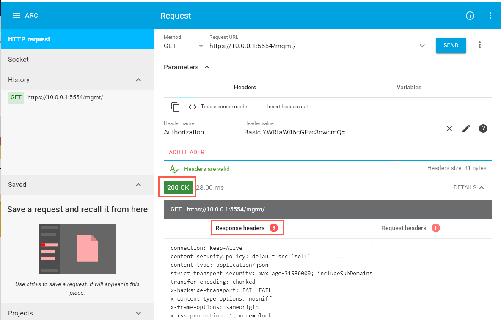

1. Scroll down to see what REST APIs are available. 

	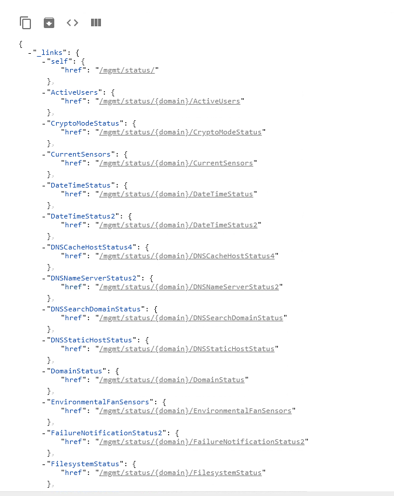
	
	You will need to scroll more than once to see all of them.

1. To identify the exact formatting of the status provider class name, you
search the received response payload. There are quite a few things in
this list that are of interest to us. Let's look at a couple.

	Using one of these, we can check the firmware version of the appliance.
	
5. Without changing the headers using the *ARC* application enter the following URI:

    ```
    https://10.0.0.1:5554/mgmt/status/default/FirmwareVersion2
    ```
    
    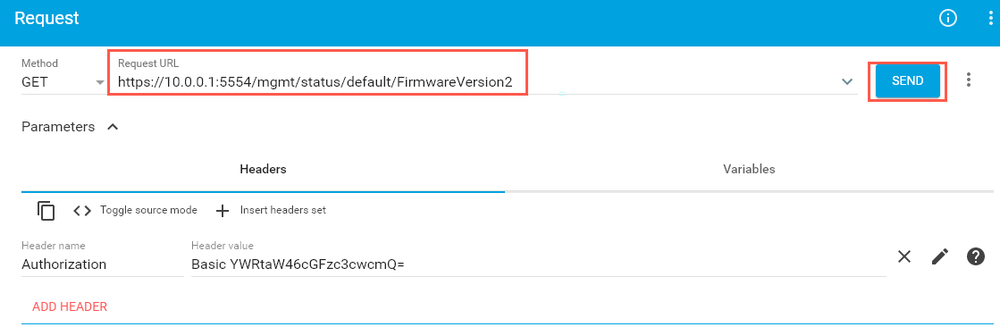
    
    Click **Send**.

1. You should receive a *200 OK* return code. Scroll down to see the response and headers.

	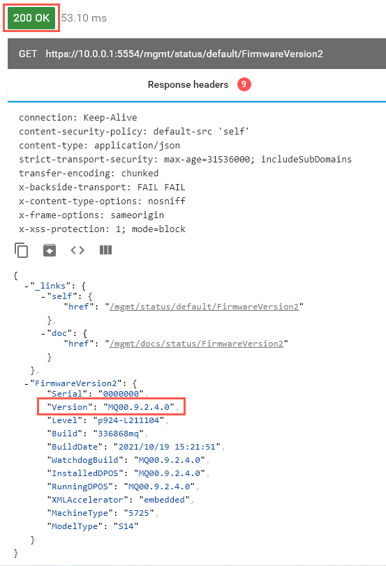

7. In the response you will see something similar to the diagram above,
    indicating that the appliance is at version 9.2.4.0.

8. Let's try another one. Enter the following URI:

	```
	https://10.0.0.1:5554/mgmt/status/default/MQSystemResources
	```
    
    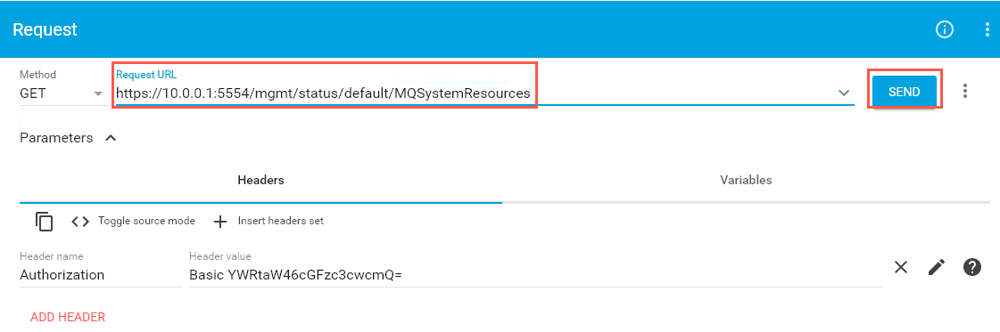

9. Click **Send**.

10. You should see a response similar to the following.

    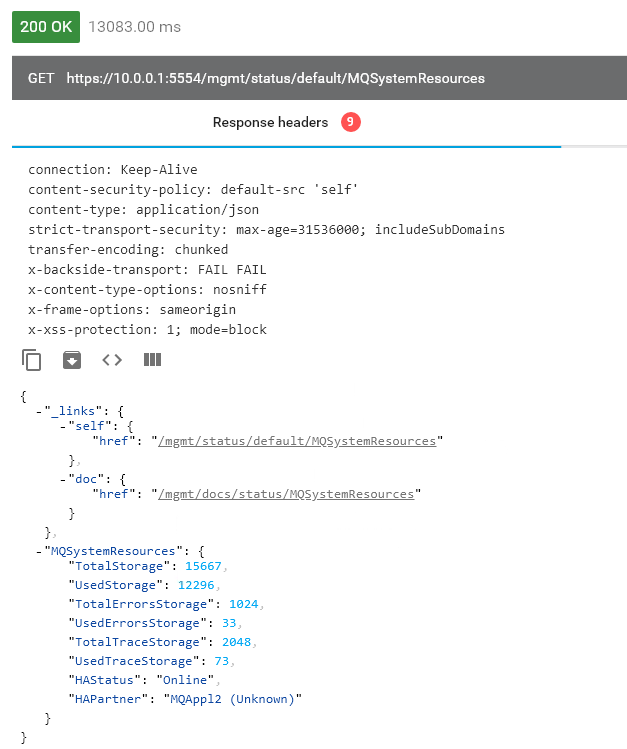

11. Depending on which environment you are using, your HA information
    may be the same as this or different. What is this response telling
    us about HA on this appliance?

	Running one more status query may give you a hint....

12. Enter the following URI: 

	```
	https://10.0.0.1:5554/mgmt/status/default/QueueManagersStatus
	```
    
    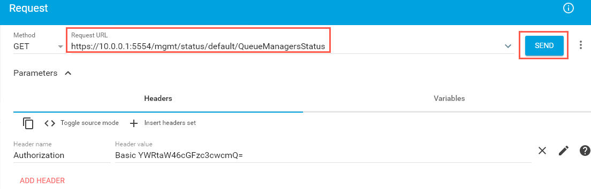    

13. Click **Send**.

14. You can see from the result your two HA queue managers, where they are running, and the local queuemanager QM1 which is not running in this case. Again, your results may be different. 

	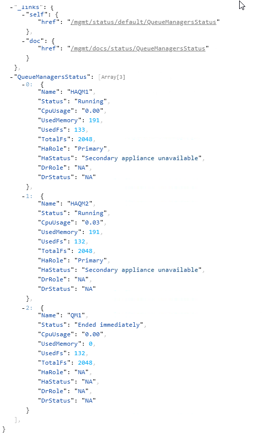 
	
### User Management using REST interface

The REST management interface uses the standard HTTP methods of GET,
POST, PUT, DELETE, and OPTIONS. However, not every resource is available
in all HTTP methods. For example, status resources support only the GET
method, where configuration resources allow more supported methods. You
can retrieve the list of supported HTTP methods on any URI by sending
the OPTIONS request to that URI. Let's try that now for the admin user.

1. Change the URI as shown below to:

	**https://10.0.0.1:5554/mgmt/config/default/User/admin**

2. Change the **operation** to **OPTIONS** from the drop-down list.

3. Click **Send**.

4. You will see from the response that GET, PUT and DELETE are
    operations that we may use for users (and specifically **admin**, in
    the case of this example).

    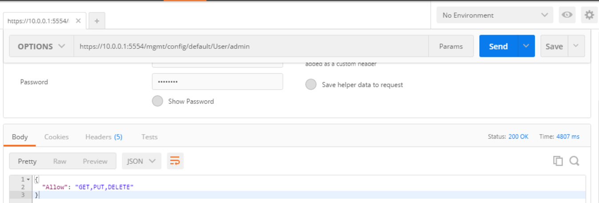

5. Obviously we do not want to delete our admin user, so let's first
    see the properties for the admin user.

6. Enter the same URI, but changing the operation to **GET**.

7. Click **Send**.

8. The figure below shows the response which indicates that the "admin"
    user is enabled, is the administrative user and has an access level
    of privileged.

	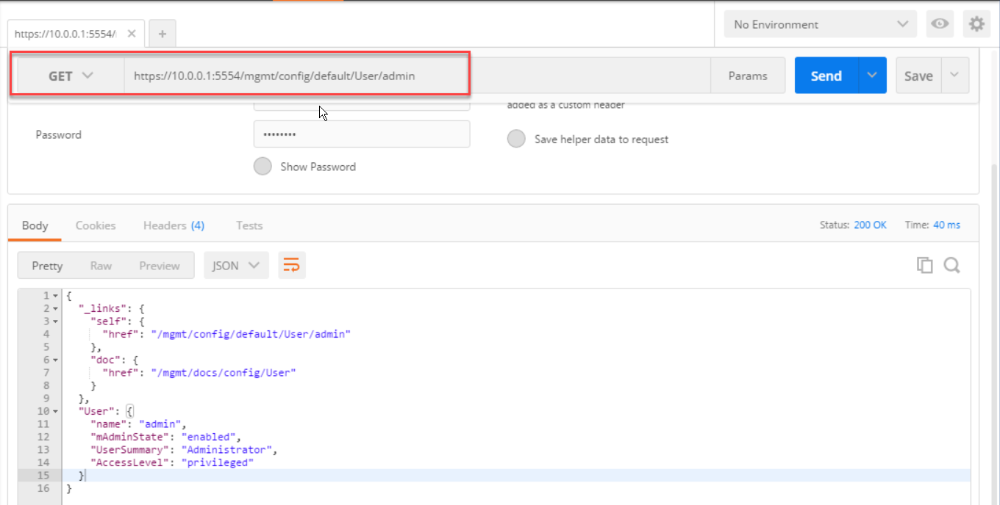

	We don't really want to change any of these attributes for our
administrative user, so let's take a look at another user.

9. You will recall that in the first lab, you created a user that is
    able to change and reset passwords.

	Enter the same URI, but changing the username to whatever user you
    created in the first lab (in our case it is **mqadmin**).

10. Click **Send**.

11. We now see that the user has an access level of privileged. 

	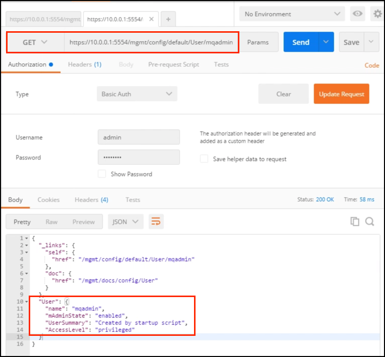 
	
	What about the testuser we created, I hear you ask? One important thing to remember is that the REST interface relates to the appliance itself and not to the management of MQ objects. The testuser, you will recall, was created using the mqcli and as such is an MQ object rather than an appliance object. REST operations for MQ that were introduced in software MQ v9.0.1 do not yet apply to the appliance. For maintenance of MQ users, we continue to use the methods as shown in other labs.

### Network Management using the REST Interface

We can also use the REST interface to manage our network configuration.
Although, we will not be changing the network settings in this lab, it
is worth taking a brief look at them.

1. Enter the following URI and click **Send**.

	**https://10.0.0.1:5554/mgmt/config/default/EthernetInterface**

	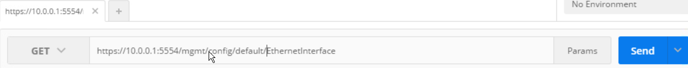

2. This shows the details of all of the configured interfaces on the
    appliance. You should see a response similar to the following.

	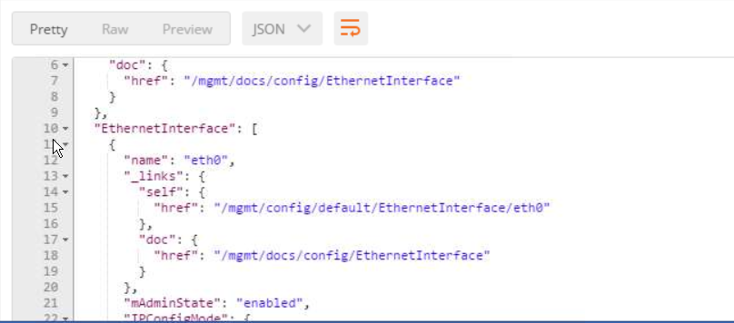

	Scroll down to see all of the information returned.

3. We can focus on one specific interface (let's choose eth2). Add
    **eth2** to the **URI**.

	**https://10.0.0.1:5554/mgmt/config/default/EthernetInterface/eth2**

4. Click **Send**.

5. We now see all of the properties for the eth2 interface.

   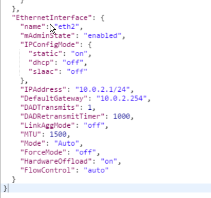

   We are also able to take this further and get the details for one
    specific property.

6. Enter the following URI and click **Send**.

	**https://10.0.0.1:5554/mgmt/config/default/EthernetInterface/eth2/IPAddress**

7. We now see the details of only the property we are interested in.

	

### File Management Using REST Interface

Last but not least, let's take a look at some of the file management
options we have using the REST interface.

You can perform all file manipulation operations by using the REST
management interface. These operations include retrieving and updating
the contents of existing files, creating files, and deleting existing
files.

As with other resources, to begin retrieving and modifying existing file
system resources, you should become familiar with the filestore resource
of the REST management interface that represents the appliance file
system.

We can find the format of the filestore resource by accessing the URI of
the filestore.

1. Enter the following URI, making sure to add the trailing "/" this
    time.

	**<https://10.0.0.1:5554/mgmt/filestore/>**

2. Click **Send**.

3. We now see the required structure for the files and directories on
    the appliance.
    
    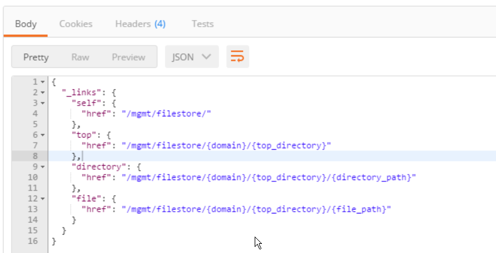

4. Let's start by listing the contents of a directory that is the top level directory for all of our MQ data.

5. Enter the following URI and click **Send**.

	**<https://10.0.0.1:5554/mgmt/filestore/default/mqqmdata>**

6. You should see a response similar to the following.
    
    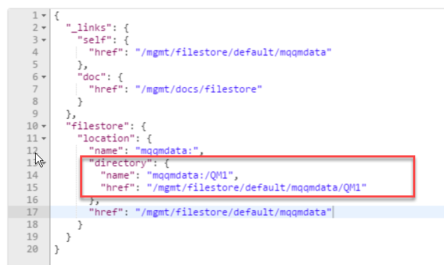

7. Let's dig a little deeper into what the QM1 directory contains (if
    the appliance you are working on no longer has the QM1 queue
    manager, go ahead and create QM1 again -- use **crtmqm --fs 2
    QM1**).

8. Enter the following URI and click **Send**:

	**<https://10.0.0.1:5554/mgmt/filestore/default/mqqmdata/QM1/qmgr/QM1>**

9. You should see a response similar to the following (scroll down
    through the response, if you know MQ this looks familiar, doesn't
    it?).

	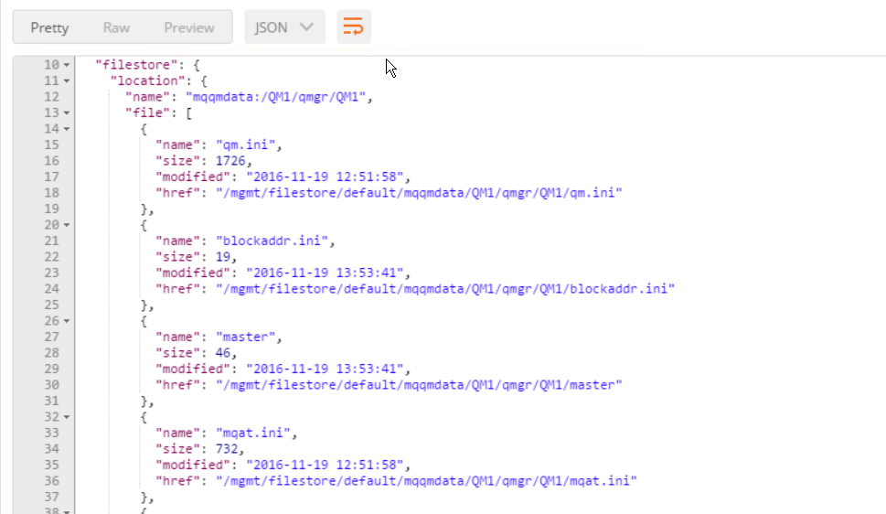

10. Let's take this one step further and check the error logs.

11. Enter the following URI and click **Send**.

	[**https://10.0.0.1:5554/mgmt/filestore/default/mqqmdata/QM1/qmgr/QM1/errors**](https://10.0.0.1:5554/mgmt/filestore/default/mqqmdata/QM1/qmgr/QM1/errors)

12. We now see the details of our "old friend" AMQERR01.LOG.

    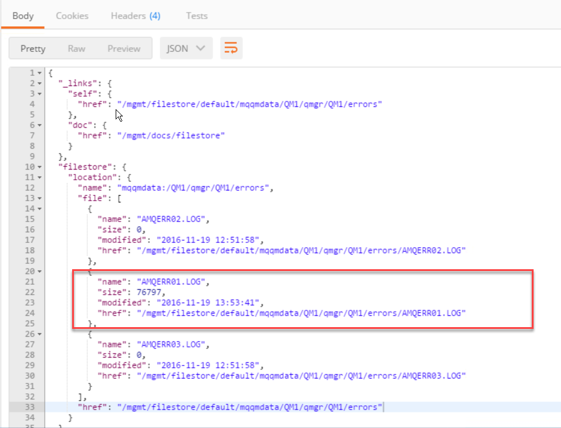

     We could now also retrieve the contents of this file, but it is
    worth pointing out that it is returned as base-64 encoded. Not
    really very useful at this point unless we want to run it through a
    decoding tool (there are many of them -- including some as simply as
    Notepad++, which is in your environment). To get an immediate text
    version of the log, you could use the Web console to view it without
    downloading it.

13. It is also possible to create directories and files using the REST
    interface.

    We will start by creating a directory. There is a directory named
    *local* that already exists, so we will create a subdirectory named
    **restlab**. A directory can be created using either the POST or PUT
    operation, as both do the same thing but have different URIs. We
    will use the POST.

15. Enter the following URI, and set the **operation** to **POST**.

	**<https://10.0.0.1:5554/mgmt/filestore/default/local>**

	Both the POST and PUT requests require that the details of the directory
to be created are specified in the request payload.

16. As you did before, select the **Authorization** tab. Select **Basic
    Auth** as the authentication method. Enter the **admin** user and
    password you had previously set.

17. Click the **Body** tab. Click the dropdown for *Body content type* and select **application/json**. Click the dropdown for *Editor view* and select **Raw input**. data type of **Raw input**. Use the
    **Text** dropdown list to select a type of **JSON
    (application/json)**.
    
    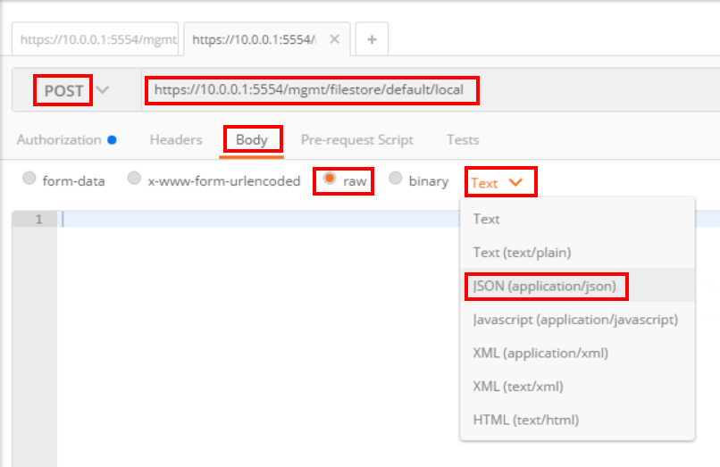

18. Enter the following text as the request data in the body:

	> **{**
	>
	> **\"directory\": {**
	>
	> **\"name\": \"restlab\"**
	>
	> **}**
	>
	> **}**

	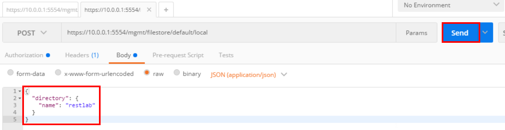
	
19. Click **Send**.

20. You should receive a result (hint: look at the bottom of Postman)
    that looks as follows.

	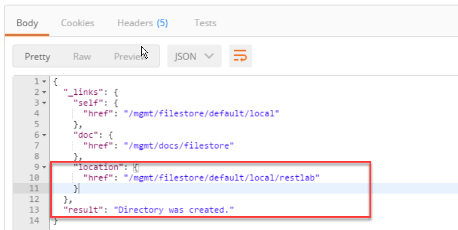

21. We will now create a file into that new directory.

    As with creating a directory, both PUT and POST are supported.

    Both the POST and PUT requests require that the details of the file to
be created are specified in the request payload. Our example uses the
required request payload, with the file name specified in the name
parameter and the contents in the contents parameter. The file contents
must be base64-encoded before they are embedded into the request
payload.

22. Enter the following URI, with **POST** as the operation.

	<https://10.0.0.1:5554/mgmt/filestore/default/local/restlab>

23. As you did previously, add the body. This time copy and paste the
    text from here:
    
```
    {
  "file": {
    "name":"resttest",
    "content":"VGhpcyBpcyBhIHR1c3QgbWVzc2FnZSBmcm9tIH1vdXIgUkVTVCBsYWI="
  }
}
```

It looks as follows:
	
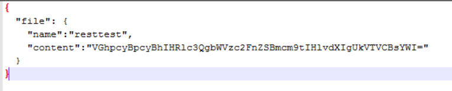

24. Click **Send**.

25. You should receive a response similar to the following.

	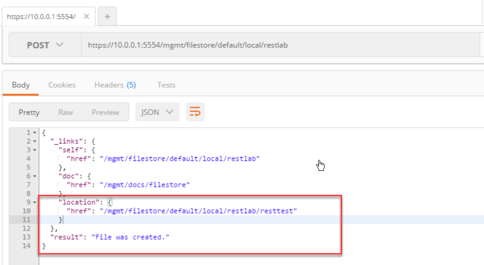

26. Let's go to the Web console and see what we have created (we will be
    able to see the text version of the file from there).

27. If you are not already logged into the console, do so now.

28. Go to **Administration -\> Main -\> File Management**.

	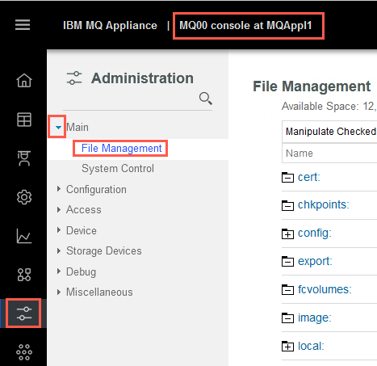

29. Expand the **local** folder to see the **restlab** directory and the
    **resttest** file.

	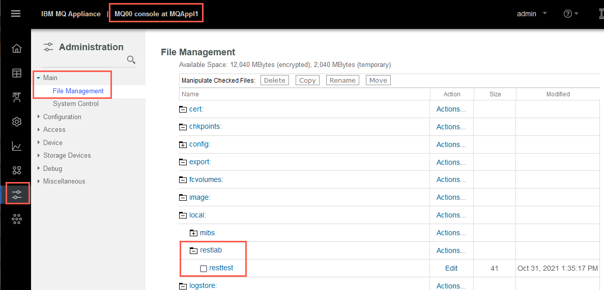
	
30. Click the **resttest** file.

31. This will open a new browser tab and the contents should look as
    follows.

	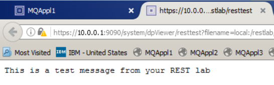


Congratulations, you have completed the REST interface lab.
