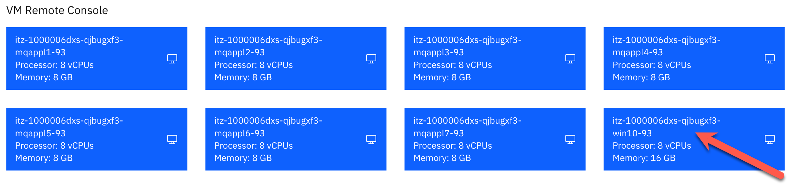

# MQ Appliance PoT Environment

The lab environment consists of multiple virtual appliances - **MQAppl1**, **MQAppl2**, **MQAppl3**, **MQAppl4**, **MQAppl5**, **MQAppl6**, and **MQAppl7**. Also included is a **Windows 10 x64** VM which will be your desktop to perform console operations and testing during your PoT experience.

Use this PoT on TechZone for configuring the appliance at power-up (Lab 1), and upon successful completion, you may use it for Labs 3 - 6 and 9. Please read the section below for details.

You will be provided a URL to a TechZone environment to work in based on the template *MQ Appliance PoT*. Log on to the environment provided in an email or by the instructor. 

## Labs 

There are three snapshots to work from: 

1. Start at appliance power-up and configure the appliance 

	Lab 1 - VMs required:
	* **Windows 10 x64**
	* **MQAppl7**

	> **Note:**  MQAppl1 is the solution for MQAppl7 setup.

2. Appliances are setup and you want to configure them for high availability 

	Lab 2 - VMs required:
	* **Windows 10 x64**
	* **MQAppl5**
	* **MQAppl6**

	> **Note:**  MQAppl1 and MQAppl2 are the solution for MQAppl5 and MQAppl6 HA configuration.

3. Appliances are setup and configured for high availability, and now you want to set up a disaster recovery environment 

	Lab 8 - VMs required:
	* **Windows 10 x64**
	* **MQAppl1**
	* **MQAppl3**

* Random labs - no specific order

	Lab 7 - VMs required:
	* **Windows 10 x64**
	* **MQAppl4**
	
	Labs 3, 4, 5, 6, 9 - VMs required:
	
	* **Windows 10 x64**
	* **MQAppl1**

### Start Windows desktop
The environment should be started. You will use the Windows desktop in all of the labs, so start it now.

1. Click the *win10-93* VM. 

	
	
1. The Windows desktop opens. To login, hit enter or click the mouse anywhere on the desktop.

	
	
1. You will sign on as **ibmdemo**. Enter **passw0rd** for the password and hit enter or click the arrow.

	
	
1. Ignore and close any pop-ups. Click *Open in a new window*.

	

1. Return to the previous browser tab. Click the browser back button to return to the main environment page. There you can open any of the other VMs. This is especially important for Lab 1 to open the MQAppl7 VM.
	
	
	
### MQ Appliance Console

> **Note:**  Be aware when using the MQ Appliance Console on the virtual appliance you will not be able to copy / paste commands from the lab guides. You may want to use Putty on the Windows VM to connect to the appliances. Using Putty you can adjust the screen size, scroll up and down, and copy / paste. You will also only need to work on one VM instead of switching between the VMs. Be aware that you cannot use Putty in Lab 1 until you have completed the Install Wizard (which enables the use of SSH). 

## IP Addresses

This document details all of the IP addresses you need for the
appliances in the labs.

Use the tables below to guide you through the initial set up of MQAppl7
in Lab 1 and also MQAppl5 and MQAppl6 if you choose to manually
configure the appliances for the HA and DR labs.

The network adapters are described here. Pay particular attention to
eth1, eth2, and eth3 and eth4. They are the adapters used for HA and DR.

Ensure you enter the addresses exactly as shown here in conjunction with
the lab instructions.

### MQAppl1 Addresses

Note that the IP addresses of eth1 through eth4 MUST be entered in CIDR
notation as shown below. 

|Virtual Adapter Network Name | Appliance Ethernet Interface | Usage | DHCP | IP Address | Gateway Addresses |
|:---------------------------:|:----------------------------:|:-----:|:----:|:----------:|:-----------------:|
| Network 1 | eth0 | Management and client traffic | Yes | 10.0.0.1 | |
| HA1 | eth1 | HA primary connection | No | 10.0.1.1 | 10.0.1.254 |
| HA2 | eth2 | HA alternate connection | No | 10.0.2.1 | 10.0.2.254 |
| HArep | eth3 | HA replication connection | No | 10.0.3.1 | 10.0.3.254 |
| DRrep | eth4 | DR replication connection | No| 10.0.4.1 | 10.0.4.254 |

### MQAppl2 Addresses

Note that the IP addresses of eth1 through eth4 MUST be entered in CIDR
notation as shown below. 

|Virtual Adapter Network Name | Appliance Ethernet Interface | Usage | DHCP | IP Address | Gateway Addresses |
|:---------------------------:|:----------------------------:|:-----:|:----:|:----------:|:-----------------:|
| Network 1 | eth0 | Management and client traffic | Yes | 10.0.0.2 |  |
| HA1 | eth1 | HA primary connection | No | 10.0.1.2 | 10.0.1.254 |
| HA2 | eth2 | HA alternate connection | No | 10.0.2.2 | 10.0.2.254 |
| HArep | eth3 | HA replication connection | No | 10.0.3.2 | 10.0.3.254 |
| DRrep | eth4 | DR replication connection | No| 10.0.4.2 | 10.0.4.254 |

### MQAppl3 Addresses

Note that the IP addresses of eth1 through eth4 MUST be entered in CIDR
notation as shown below. 

|Virtual Adapter Network Name | Appliance Ethernet Interface | Usage | DHCP | IP Address | Gateway Addresses |
|:---------------------------:|:----------------------------:|:-----:|:----:|:----------:|:-----------------:|
| Network 1 | eth0 | Management and client traffic | Yes | 10.0.0.3 | |
| HA1 | eth1 | HA primary connection | No | 10.0.1.3 | 10.0.1.254 |
| HA2 | eth2 | HA alternate connection | No | 10.0.2.3 | 10.0.2.254 |
| HArep | eth3 | HA replication connection | No | 10.0.3.3 | 10.0.3.254 |
| DRrep | eth4 | DR replication connection | No| 10.0.4.3 | 10.0.4.254 |

### MQAppl4 Addresses

Note that the IP addresses of eth1 through eth4 MUST be entered in CIDR
notation as shown below. 

|Virtual Adapter Network Name | Appliance Ethernet Interface | Usage | DHCP | IP Address | Gateway Addresses |
|:---------------------------:|:----------------------------:|:-----:|:----:|:----------:|:-----------------:|
| Network 1 | eth0 | Management and client traffic | Yes | 10.0.0.4 | |
| HA1 | eth1 | HA primary connection | No | 10.0.1.4 | 10.0.1.254 |
| HA2 | eth2 | HA alternate connection | No | 10.0.2.4 | 10.0.2.254 |
| HArep | eth3 | HA replication connection | No | 10.0.3.4 | 10.0.3.254 |
| DRrep | eth4 | DR replication connection | No| 10.0.4.4 | 10.0.4.254 |

### MQAppl5 Addresses

Note that the IP addresses of eth1 through eth4 MUST be entered in CIDR
notation as shown below. 

|Virtual Adapter Network Name | Appliance Ethernet Interface | Usage | DHCP | IP Address | Gateway Addresses |
|:---------------------------:|:----------------------------:|:-----:|:----:|:----------:|:-----------------:|
| Network 1 | eth0 | Management and client traffic | Yes | 10.0.0.5 | |
| HA1 | eth1 | HA primary connection | No | 10.0.1.5 | 10.0.1.254 |
| HA2 | eth2 | HA alternate connection | No | 10.0.2.5 | 10.0.2.254 |
| HArep | eth3 | HA replication connection | No | 10.0.3.5 | 10.0.3.254 |
| DRrep | eth4 | DR replication connection | No| 10.0.4.5 | 10.0.4.254 |

### MQAppl6 Addresses

Note that the IP addresses of eth1 through eth4 MUST be entered in CIDR
notation as shown below. 

|Virtual Adapter Network Name | Appliance Ethernet Interface | Usage | DHCP | IP Address | Gateway Addresses |
|:---------------------------:|:----------------------------:|:-----:|:----:|:----------:|:-----------------:|
| Network 1 | eth0 | Management and client traffic | Yes | 10.0.0.6 | |
| HA1 | eth1 | HA primary connection | No | 10.0.1.6 | 10.0.1.254 |
| HA2 | eth2 | HA alternate connection | No | 10.0.2.6 | 10.0.2.254 |
| HArep | eth3 | HA replication connection | No | 10.0.3.6 | 10.0.3.254 |
| DRrep | eth4 | DR replication connection | No| 10.0.4.6 | 10.0.4.254 |

### MQAppl7 Addresses

Note that the IP addresses of eth1 through eth4 MUST be entered in CIDR
notation as shown below. 

|Virtual Adapter Network Name | Appliance Ethernet Interface | Usage | DHCP | IP Address | Gateway Addresses |
|:---------------------------:|:----------------------------:|:-----:|:----:|:----------:|:-----------------:|
| Network 1 | eth0 | Management and client traffic | Yes | 10.0.0.7 | |
| HA1 | eth1 | HA primary connection | No | 10.0.1.7 | 10.0.1.254 |
| HA2 | eth2 | HA alternate connection | No | 10.0.2.7 | 10.0.2.254 |
| HArep | eth3 | HA replication connection | No | 10.0.3.7 | 10.0.3.254 |
| DRrep | eth4 | DR replication connection | No| 10.0.4.7 | 10.0.4.254 |

[Return MQ Appliance Menu](index.md)

[Get started with Lab 1](lab1/mq_appl_pot_lab1.md)